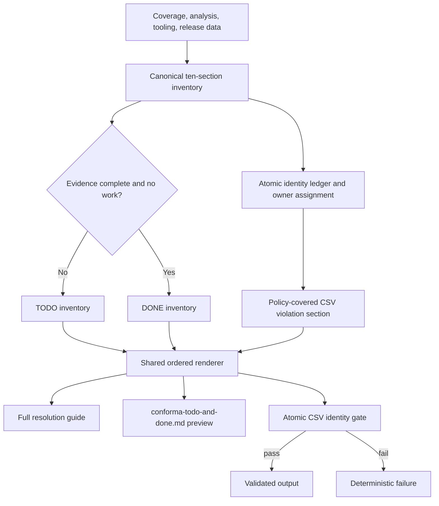

# Conforma TODO and DONE Resolution Report Implementation Plan

> **For agentic workers:** Implement this plan task-by-task with a fresh test
> cycle after each task. Preserve the repository's deterministic workflow and
> show generated script output verbatim.

**Goal:** Rework the Conforma resolution guide and preview so all ten report
sections are always visible, actionable or unknown sections are TODO, proven
complete sections are DONE, and the generated output fails if its TODO/DONE
violation evidence does not account for every source CSV violation.

**Architecture:** A deterministic ledger will normalize source violation
records into atomic identities and assign each identity exactly one owning
section. `guide_renderers.py` will construct one canonical ordered section
inventory containing status, heading number, body, work-item count, owned
identities, and secondary references. The full resolution guide and renamed
`conforma-todo-and-done.md` preview will render that same inventory. The
presentation validator will validate the complete two-group structure and
the owner partition rather than assuming a fixed set of TODO headings.

Each rendered section will include a stable machine-readable marker immediately
before its heading, for example `<!-- conforma-section: tooling -->`. Human
titles remain descriptive, while validators use the marker rather than
guessing section identity from prose.

**Tech Stack:** Python, Markdown renderers, pytest, existing Conforma context
and coverage data structures.

**Spec:** Approved in-chat design for the Conforma TODO/DONE resolution report
change, recorded in `skills/conforma-analyze/todo/resolution-report-todo-done-sections.md`.

## Global Constraints

- Every one of the ten logical sections is rendered exactly once.
- Tooling always owns number `#0` in whichever status group applies.
- TODO and DONE numbering are independent and start at `#0`.
- Missing release dates, missing coverage inputs, unknown tooling state, and
  evaluation errors are TODO conditions, never DONE conditions.
- Merge Request coverage remains TODO until the Merge Request is merged.
- Existing policy-file coverage is represented in the covered-violations DONE
  section.
- Atomic violation identity is `(violation code, component, semantic detail)`.
- Every source CSV violation identity has exactly one owning TODO or DONE
  section. Secondary expiry and warning sections may reference an owned
  identity but must not count it again in the source-violation gate.
- The union of owned identities across TODO and DONE must exactly equal the
  source CSV violation identity set; generation fails on missing, duplicate,
  or unclassified owners.
- Exception and warning work-item counts remain separate from source CSV
  violation counts and are labelled accordingly.
- The preview filename is `conforma-todo-and-done.md` everywhere.
- Modified code must retain at least 97% line, branch, and statement coverage
  wherever the repository coverage gate measures those metrics.

## Review Focus

- A missing upcoming release date must make release-dependent sections TODO,
  not empty DONE sections; test this with otherwise valid violation data.
- Unknown or absent tooling health must make Tooling TODO #0; test this without
  silently treating missing health JSON as healthy.
- A violation covered by an open Merge Request must remain TODO, while a
  policy-covered violation must appear in DONE; test both in one report.
- A partially covered rule with different components must partition atomic
  identities without duplicates; test covered and uncovered components.
- Warning and exception item counts must not corrupt the source CSV identity
  gate; test a report where these counts differ from violation counts.

## Proposed section inventory

The ten logical sections, in their stable source order, are:

1. Tooling health.
2. Violations without exception or open Merge Request.
3. Exceptions expiring within 14 days.
4. Violations with expiring exceptions and no open Merge Request.
5. Violations with expiring exceptions whose open Merge Request also expires
   before release.
6. Violations with expiring exceptions whose open Merge Request extends past
   release.
7. Violations with an open Merge Request expiring before release.
8. Violations addressed by open Merge Requests not yet merged.
9. Warnings becoming violations before the release date.
10. Warnings becoming violations after the release date.

The policy-covered CSV violations section is an additional DONE evidence
section, always present after all actionable TODO sections and before empty
former-work sections. Tooling is reserved as TODO #0 or DONE #0. If Tooling is
TODO, the covered section is DONE #0; otherwise it follows healthy Tooling as
the next independent DONE number.

The ledger assigns one owner using this precedence: policy-covered identity;
uncovered identity with an open Merge Request (most specific known expiry
state, otherwise the unmerged-Merge-Request section); uncovered identity with
an expiring policy exception (most specific known expiry state); then
uncovered identity without exception or open Merge Request. Missing release
data keeps the affected release-dependent sections TODO and falls back to the
best non-release owner with an explicit missing-data reason. Secondary
sections retain their work-item rows and references, but their rows do not
increase the source-violation ownership total.

### Task 1: Define the atomic violation ledger and ownership gate

**Files:**

- Create: `skills/conforma-analyze/scripts/violation_section_ledger.py`
- Modify: `skills/conforma-analyze/scripts/guide_renderers.py`
- Modify: `skills/conforma-analyze/scripts/generate_resolution_guide.py`
- Test: `tests/unit/test_conforma_analyze_violation_section_ledger.py`
- Test: `tests/unit/test_conforma_analyze_generate_resolution_guide.py`

**Interfaces:**

- Produce an atomic source identity containing base violation code, full
  violation code, component, and semantic detail.
- Produce a ledger mapping each source identity to exactly one owner section,
  its coverage classification, evidence, and optional secondary references.
- Produce a deterministic validation result or raise a clear error when the
  owner partition differs from the source CSV identity set.

- [ ] Load violation CSV records separately from warning records and normalize
  the exact atomic identity used by `scripts/conforma_counting.py`.
- [ ] Pass the raw violation records from `generate_resolution_guide.py` into
  the renderer; the production path must not reconstruct semantic identities
  from component-level coverage JSON. Renderer-only tests may use an explicit
  fallback fixture, but generation must fail closed if raw records are absent.
- [ ] Preserve `full_violation_code` for policy matching while retaining the
  base code, component, and semantic detail for report accounting.
- [ ] Assign exactly one owner with the documented precedence and permit
  secondary section references without double-counting.
- [ ] Classify each identity as policy-covered, open-Merge-Request-covered,
  uncovered, or unknown; unknown identities remain TODO with evidence.
- [ ] Add explicit unknown handling for missing release dates, missing
  coverage inputs, and absent tooling health data; classify affected records
  as TODO with a diagnostic body.
- [ ] Extract the existing ten bucket renderers into section records without
  changing their table content or source order.
- [ ] Add unit tests for complete data, missing release data, unknown tooling,
-  mixed Merge Request/policy coverage, partial component/detail coverage,
  overlapping secondary memberships, duplicate ownership, missing ownership,
  and warning counts that differ from CSV violation counts.
- [ ] Run `pytest tests/unit/test_conforma_analyze_generate_resolution_guide.py -v`.

### Task 2: Render independent TODO and DONE groups

**Files:**

- Modify: `skills/conforma-analyze/scripts/guide_renderers.py`
- Test: `tests/unit/test_conforma_analyze_generate_resolution_guide.py`

**Interfaces:**

- Consume the canonical section records and atomic ledger from Task 1.
- Produce one Markdown block containing `## TODO`, all TODO sections, `## DONE`,
  and all DONE sections in deterministic order.

- [ ] Assign TODO numbers independently starting at `#0`, reserving Tooling
  `#0` whenever Tooling is TODO.
- [ ] Assign DONE numbers independently starting at `#0`, reserving Tooling
  `#0` whenever Tooling is DONE.
- [ ] Render all ten logical sections exactly once, including zero-item and
  not-applicable states; never filter records by count.
- [ ] Place the policy-covered evidence section first among non-Tooling DONE
  sections and place empty former-work sections after it; preserve secondary
  references in their original logical sections without claiming ownership.
- [ ] Preserve existing anchors, tables, links, and semantic-detail rows.
- [ ] Emit one stable `conforma-section` marker per logical section and one
  marker for covered CSV evidence; use these markers for validation instead of
  inferring identity from translated or changed titles.
- [ ] Add exact-output tests for all-TODO, all-DONE, mixed, unknown-input, and
  Tooling status permutations.
- [ ] Run the focused renderer tests.

### Task 3: Rename and regenerate the preview from the shared output

**Files:**

- Modify: `scripts/conforma_constants.py`
- Modify: `skills/conforma-analyze/scripts/generate_resolution_guide.py`
- Modify: `skills/conforma-analyze/scripts/guide_renderers.py`
- Test: `tests/unit/test_conforma_analyze_generate_resolution_guide.py`

**Interfaces:**

- Rename `TODO_PREVIEW_FILENAME` to the new `conforma-todo-and-done.md`
  value while preserving the constant interface unless a clearer rename is
  required by existing import conventions.
- Make the preview writer consume the same complete TODO/DONE block used by
  the full guide.

- [ ] Rename the generated filename to `conforma-todo-and-done.md`.
- [ ] Update context handover output and default path discovery.
- [ ] Remove the old actionable-only preview behavior.
- [ ] Ensure metadata remains before the complete TODO/DONE block.
- [ ] Add tests asserting the new filename, context value, complete sections,
  and byte-for-byte preservation of the shared section block.
- [ ] Run the focused generator tests.

### Task 4: Make presentation validation structure-aware and fail closed

**Files:**

- Modify: `skills/conforma-analyze/scripts/present_conforma_report.py`
- Modify: `skills/references/script-output-presentation.md`
- Test: `tests/unit/test_conforma_analyze_present_conforma_report.py`

**Interfaces:**

- Validate the renamed preview's metadata, complete TODO/DONE groups,
  independent numbering, stable section inventory, and preserved bodies.

- [ ] Replace `REQUIRED_TODO_NUMBERS = range(1, 8)` with parsing of both
  status groups, stable section markers, and reserved Tooling numbering.
- [ ] Reject missing, duplicate, omitted, or out-of-order section headings.
- [ ] Reject a section with an unknown status, an omitted zero-count body, or
  a shortened DONE body.
- [ ] Validate the source CSV identity gate emitted by the generator.
- [ ] Update tests for valid mixed reports and every fail-closed condition.
- [ ] Run `pytest tests/unit/test_conforma_analyze_present_conforma_report.py -v`.

### Task 5: Update workflow, skill, and repository documentation

**Files:**

- Modify: `skills/conforma-analyze/SKILL.md`
- Modify: `skills/conforma-analyze/workflows/full-analysis.md`
- Modify: `skills/conforma-analyze/workflows/regenerate-guide.md`
- Modify: `skills/references/script-output-presentation.md`
- Modify: `skills/conforma/TODO.md`
- Modify: `skills/conforma-analyze/todo/resolution-report-todo-done-sections.md`
- Modify: `skills/conforma-analyze/todo/README.md`

- [ ] Replace actionable-only preview terminology with the complete
  TODO-and-DONE contract and new filename.
- [ ] Document that missing or unknown inputs produce TODO, never false DONE.
- [ ] Document the source CSV identity gate and the distinction between
  violation counts and exception/warning work-item counts.
- [ ] Link this plan from the TODO record and update its status after all
  implementation and validation tasks pass.
- [ ] Run repository documentation and link checks.

### Task 6: Full validation and independent review

**Files:**

- Test: all affected unit tests and repository coverage configuration.

- [ ] Run the focused renderer, generator, and presentation tests together.
- [ ] Run `pytest tests/unit/` and record the exact result.
- [ ] Run the repository coverage checks and confirm the 97% line, branch,
  and statement requirements for modified code.
- [ ] Generate representative reports with healthy Tooling, unhealthy Tooling,
  missing release data, policy coverage, Merge Request coverage, and mixed
  partial coverage.
- [ ] Verify the full guide and renamed preview contain the same complete
  TODO/DONE section inventory and that all links resolve.
- [ ] Perform an independent review of the final diff and handover record.
- [ ] Move the completed TODO document to `skills/conforma-analyze/done/` and
  index the validation record in `done/README.md` only after all checks pass.

## Plan self-review

- The ten current logical sections are explicitly listed, including the two
  warning windows and all release-dependent exception/Merge Request buckets.
- Unknown release and coverage inputs are explicitly TODO conditions, so no
  technical failure can become a false green DONE result.
- TODO and DONE numbering is independent, with Tooling retaining `#0`.
- The preview rename is covered in constants, generation, presentation,
  documentation, context handover, and tests.
- The count gate compares atomic CSV identities rather than incompatible
  exception and warning work-item totals.
- Each atomic identity has one owner; overlapping expiry and warning sections
  use secondary references and cannot create duplicate ownership.
- Validation is bounded to the canonical `## TODO` / `## DONE` block and does
  not mistake the full guide's later coverage, resolution, warning, or
  statistical sections for inventory entries.
- No section is conditionally filtered from output.
