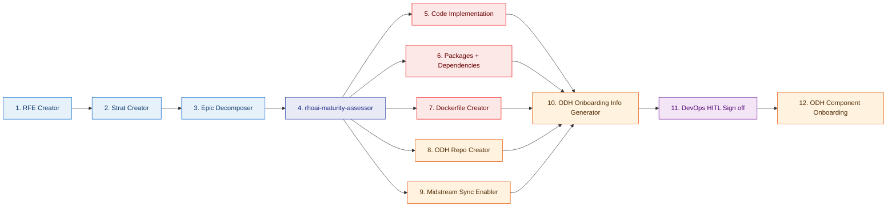

## Flow Diagram

### Legend

| Color     | Category                      | Stages               |
| --------- | ----------------------------- | -------------------- |
| 🔵 Blue   | **Planning & Strategy**       | 1, 2, 3              |
| 🔷 Indigo | **Assessment**                | 4 *(new)*            |
| 🔴 Red    | **Development & Engineering** | 5, 6, 7, 13, 18      |
| 🟠 Orange | **DevOps & Infrastructure**   | 8, 9, 10, 12, 15, 17 |
| 🟣 Purple | **Human Approval (HITL)**     | 11, 16               |
| 🔷 Teal   | **Quality & Validation**      | 14, 19               |
| 🟢 Green  | **Release**                   | 20                   |

## Stages

| #   | Stage                                         | Category        | Description                                                            | Change             |
| --- | --------------------------------------------- | --------------- | ---------------------------------------------------------------------- | ------------------ |
| 1   | **RFE Creator**                               | 🔵 Planning     | Requirement/Feature creation                                           | —                  |
| 2   | **Strat Creator**                             | 🔵 Planning     | Strategy creation                                                      | —                  |
| 3   | **Epic Decomposer**                           | 🔵 Planning     | Epic decomposition into tasks                                          | —                  |
| 4   | **rhoai-maturity-assessor**                   | 🔷 Assessment   | Assess component maturity and readiness before engineering work begins | **New**            |
| 5   | **Code Implementation in upstream repos**     | 🔴 Development  | Implementation/development in upstream                                 | Parallel *(was 4)* |
| 6   | **Packages+Dependencies Generator**           | 🔴 Development  | Identify packages and dependencies                                     | Parallel *(was 5)* |
| 7   | **Dockerfile Creator**                        | 🔴 Development  | Create/update Dockerfiles                                              | Parallel *(was 6)* |
| 8   | **ODH Repo Creator**                          | 🟠 DevOps/Infra | Create ODH repository                                                  | Parallel *(was 7)* |
| 9   | **Upstream to Midstream Sync Enabler**        | 🟠 DevOps/Infra | Enable sync from upstream to midstream                                 | Parallel *(was 8)* |
| 10  | **ODH Component Onboarding Info Generator**   | 🟠 DevOps/Infra | Generate onboarding details for ODH                                    | *(was 9)*          |
| 11  | **DevOps HITL Sign off**                      | 🟣 Approval     | Human-in-the-loop approval (ODH)                                       | *(was 10)*         |
| 12  | **ODH Component Onboarding**                  | 🟠 DevOps/Infra | Onboard component to ODH platform                                      | *(was 11)*         |
| 13  | **ODH Build**                                 | 🔴 Development  | Build ODH component                                                    | *(was 12)*         |
| 14  | **Q&E / Validation**                          | 🔷 Quality      | Quality Engineering validation (ODH)                                   | *(was 13)*         |
| 15  | **RHOAI Component Onboarding Info Generator** | 🟠 DevOps/Infra | Generate onboarding details for RHOAI                                  | *(was 14)*         |
| 16  | **DevOps HITL Sign off**                      | 🟣 Approval     | Human-in-the-loop approval (RHOAI)                                     | *(was 15)*         |
| 17  | **RHOAI Component Onboarding**                | 🟠 DevOps/Infra | Onboard component to RHOAI platform                                    | *(was 16)*         |
| 18  | **RHOAI Build**                               | 🔴 Development  | Build RHOAI component                                                  | *(was 17)*         |
| 19  | **Q&E / Validation**                          | 🔷 Quality      | Quality Engineering validation (RHOAI)                                 | *(was 18)*         |
| 20  | **Release**                                   | 🟢 Release      | Final release                                                          | *(was 19)*         |

