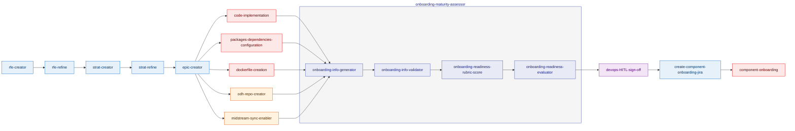

## Flow Diagram

### Legend

| Color     | Category                      | Stages         |
| --------- | ----------------------------- | -------------- |
| 🔵 Blue   | **Planning & Strategy**       | 1–5, 16        |
| 🔷 Indigo | **Assessment**                | 11, 12, 13, 14 |
| 🔴 Red    | **Development & Engineering** | 6, 7, 8, 17    |
| 🟠 Orange | **DevOps & Infrastructure**   | 9, 10          |
| 🟣 Purple | **Human Approval (HITL)**     | 15             |

## Stages

| #   | Stage                                     | Category        | Description                                               | Flow        |
| --- | ----------------------------------------- | --------------- | --------------------------------------------------------- | ----------- |
| 1   | **rfe-creator**                           | 🔵 Planning     | RFE (Requirement/Feature) creation                        | Sequential  |
| 2   | **rfe-refine**                            | 🔵 Planning     | RFE refinement                                            | Sequential  |
| 3   | **strat-creator**                         | 🔵 Planning     | Strategy creation                                         | Sequential  |
| 4   | **strat-refine**                          | 🔵 Planning     | Strategy refinement                                       | Sequential  |
| 5   | **epic-creator**                          | 🔵 Planning     | Epic decomposition into tasks                             | Sequential  |
| 6   | **code-implementation**                   | 🔴 Development  | Code implementation in upstream repos                     | Parallel    |
| 7   | **packages-dependencies-configuration**   | 🔴 Development  | Packages and dependencies configuration                   | Parallel    |
| 8   | **dockerfile-creation**                   | 🔴 Development  | Dockerfile creation                                       | Parallel    |
| 9   | **odh-repo-creator**                      | 🟠 DevOps/Infra | ODH repository creation                                   | Parallel    |
| 10  | **midstream-sync-enabler**                | 🟠 DevOps/Infra | Upstream to midstream sync enablement                     | Parallel    |
| 11  | **onboarding-info-generator**             | 🔷 Assessment   | Extract onboarding info from epics                        | Sequential  |
| 12  | **onboarding-info-validator**             | 🔷 Assessment   | Validate extracted onboarding info                        | Sequential  |
| 13  | **onboarding-readiness-rubric-score**     | 🔷 Assessment   | Score component readiness across rubric dimensions        | Sequential  |
| 14  | **onboarding-readiness-evaluator**        | 🔷 Assessment   | Evaluate readiness threshold and determine next action    | Sequential  |
| 15  | **devops-HITL-sign-off**                  | 🟣 Approval     | Human-in-the-loop review and approval                     | Sequential  |
| 16  | **create-component-onboarding-jira**      | 🔵 Planning     | Create onboarding Jira tickets (ODH + RHOAI)              | Sequential  |
| 17  | **component-onboarding**                  | 🔴 Development  | Execute component onboarding pipeline                     | Sequential  |

