## Flow Diagram

```mermaid
flowchart LR
    classDef planning   fill:#e7f1fa,stroke:#0066cc,color:#003366
    classDef assessment fill:#e8eaf6,stroke:#3949ab,color:#1a237e
    classDef dev        fill:#fde8e8,stroke:#ee0000,color:#660000
    classDef infra      fill:#fff3e0,stroke:#e65100,color:#4e2a00
    classDef approval   fill:#f3e5f5,stroke:#7b1fa2,color:#4a0072
    classDef trigger    fill:#fff9c4,stroke:#f9a825,color:#4a3800

    A[1. RFE Creator]:::planning
    B[2. Strat Creator]:::planning
    C[3. Epic Decomposer --> Onboarding Epic]:::planning
    D[4. Onboarding Info Generator + Validator]:::infra
    I[5. Onboarding Readiness Score <br /> rubric]:::assessment
    E[6. Code Implementation <br /> Packages + Dependencies Exploration <br /> Dockerfile Creator]:::dev
    F[7. ODH Repo Creator <br />+<br /> Midstream Sync Enabler]:::infra
    G[8. Onboarding Readiness Evaluator]:::assessment
    H[9. Onboarding Trigger through Gitops]:::trigger
    J[10. AI Review + DevOps HITL Sign off]:::approval
    K[11. ODH Component Onboarding]:::infra

    A --> B --> C --> D --> I --> E --> F --> G --> H --> J --> K
```

### Legend

| Color      | Category                      | Stages  |
| ---------- | ----------------------------- | ------- |
| 🔵 Blue    | **Planning & Strategy**       | 1, 2, 3 |
| 🟠 Orange  | **DevOps & Infrastructure**   | 4, 7, 11 |
| 🔷 Indigo  | **Assessment**                | 5, 8    |
| 🔴 Red     | **Development & Engineering** | 6       |
| 🟡 Yellow  | **Trigger / Automation**      | 9       |
| 🟣 Purple  | **Human Approval (HITL)**     | 10      |

## Stages

| #   | Stage                                                                              | Category         | Description                                                                              |
| --- | ---------------------------------------------------------------------------------- | ---------------- | ---------------------------------------------------------------------------------------- |
| 1   | **RFE Creator**                                                                    | 🔵 Planning      | Requirement/Feature creation                                                             |
| 2   | **Strat Creator**                                                                  | 🔵 Planning      | Strategy creation                                                                        |
| 3   | **Epic Decomposer → Onboarding Epic**                                             | 🔵 Planning      | Epic decomposition into tasks, producing the onboarding epic                             |
| 4   | **Onboarding Info Generator + Validator**                                          | 🟠 DevOps/Infra  | Generate and validate onboarding details (component metadata, repo info, dependencies)   |
| 5   | **Onboarding Readiness Score / Rubric**                                            | 🔷 Assessment    | Score component readiness against the onboarding rubric                                  |
| 6   | **Code Implementation + Packages & Dependencies Exploration + Dockerfile Creator** | 🔴 Development   | Upstream code implementation, package/dependency identification, and Dockerfile creation  |
| 7   | **ODH Repo Creator + Midstream Sync Enabler**                                      | 🟠 DevOps/Infra  | Create ODH repository and enable upstream-to-midstream sync                              |
| 8   | **Onboarding Readiness Evaluator**                                                 | 🔷 Assessment    | Evaluate component readiness post-setup before triggering onboarding                     |
| 9   | **Onboarding Trigger through GitOps**                                              | 🟡 Trigger       | Trigger the onboarding pipeline via GitOps automation                                    |
| 10  | **AI Review + DevOps HITL Sign off**                                               | 🟣 Approval      | AI-assisted review followed by human-in-the-loop DevOps approval                        |
| 11  | **ODH Component Onboarding**                                                       | 🟠 DevOps/Infra  | Execute the onboarding steps to register the component on the ODH/RHOAI platform        |

