## Flow Diagram

```mermaid
flowchart TD
    subgraph row1 [" "]
        direction LR
        A["1. RFE Creator"]:::planning --> B["2. Strat Creator"]:::planning --> C["3. Epic Decomposer"]:::planning --> D["4. Code Implementation in upstream repos"]:::dev
    end

    subgraph row2 [" "]
        direction LR
        E["5. Packages+Dependencies Generator"]:::dev --> F["6. Dockerfile Creator"]:::dev --> G["7. ODH Repo Creator"]:::infra
    end

    subgraph row3 [" "]
        direction LR
        H["8. Upstream to Midstream Sync Enabler"]:::infra --> I["9. ODH Component Onboarding Info Generator"]:::infra --> J["10. DevOps HITL Sign off"]:::approval
    end

    subgraph row4 [" "]
        direction LR
        K["11. ODH Component Onboarding"]:::infra --> L["12. ODH Build"]:::dev --> M["13. Q&E / Validation"]:::qe
    end

    subgraph row5 [" "]
        direction LR
        N["14. RHOAI Component Onboarding Info Generator"]:::infra --> O["15. DevOps HITL Sign off"]:::approval --> P["16. RHOAI Component Onboarding"]:::infra
    end

    subgraph row6 [" "]
        direction LR
        Q["17. RHOAI Build"]:::dev --> R["18. Q&E / Validation"]:::qe --> S["19. Release"]:::release
    end

    D -.->|"▼"| E
    G -.->|"▼"| H
    J -.->|"▼"| K
    M -.->|"▼"| N
    P -.->|"▼"| Q

    classDef planning fill:#e7f1fa,stroke:#0066cc,color:#003366
    classDef dev fill:#fde8e8,stroke:#ee0000,color:#660000
    classDef infra fill:#fff3e0,stroke:#e65100,color:#4e2a00
    classDef approval fill:#f3e5f5,stroke:#7b1fa2,color:#4a0072
    classDef qe fill:#e0f7fa,stroke:#00838f,color:#003d44
    classDef release fill:#e8f5e3,stroke:#3e8c35,color:#1a4d1a

    style row1 fill:none,stroke:none
    style row2 fill:none,stroke:none
    style row3 fill:none,stroke:none
    style row4 fill:none,stroke:none
    style row5 fill:none,stroke:none
    style row6 fill:none,stroke:none
```

### Legend

| Color | Category | Stages |
|-------|----------|--------|
| 🔵 Blue | **Planning & Strategy** | 1, 2, 3 |
| 🔴 Red | **Development & Engineering** | 4, 5, 6, 12, 17 |
| 🟠 Orange | **DevOps & Infrastructure** | 7, 8, 9, 11, 14, 16 |
| 🟣 Purple | **Human Approval (HITL)** | 10, 15 |
| 🔷 Teal | **Quality & Validation** | 13, 18 |
| 🟢 Green | **Release** | 19 |

## Stages

| # | Stage | Category | Description |
|---|-------|----------|-------------|
| 1 | **RFE Creator** | 🔵 Planning | Requirement/Feature creation |
| 2 | **Strat Creator** | 🔵 Planning | Strategy creation |
| 3 | **Epic Decomposer** | 🔵 Planning | Epic decomposition into tasks |
| 4 | **Code Implementation in upstream repos** | 🔴 Development | Implementation/development in upstream |
| 5 | **Packages+Dependencies Explorer** | 🔴 Development | Identify packages and dependencies |
| 6 | **Dockerfile Creator** | 🔴 Development | Create/update Dockerfiles |
| 7 | **ODH Repo Creator** | 🟠 DevOps/Infra | Create ODH repository |
| 8 | **upstream to midstream sync enabler** | 🟠 DevOps/Infra | Enable sync from upstream to midstream |
| 9 | **ODH Component Onboarding Info Generator** | 🟠 DevOps/Infra | Generate onboarding details for ODH |
| 10 | **DevOps HITL Sign off** | 🟣 Approval | Human-in-the-loop approval (ODH) |
| 11 | **ODH Component Onboarding** | 🟠 DevOps/Infra | Onboard component to ODH platform |
| 12 | **ODH Build** | 🔴 Development | Build ODH component |
| 13 | **Q&E / Validation** | 🔷 Quality | Quality Engineering validation (ODH) |
| 14 | **RHOAI Component Onboarding Info Generator** | 🟠 DevOps/Infra | Generate onboarding details for RHOAI |
| 15 | **DevOps HITL Sign off** | 🟣 Approval | Human-in-the-loop approval (RHOAI) |
| 16 | **RHOAI Component Onboarding** | 🟠 DevOps/Infra | Onboard component to RHOAI platform |
| 17 | **RHOAI Build** | 🔴 Development | Build RHOAI component |
| 18 | **Q&E / Validation** | 🔷 Quality | Quality Engineering validation (RHOAI) |
| 19 | **Release** | 🟢 Release | Final release |
