# ADLC Onboarding — Maturity Assessor & Automated Jira Creation

Detailed DAG (Directed Acyclic Graph) flow diagrams for the two skills that sit upstream
of the existing component onboarding orchestrator (`onboard-konflux-components-for-odh-and-rhoai`).

**DAG 1** assesses whether a component is ready for onboarding to **both ODH and RHOAI**.
**DAG 2** picks up ready components and creates **two onboarding Jira tickets** (ODH first, then RHOAI).

---

## 1. Onboarding-Maturity-Assessor Skill Flow

```mermaid
flowchart LR
    classDef extract   fill:#DDEEFF,stroke:#1A4A8A,color:#0d2045
    classDef validate  fill:#D4EDDA,stroke:#2D7D46,color:#154420
    classDef score     fill:#fff3e0,stroke:#e65100,color:#4e2a00
    classDef human     fill:#f3e5f5,stroke:#7b1fa2,color:#4a0072
    classDef trigger   fill:#fff9c4,stroke:#f9a825,color:#4a3800
    classDef errPath   fill:#fde8e8,stroke:#ee0000,color:#660000
    classDef condPath  fill:#F5F5F5,stroke:#AAAAAA,color:#555555,stroke-dasharray:5 3
    classDef decide    fill:#FFFBE6,stroke:#B8860B,color:#5a4000
    classDef start     fill:#E8E8E8,stroke:#444444,color:#111111
    classDef done      fill:#1A4A8A,stroke:#0d2045,color:#FFFFFF

    %% ── Schedule ──────────────────────────────────────────────
    subgraph SCHED["Schedule"]
        SCHED_START(["Every few hours — periodic trigger"]):::start
    end

    %% ── Stage A: Onboarding Info Generator ────────────────────
    subgraph STAGE_A["Stage A · Onboarding Info Generator"]
        A_ENTRY["Locate onboarding epic<br/>in Jira"]:::extract
        A_SCAN["Scan sibling epics<br/>under parent feature"]:::extract
        A_EXTRACT_DESC["Extract info from<br/>descriptions + comments"]:::extract
        A_EXTRACT_ATTACH["Extract info from<br/>attachments + linked issues"]:::extract
        A_FIELDS_COMMON["Extract common:<br/>component_name, repo_url,<br/>context_path, dockerfile_path"]:::extract
        A_FIELDS_ODH["Extract ODH:<br/>build_type (CI),<br/>odh_repo_branch"]:::extract
        A_FIELDS_RHOAI["Extract RHOAI:<br/>architectures,<br/>target_rhoai_version,<br/>rhoai_repo_branch,<br/>descriptions,<br/>release_category"]:::extract
        A_DEC_OPERATOR{"is_operator?"}:::decide
        A_FIELDS_OP["Extract:<br/>manifest_src_path,<br/>manifest_dest_path"]:::condPath
        A_DEC_FIRST{"Existing<br/>attachment<br/>on epic?"}:::decide
        A_CREATE["Create new structured<br/>attachment on epic"]:::extract
        A_UPDATE["Update existing<br/>attachment with<br/>new/changed fields"]:::extract
        A_PARTIAL["Store partial info —<br/>mark missing fields"]:::extract
    end

    %% ── Stage B: Onboarding Info Validator ────────────────────
    subgraph STAGE_B["Stage B · Onboarding Info Validator"]
        B_LOAD["Load info from<br/>Jira attachment"]:::validate
        B_REQ["Check required fields<br/>for both ODH + RHOAI"]:::validate
        B_FORMAT["Validate format:<br/>name regex, URL,<br/>branch naming"]:::validate
        B_ODH_CHECK["Validate ODH fields:<br/>build_type,<br/>odh_repo_branch"]:::validate
        B_RHOAI_CHECK["Validate RHOAI fields:<br/>architectures, version,<br/>descriptions,<br/>release_category"]:::validate
        B_BRANCH["Cross-validate:<br/>rhoai_repo_branch vs<br/>target_rhoai_version"]:::validate
        B_DF_FETCH["Check Dockerfile at<br/>repo_url / branch / path"]:::validate
        B_DEC_DF{"Dockerfile<br/>found?"}:::decide
        B_DIGEST["Check FROM instructions<br/>for @sha256 digest<br/>pinning"]:::validate
        B_DF_MISSING["Record:<br/>Dockerfile not found"]:::errPath
        B_DIGEST_FAIL["Record:<br/>digest violations"]:::errPath
        B_STATUS["Record validation<br/>status on Jira"]:::validate
        B_DEC_VALID{"All validations<br/>passed?"}:::decide
        B_PASS["Mark:<br/>validation-successful"]:::validate
        B_FAIL["Mark: validation-failed<br/>— list violations"]:::errPath
    end

    %% ── Stage C: Onboarding Readiness Rubric Score ────────────
    subgraph STAGE_C["Stage C · Onboarding Readiness Rubric Score"]
        C_CODE["Code Completeness<br/>(0–2)"]:::score
        C_REPO["Repository Setup<br/>(0–2)"]:::score
        C_DF["Dockerfile Readiness<br/>(0–2)"]:::score
        C_DEPS["Dependency Resolution<br/>(0–2)"]:::score
        C_INFO["Onboarding Info<br/>Completeness (0–2)<br/>— both ODH + RHOAI"]:::score
        C_CICD["CI/CD Prerequisites<br/>(0–2)"]:::score
        C_TOTAL["Compute total score<br/>(out of 12)"]:::score
        C_JIRA["Update score on Jira<br/>in structured format"]:::score
    end

    %% ── Stage D: Onboarding Readiness Evaluator ───────────────
    subgraph STAGE_D["Stage D · Onboarding Readiness Evaluator"]
        D_LOAD["Load total score +<br/>per-dimension scores"]:::score
        D_DEC{"Total ≥ 9<br/>AND<br/>no dimension = 0?"}:::decide
        D_READY["Add label:<br/>ready-for-human-review"]:::human
        D_PR["Raise PR to designated<br/>repo for HITL review"]:::human
        D_NOT_READY["Add label:<br/>not-ready-for-onboarding"]:::errPath
        D_LOG["Log failed dimensions<br/>+ remediation hints"]:::errPath
    end

    %% ── Stage E: Human Review Monitor ─────────────────────────
    subgraph STAGE_E["Stage E · Human Review Monitor"]
        E_CHECK["Check HITL<br/>PR status"]:::human
        E_DEC{"PR status?"}:::decide
        E_APPROVED["Remove: ready-for-human-review<br/>Add: ready-for-onboarding"]:::trigger
        E_REJECTED["Remove: ready-for-human-review<br/>Add: not-ready-for-onboarding"]:::errPath
        E_FEEDBACK["Log reviewer feedback<br/>on Jira"]:::errPath
        E_PENDING["No action —<br/>wait for next cycle"]:::condPath
    end

    %% ── Terminal ──────────────────────────────────────────────
    DONE_READY(["Component ready for<br/>onboarding (both products)"]):::done
    DONE_WAIT(["Awaiting next<br/>assessment cycle"]):::start

    %% ── Edges: Schedule → Stage A ─────────────────────────────
    SCHED_START --> A_ENTRY
    A_ENTRY --> A_SCAN
    A_SCAN --> A_EXTRACT_DESC
    A_SCAN --> A_EXTRACT_ATTACH
    A_EXTRACT_DESC --> A_FIELDS_COMMON
    A_EXTRACT_ATTACH --> A_FIELDS_COMMON

    %% ── Edges: Stage A sequential collection ─────────────────
    A_FIELDS_COMMON --> A_FIELDS_ODH
    A_FIELDS_ODH --> A_FIELDS_RHOAI
    A_FIELDS_RHOAI --> A_DEC_OPERATOR

    %% ── Edges: Stage A operator + persistence ─────────────────
    A_DEC_OPERATOR -->|"Yes"| A_FIELDS_OP
    A_FIELDS_OP --> A_DEC_FIRST
    A_DEC_OPERATOR -->|"No"| A_DEC_FIRST
    A_DEC_FIRST -->|"No (first run)"| A_CREATE
    A_DEC_FIRST -->|"Yes (subsequent)"| A_UPDATE
    A_CREATE -->|"Some fields missing"| A_PARTIAL
    A_UPDATE -->|"Some fields missing"| A_PARTIAL
    A_CREATE -->|"All fields found"| B_LOAD
    A_UPDATE -->|"All fields found"| B_LOAD
    A_PARTIAL -->|"Proceed with partial"| B_LOAD

    %% ── Edges: Stage B validation (both products) ─────────────
    B_LOAD --> B_REQ
    B_REQ --> B_FORMAT
    B_FORMAT --> B_ODH_CHECK
    B_ODH_CHECK --> B_RHOAI_CHECK
    B_RHOAI_CHECK --> B_BRANCH
    B_BRANCH --> B_DF_FETCH
    B_DF_FETCH --> B_DEC_DF
    B_DEC_DF -->|"Yes"| B_DIGEST
    B_DEC_DF -->|"No"| B_DF_MISSING
    B_DF_MISSING --> B_STATUS
    B_DIGEST -->|"Pass"| B_STATUS
    B_DIGEST -->|"Fail"| B_DIGEST_FAIL
    B_DIGEST_FAIL --> B_STATUS
    B_STATUS --> B_DEC_VALID
    B_DEC_VALID -->|"Yes"| B_PASS
    B_DEC_VALID -->|"No"| B_FAIL
    B_PASS --> C_CODE
    B_FAIL -->|"Proceed with known failures"| C_CODE

    %% ── Edges: Stage C scoring ────────────────────────────────
    C_CODE --> C_REPO
    C_REPO --> C_DF
    C_DF --> C_DEPS
    C_DEPS --> C_INFO
    C_INFO --> C_CICD
    C_CICD --> C_TOTAL
    C_TOTAL --> C_JIRA

    %% ── Edges: Stage D evaluation ─────────────────────────────
    C_JIRA --> D_LOAD
    D_LOAD --> D_DEC
    D_DEC -->|"Yes: score ≥ 9, no zeros"| D_READY
    D_READY --> D_PR
    D_PR --> E_CHECK
    D_DEC -->|"No"| D_NOT_READY
    D_NOT_READY --> D_LOG
    D_LOG --> DONE_WAIT

    %% ── Edges: Stage E human review ──────────────────────────
    E_CHECK --> E_DEC
    E_DEC -->|"Approved"| E_APPROVED
    E_APPROVED --> DONE_READY
    E_DEC -->|"Rejected"| E_REJECTED
    E_REJECTED --> E_FEEDBACK
    E_FEEDBACK --> DONE_WAIT
    E_DEC -->|"Pending"| E_PENDING
    E_PENDING --> DONE_WAIT
```



### Legend

| Color | Category | Usage |
|-------|----------|-------|
| 🔵 Blue | Information Gathering | Stage A — extracts all fields for both ODH and RHOAI |
| 🟢 Green | Validation | Stage B — validates both product field sets, Dockerfile checks |
| 🟠 Orange | Scoring / Assessment | Stage C — rubric dimensions (0–2 each) |
| 🟣 Purple | Human Interaction | Stage D ready state, Stage E HITL review |
| 🟡 Yellow | Automation / Trigger | `ready-for-onboarding` label handoff |
| 🔴 Red/Pink | Error / Failure | Validation failures, digest violations, rejection |
| ⬜ Grey dashed | Conditional | Operator-specific paths |
| 🟤 Amber | Decision | All diamond-shaped decision nodes |
| 🔷 Dark Blue | Terminal | Final done states |

### Required Fields (Collected for Both Products)

| Field | Common | ODH Ticket | RHOAI Ticket | is_operator = true |
|-------|:---:|:---:|:---:|:---:|
| `component_name` | ✓ | ✓ | ✓ | |
| `repo_url` | ✓ | ✓ | ✓ | |
| `context_path` | ✓ | ✓ | ✓ | |
| `dockerfile_path` | ✓ | ✓ | ✓ | |
| `is_operator` | ✓ | ✓ | ✓ | |
| `build_type` (CI) | | ✓ | | |
| `odh_repo_branch` | | ✓ | | |
| `architectures` | | | ✓ | |
| `target_rhoai_version` | | | ✓ | |
| `rhoai_repo_branch` | | | ✓ | |
| `long_description` | | | ✓ | |
| `short_description` | | | ✓ | |
| `release_category` | | | ✓ | |
| `operator_manifest_src_path` | | | | ✓ |
| `operator_manifest_dest_path` | | | | ✓ |

### Rubric Scoring Dimensions

| Dimension | Score | 0 | 1 | 2 |
|-----------|:---:|---|---|---|
| **Code Completeness** | 0–2 | No code / repo empty | Code exists, tests incomplete | Code implemented, tests passing |
| **Repository Setup** | 0–2 | Repo does not exist | Repo exists, ODH or RHOAI branch missing | Both ODH + RHOAI branches exist with correct structure |
| **Dockerfile Readiness** | 0–2 | No Dockerfile | Dockerfile exists, not digest-pinned | Dockerfile complete + digest-pinned |
| **Dependency Resolution** | 0–2 | Dependencies unexplored | Some deps identified, not all resolved | All upstream deps available |
| **Onboarding Info Completeness** | 0–2 | Critical fields missing for either product | Some required fields missing | ALL fields populated for BOTH ODH and RHOAI |
| **CI/CD Prerequisites** | 0–2 | No CI infrastructure | Partial CI setup | CI pipelines in place |

**Threshold**: total ≥ 9/12 **AND** no dimension scores 0 → **ready for human review** (both products)

---

## 2. Create Component Onboarding Jira (Automated) — Skill Flow

Creates **two Jira tickets** per component: ODH first, then RHOAI.

```mermaid
flowchart LR
    classDef extract   fill:#DDEEFF,stroke:#1A4A8A,color:#0d2045
    classDef validate  fill:#D4EDDA,stroke:#2D7D46,color:#154420
    classDef trigger   fill:#fff9c4,stroke:#f9a825,color:#4a3800
    classDef errPath   fill:#fde8e8,stroke:#ee0000,color:#660000
    classDef condPath  fill:#F5F5F5,stroke:#AAAAAA,color:#555555,stroke-dasharray:5 3
    classDef decide    fill:#FFFBE6,stroke:#B8860B,color:#5a4000
    classDef start     fill:#E8E8E8,stroke:#444444,color:#111111
    classDef done      fill:#1A4A8A,stroke:#0d2045,color:#FFFFFF

    %% ── Schedule ──────────────────────────────────────────────
    subgraph SCHED["Schedule"]
        SCHED_START(["Periodic trigger"]):::start
    end

    %% ── Step 1: Discovery ─────────────────────────────────────
    subgraph DISCOVER["Step 1 · Discovery"]
        J_QUERY["Query Jira:<br/>label = ready-for-onboarding"]:::extract
        J_DEC_FOUND{"Epics<br/>found?"}:::decide
        J_NONE(["No eligible epics<br/>— exit"]):::start
    end

    %% ── For Each Epic ─────────────────────────────────────────
    subgraph LOOP["For Each Epic"]

        J_ITER["Pick next epic<br/>from result set"]:::extract

        %% ── Step 2: Extract Info ──────────────────────────────
        subgraph EXTRACT["Step 2 · Extract Combined Info"]
            J_EXTRACT["Extract structured<br/>attachment from epic"]:::extract
            J_DEC_ATTACH{"Attachment<br/>found?"}:::decide
            J_NO_ATTACH["Log error —<br/>skip epic"]:::errPath
            J_PARSE["Parse combined<br/>onboarding info<br/>(ODH + RHOAI fields)"]:::extract
        end

        %% ── ODH Phase ─────────────────────────────────────────
        subgraph ODH_PHASE["ODH Onboarding Ticket (first)"]
            O_BUILD["Build ODH YAML:<br/>common fields +<br/>build_type (CI) +<br/>odh_repo_branch"]:::extract
            O_DEC_OP{"is_operator?"}:::decide
            O_OP["Add: manifest_src_path,<br/>manifest_dest_path"]:::condPath
            O_WRITE["Write ODH<br/>onboarding YAML"]:::extract
            O_SCHEMA["Validate ODH YAML<br/>against schema"]:::validate
            O_DEC_SCHEMA{"Valid?"}:::decide
            O_FAIL["ODH schema errors<br/>— skip epic"]:::errPath
            O_DEC_EXISTING{"Existing<br/>ODH Jira?"}:::decide
            O_CLONE["Clone ODH template<br/>RHOAIENG-35683"]:::trigger
            O_ERR_CLONE["Clone failed<br/>— skip epic"]:::errPath
            O_ATTACH["Upload ODH YAML<br/>to ticket"]:::trigger
            O_ERR_ATTACH["Upload failed<br/>— skip epic"]:::errPath
            O_LABELS["Add labels:<br/>yaml-attached"]:::trigger
            O_LINK["Link to<br/>parent feature"]:::trigger
            O_META["Update title,<br/>description, labels"]:::trigger
            O_DONE["ODH ticket created"]:::trigger
        end

        %% ── RHOAI Phase ───────────────────────────────────────
        subgraph RHOAI_PHASE["RHOAI Onboarding Ticket (second)"]
            R_BUILD["Build RHOAI YAML:<br/>common fields +<br/>RHOAI fields +<br/>rhoai_repo_branch"]:::extract
            R_DEC_OP{"is_operator?"}:::decide
            R_OP["Add: manifest_src_path,<br/>manifest_dest_path"]:::condPath
            R_WRITE["Write RHOAI<br/>onboarding YAML"]:::extract
            R_SCHEMA["Validate RHOAI YAML<br/>against schema"]:::validate
            R_DEC_SCHEMA{"Valid?"}:::decide
            R_FAIL["RHOAI schema errors<br/>— skip epic"]:::errPath
            R_DF["Check Dockerfile<br/>@sha256 digest<br/>pinning"]:::validate
            R_DEC_DF{"Dockerfile<br/>check?"}:::decide
            R_DF_PASS["Digest check<br/>passed"]:::validate
            R_DF_404["Not found —<br/>continue with notice"]:::errPath
            R_DF_FAIL["Digest violations<br/>— skip epic"]:::errPath
            R_DEC_EXISTING{"Existing<br/>RHOAI Jira?"}:::decide
            R_CLONE["Clone RHOAI template<br/>RHOAIENG-17225"]:::trigger
            R_ERR_CLONE["Clone failed<br/>— skip epic"]:::errPath
            R_ATTACH["Upload RHOAI YAML<br/>to ticket"]:::trigger
            R_ERR_ATTACH["Upload failed<br/>— skip epic"]:::errPath
            R_LABELS["Add labels:<br/>yaml-attached"]:::trigger
            R_LINK["Link to<br/>parent feature"]:::trigger
            R_META["Update title,<br/>description, labels"]:::trigger
        end

        %% ── Downstream ───────────────────────────────────────
        subgraph DOWNSTREAM["Downstream"]
            D_READY["Both tickets ready<br/>for orchestrator"]:::trigger
            D_LINK(["ODH onboarded first,<br/>then RHOAI"]):::done
        end

        J_NEXT{"More<br/>epics?"}:::decide
    end

    DONE_ALL(["All epics processed<br/>— exit"]):::done

    %% ── Edges: Schedule → Discovery ───────────────────────────
    SCHED_START --> J_QUERY
    J_QUERY --> J_DEC_FOUND
    J_DEC_FOUND -->|"Yes"| J_ITER
    J_DEC_FOUND -->|"No"| J_NONE

    %% ── Edges: Extract ────────────────────────────────────────
    J_ITER --> J_EXTRACT
    J_EXTRACT --> J_DEC_ATTACH
    J_DEC_ATTACH -->|"Yes"| J_PARSE
    J_DEC_ATTACH -->|"No"| J_NO_ATTACH
    J_NO_ATTACH --> J_NEXT

    %% ── Edges: ODH Phase ──────────────────────────────────────
    J_PARSE --> O_BUILD
    O_BUILD --> O_DEC_OP
    O_DEC_OP -->|"Yes"| O_OP
    O_OP --> O_WRITE
    O_DEC_OP -->|"No"| O_WRITE
    O_WRITE --> O_SCHEMA
    O_SCHEMA --> O_DEC_SCHEMA
    O_DEC_SCHEMA -->|"Pass"| O_DEC_EXISTING
    O_DEC_SCHEMA -->|"Fail"| O_FAIL
    O_FAIL --> J_NEXT
    O_DEC_EXISTING -->|"Yes (existing)"| O_ATTACH
    O_DEC_EXISTING -->|"No (new)"| O_CLONE
    O_CLONE --> O_ATTACH
    O_CLONE -->|"Failed"| O_ERR_CLONE
    O_ERR_CLONE --> J_NEXT
    O_ATTACH --> O_LABELS
    O_ATTACH -->|"Failed"| O_ERR_ATTACH
    O_ERR_ATTACH --> J_NEXT
    O_LABELS -->|"label: yaml-attached"| O_LINK
    O_LINK --> O_META
    O_META --> O_DONE

    %% ── Edges: ODH → RHOAI handoff ───────────────────────────
    O_DONE -->|"ODH done, start RHOAI"| R_BUILD

    %% ── Edges: RHOAI Phase ───────────────────────────────────
    R_BUILD --> R_DEC_OP
    R_DEC_OP -->|"Yes"| R_OP
    R_OP --> R_WRITE
    R_DEC_OP -->|"No"| R_WRITE
    R_WRITE --> R_SCHEMA
    R_SCHEMA --> R_DEC_SCHEMA
    R_DEC_SCHEMA -->|"Pass"| R_DF
    R_DEC_SCHEMA -->|"Fail"| R_FAIL
    R_FAIL --> J_NEXT
    R_DF --> R_DEC_DF
    R_DEC_DF -->|"Pass"| R_DF_PASS
    R_DEC_DF -->|"Not found (exit 2)"| R_DF_404
    R_DEC_DF -->|"Violations (exit 1)"| R_DF_FAIL
    R_DF_PASS --> R_DEC_EXISTING
    R_DF_404 -->|"Continue with notice"| R_DEC_EXISTING
    R_DF_FAIL --> J_NEXT
    R_DEC_EXISTING -->|"Yes (existing)"| R_ATTACH
    R_DEC_EXISTING -->|"No (new)"| R_CLONE
    R_CLONE --> R_ATTACH
    R_CLONE -->|"Failed"| R_ERR_CLONE
    R_ERR_CLONE --> J_NEXT
    R_ATTACH --> R_LABELS
    R_ATTACH -->|"Failed"| R_ERR_ATTACH
    R_ERR_ATTACH --> J_NEXT
    R_LABELS -->|"label: yaml-attached"| R_LINK
    R_LINK --> R_META

    %% ── Edges: Downstream ─────────────────────────────────────
    R_META --> D_READY
    D_READY --> D_LINK
    D_LINK --> J_NEXT

    %% ── Edges: Loop control ───────────────────────────────────
    J_NEXT -->|"Yes"| J_ITER
    J_NEXT -->|"No"| DONE_ALL
```



### Legend

| Color | Category | Usage |
|-------|----------|-------|
| 🔵 Blue | Information Gathering | Extraction, YAML building |
| 🟢 Green | Validation | Schema validation, Dockerfile digest check |
| 🟡 Yellow | Automation / Trigger | Template cloning, YAML upload, label updates, downstream trigger |
| 🔴 Red/Pink | Error / Failure | Schema failures, digest violations, clone/upload failures |
| ⬜ Grey dashed | Conditional | Operator-specific paths |
| 🟤 Amber | Decision | All diamond-shaped decision nodes |
| 🔷 Dark Blue | Terminal | Final "ready for orchestrator" and "all done" states |
| ⬛ Grey | Start / No-op | Schedule trigger, no-epics exit |

---

## Jira Label State Machine (Across Both DAGs)

```
Epic created (no label)
  │
  ├─ [DAG 1 · Stage D: score < threshold] ──→ not-ready-for-onboarding
  │                                               │
  │                                    (next cycle re-assesses)
  │
  └─ [DAG 1 · Stage D: score ≥ threshold] ─→ ready-for-human-review
                                                  │
                    ┌─────────────────────────────┼──────────────────┐
                    │                             │                  │
        [Stage E: PR approved]       [Stage E: PR rejected]   [Stage E: pending]
                    │                             │                  │
          ready-for-onboarding       not-ready-for-onboarding   (wait next cycle)
                    │
        [DAG 2: picks up epic]
                    │
          ┌── ODH Jira ticket created ── yaml-attached
          │
          └── RHOAI Jira ticket created ── yaml-attached
                    │
        [Orchestrator: ODH onboarded first, then RHOAI]
```

---

## Edge Cases Reference

| Edge Case | DAG | How It's Handled |
|-----------|:---:|-----------------|
| First run — no info exists yet | 1 | `A_DEC_FIRST` → "No (first run)" → `A_CREATE` creates initial attachment |
| Partial info available | 1 | `A_PARTIAL` marks missing fields; `C_INFO` scores 0–1, reducing total |
| Human rejects HITL review | 1 | `E_DEC` → "Rejected" → removes `ready-for-human-review`, logs feedback, re-assessed next cycle |
| Dockerfile doesn't exist yet | 1 | `B_DEC_DF` → "No" → `B_DF_MISSING` (non-blocking, reduces `C_DF` rubric score) |
| Dockerfile doesn't exist | 2 | `R_DEC_DF` → "Not found" → `R_DF_404` continues RHOAI phase with notice |
| Digest pinning violations | 2 | `R_DEC_DF` → "Violations" → `R_DF_FAIL` → skip epic |
| `is_operator` conditional | Both | Manifest paths extracted/added for both ODH and RHOAI YAMLs |
| No structured attachment on epic | 2 | `J_DEC_ATTACH` → "No" → `J_NO_ATTACH` → skip to next epic |
| ODH schema validation fails | 2 | `O_FAIL` → skip entire epic (neither ticket created) |
| RHOAI schema validation fails | 2 | `R_FAIL` → skip epic (ODH ticket already created — note in Jira) |
| ODH clone template fails | 2 | `O_ERR_CLONE` → skip entire epic |
| RHOAI clone template fails | 2 | `R_ERR_CLONE` → skip epic (ODH ticket already created — note in Jira) |
| YAML upload fails | 2 | `O_ERR_ATTACH` / `R_ERR_ATTACH` → skip epic |
| HITL PR still pending | 1 | `E_DEC` → "Pending" → `E_PENDING` → `DONE_WAIT` (re-checked next cycle) |
| No eligible epics found | 2 | `J_DEC_FOUND` → "No" → `J_NONE` (clean exit) |
