# ADLC Onboarding — Maturity Assessor & Automated Jira Creation

Detailed DAG (Directed Acyclic Graph) flow diagrams for the two skills that sit upstream
of the existing component onboarding orchestrator (`onboard-konflux-components-for-odh-and-rhoai`).

**DAG 1** assesses whether a component is ready for onboarding.
**DAG 2** picks up ready components and creates the onboarding Jira ticket automatically.

---

## 1. Onboarding-Maturity-Assessor Skill Flow

```mermaid
flowchart LR
    classDef extract   fill:#DDEEFF,stroke:#1A4A8A,color:#0d2045
    classDef validate  fill:#D4EDDA,stroke:#2D7D46,color:#154420
    classDef score     fill:#fff3e0,stroke:#e65100,color:#4e2a00
    classDef human     fill:#f3e5f5,stroke:#7b1fa2,color:#4a0072
    classDef trigger   fill:#fff9c4,stroke:#f9a825,color:#4a3800
    classDef errPath   fill:#fde8e8,stroke:#ee0000,color:#660000
    classDef condPath  fill:#F5F5F5,stroke:#AAAAAA,color:#555555,stroke-dasharray:5 3
    classDef decide    fill:#FFFBE6,stroke:#B8860B,color:#5a4000
    classDef start     fill:#E8E8E8,stroke:#444444,color:#111111
    classDef done      fill:#1A4A8A,stroke:#0d2045,color:#FFFFFF

    %% ── Schedule ──────────────────────────────────────────────
    subgraph SCHED["Schedule"]
        SCHED_START(["Every few hours — periodic trigger"]):::start
    end

    %% ── Stage A: Onboarding Info Generator ────────────────────
    subgraph STAGE_A["Stage A · Onboarding Info Generator"]
        A_ENTRY["Locate onboarding epic<br/>in Jira"]:::extract
        A_SCAN["Scan sibling epics<br/>under parent feature"]:::extract
        A_EXTRACT_DESC["Extract info from<br/>descriptions + comments"]:::extract
        A_EXTRACT_ATTACH["Extract info from<br/>attachments + linked issues"]:::extract
        A_DEC_PRODUCT{"ODH or RHOAI?"}:::decide
        A_FIELDS_COMMON["Extract common fields:<br/>component_name, repo_url,<br/>repo_branch, context_path,<br/>dockerfile_path"]:::extract
        A_FIELDS_ODH["Extract ODH:<br/>build_type"]:::condPath
        A_DEC_BUILD{"build_type =<br/>Release?"}:::decide
        A_FIELDS_RELEASE["Extract:<br/>odh_release_tag"]:::condPath
        A_FIELDS_RHOAI["Extract RHOAI:<br/>architectures,<br/>target_rhoai_version,<br/>descriptions,<br/>release_category"]:::condPath
        A_DEC_OPERATOR{"is_operator?"}:::decide
        A_FIELDS_OP["Extract:<br/>manifest_src_path,<br/>manifest_dest_path"]:::condPath
        A_DEC_FIRST{"Existing<br/>attachment<br/>on epic?"}:::decide
        A_CREATE["Create new structured<br/>attachment on epic"]:::extract
        A_UPDATE["Update existing<br/>attachment with<br/>new/changed fields"]:::extract
        A_PARTIAL["Store partial info —<br/>mark missing fields"]:::extract
    end

    %% ── Stage B: Onboarding Info Validator ────────────────────
    subgraph STAGE_B["Stage B · Onboarding Info Validator"]
        B_LOAD["Load info from<br/>Jira attachment"]:::validate
        B_REQ["Check required<br/>fields present"]:::validate
        B_FORMAT["Validate format:<br/>name regex, URL,<br/>branch naming"]:::validate
        B_DEC_PRODUCT{"ODH or RHOAI?"}:::decide
        B_BRANCH["Cross-validate:<br/>repo_branch vs<br/>target_rhoai_version"]:::validate
        B_DF_FETCH["Check Dockerfile at<br/>repo_url / branch / path"]:::validate
        B_DEC_DF{"Dockerfile<br/>found?"}:::decide
        B_DIGEST["Check FROM instructions<br/>for @sha256 digest<br/>pinning"]:::validate
        B_DF_MISSING["Record:<br/>Dockerfile not found"]:::errPath
        B_DIGEST_FAIL["Record:<br/>digest violations"]:::errPath
        B_STATUS["Record validation<br/>status on Jira"]:::validate
        B_DEC_VALID{"All validations<br/>passed?"}:::decide
        B_PASS["Mark:<br/>validation-successful"]:::validate
        B_FAIL["Mark: validation-failed<br/>— list violations"]:::errPath
    end

    %% ── Stage C: Onboarding Readiness Rubric Score ────────────
    subgraph STAGE_C["Stage C · Onboarding Readiness Rubric Score"]
        C_CODE["Code Completeness<br/>(0–2)"]:::score
        C_REPO["Repository Setup<br/>(0–2)"]:::score
        C_DF["Dockerfile Readiness<br/>(0–2)"]:::score
        C_DEPS["Dependency Resolution<br/>(0–2)"]:::score
        C_INFO["Onboarding Info<br/>Completeness (0–2)"]:::score
        C_CICD["CI/CD Prerequisites<br/>(0–2)"]:::score
        C_TOTAL["Compute total score<br/>(out of 12)"]:::score
        C_JIRA["Update score on Jira<br/>in structured format"]:::score
    end

    %% ── Stage D: Onboarding Readiness Evaluator ───────────────
    subgraph STAGE_D["Stage D · Onboarding Readiness Evaluator"]
        D_LOAD["Load total score +<br/>per-dimension scores"]:::score
        D_DEC{"Total ≥ 9<br/>AND<br/>no dimension = 0?"}:::decide
        D_READY["Add label:<br/>ready-for-human-review"]:::human
        D_PR["Raise PR to designated<br/>repo for HITL review"]:::human
        D_NOT_READY["Add label:<br/>not-ready-for-onboarding"]:::errPath
        D_LOG["Log failed dimensions<br/>+ remediation hints"]:::errPath
    end

    %% ── Stage E: Human Review Monitor ─────────────────────────
    subgraph STAGE_E["Stage E · Human Review Monitor"]
        E_CHECK["Check HITL<br/>PR status"]:::human
        E_DEC{"PR status?"}:::decide
        E_APPROVED["Remove: ready-for-human-review<br/>Add: ready-for-onboarding"]:::trigger
        E_REJECTED["Remove: ready-for-human-review<br/>Add: not-ready-for-onboarding"]:::errPath
        E_FEEDBACK["Log reviewer feedback<br/>on Jira"]:::errPath
        E_PENDING["No action —<br/>wait for next cycle"]:::condPath
    end

    %% ── Terminal ──────────────────────────────────────────────
    DONE_READY(["Component ready<br/>for onboarding"]):::done
    DONE_WAIT(["Awaiting next<br/>assessment cycle"]):::start

    %% ── Edges: Schedule → Stage A ─────────────────────────────
    SCHED_START --> A_ENTRY
    A_ENTRY --> A_SCAN
    A_SCAN --> A_EXTRACT_DESC
    A_SCAN --> A_EXTRACT_ATTACH
    A_EXTRACT_DESC --> A_DEC_PRODUCT
    A_EXTRACT_ATTACH --> A_DEC_PRODUCT

    %% ── Edges: Stage A product branching ──────────────────────
    A_DEC_PRODUCT -->|"Always"| A_FIELDS_COMMON
    A_FIELDS_COMMON --> A_DEC_OPERATOR
    A_DEC_PRODUCT -->|"ODH"| A_FIELDS_ODH
    A_FIELDS_ODH --> A_DEC_BUILD
    A_DEC_BUILD -->|"Yes (Release)"| A_FIELDS_RELEASE
    A_FIELDS_RELEASE --> A_DEC_OPERATOR
    A_DEC_BUILD -->|"No (CI)"| A_DEC_OPERATOR
    A_DEC_PRODUCT -->|"RHOAI"| A_FIELDS_RHOAI
    A_FIELDS_RHOAI --> A_DEC_OPERATOR

    %% ── Edges: Stage A operator + persistence ─────────────────
    A_DEC_OPERATOR -->|"Yes"| A_FIELDS_OP
    A_FIELDS_OP --> A_DEC_FIRST
    A_DEC_OPERATOR -->|"No"| A_DEC_FIRST
    A_DEC_FIRST -->|"No (first run)"| A_CREATE
    A_DEC_FIRST -->|"Yes (subsequent)"| A_UPDATE
    A_CREATE -->|"Some fields missing"| A_PARTIAL
    A_UPDATE -->|"Some fields missing"| A_PARTIAL
    A_CREATE -->|"All fields found"| B_LOAD
    A_UPDATE -->|"All fields found"| B_LOAD
    A_PARTIAL -->|"Proceed with partial"| B_LOAD

    %% ── Edges: Stage B validation ─────────────────────────────
    B_LOAD --> B_REQ
    B_REQ --> B_FORMAT
    B_FORMAT --> B_DEC_PRODUCT
    B_DEC_PRODUCT -->|"ODH"| B_STATUS
    B_DEC_PRODUCT -->|"RHOAI"| B_BRANCH
    B_BRANCH --> B_DF_FETCH
    B_DF_FETCH --> B_DEC_DF
    B_DEC_DF -->|"Yes"| B_DIGEST
    B_DEC_DF -->|"No"| B_DF_MISSING
    B_DF_MISSING --> B_STATUS
    B_DIGEST -->|"Pass"| B_STATUS
    B_DIGEST -->|"Fail"| B_DIGEST_FAIL
    B_DIGEST_FAIL --> B_STATUS
    B_STATUS --> B_DEC_VALID
    B_DEC_VALID -->|"Yes"| B_PASS
    B_DEC_VALID -->|"No"| B_FAIL
    B_PASS --> C_CODE
    B_FAIL -->|"Proceed with known failures"| C_CODE

    %% ── Edges: Stage C scoring ────────────────────────────────
    C_CODE --> C_REPO
    C_REPO --> C_DF
    C_DF --> C_DEPS
    C_DEPS --> C_INFO
    C_INFO --> C_CICD
    C_CICD --> C_TOTAL
    C_TOTAL --> C_JIRA

    %% ── Edges: Stage D evaluation ─────────────────────────────
    C_JIRA --> D_LOAD
    D_LOAD --> D_DEC
    D_DEC -->|"Yes: score ≥ 9, no zeros"| D_READY
    D_READY --> D_PR
    D_PR --> E_CHECK
    D_DEC -->|"No"| D_NOT_READY
    D_NOT_READY --> D_LOG
    D_LOG --> DONE_WAIT

    %% ── Edges: Stage E human review ──────────────────────────
    E_CHECK --> E_DEC
    E_DEC -->|"Approved"| E_APPROVED
    E_APPROVED --> DONE_READY
    E_DEC -->|"Rejected"| E_REJECTED
    E_REJECTED --> E_FEEDBACK
    E_FEEDBACK --> DONE_WAIT
    E_DEC -->|"Pending"| E_PENDING
    E_PENDING --> DONE_WAIT
```



### Legend

| Color | Category | Usage |
|-------|----------|-------|
| 🔵 Blue | Information Gathering | Stage A — extraction from Jira epics |
| 🟢 Green | Validation | Stage B — schema, format, Dockerfile checks |
| 🟠 Orange | Scoring / Assessment | Stage C — rubric dimensions (0–2 each) |
| 🟣 Purple | Human Interaction | Stage D ready state, Stage E HITL review |
| 🟡 Yellow | Automation / Trigger | `ready-for-onboarding` label handoff |
| 🔴 Red/Pink | Error / Failure | Validation failures, digest violations, rejection |
| ⬜ Grey dashed | Conditional | Product-specific (ODH/RHOAI), operator-specific paths |
| 🟤 Amber | Decision | All diamond-shaped decision nodes |
| 🔷 Dark Blue | Terminal | Final done states |

### Required Fields by Product Context

| Field | Always Required | ODH | RHOAI | is_operator = true |
|-------|:---:|:---:|:---:|:---:|
| `product_context` | ✓ | | | |
| `component_name` | ✓ | | | |
| `repo_url` | ✓ | | | |
| `repo_branch` | ✓ | | | |
| `context_path` | ✓ | | | |
| `dockerfile_path` | ✓ | | | |
| `is_operator` | ✓ | | | |
| `build_type` | | ✓ | | |
| `odh_release_tag` | | Release only | | |
| `architectures` | | | ✓ | |
| `target_rhoai_version` | | | ✓ | |
| `long_description` | | | ✓ | |
| `short_description` | | | ✓ | |
| `release_category` | | | ✓ | |
| `operator_manifest_src_path` | | | | ✓ |
| `operator_manifest_dest_path` | | | | ✓ |

### Rubric Scoring Dimensions

| Dimension | Score | 0 | 1 | 2 |
|-----------|:---:|---|---|---|
| **Code Completeness** | 0–2 | No code / repo empty | Code exists, tests incomplete | Code implemented, tests passing |
| **Repository Setup** | 0–2 | Repo does not exist | Repo exists, branch missing or structure wrong | Repo + branch + correct structure |
| **Dockerfile Readiness** | 0–2 | No Dockerfile | Dockerfile exists, deps incomplete or not digest-pinned (RHOAI) | Dockerfile complete + digest-pinned |
| **Dependency Resolution** | 0–2 | Dependencies unexplored | Some deps identified, not all resolved | All upstream deps available |
| **Onboarding Info Completeness** | 0–2 | Missing critical fields | Some required fields missing | All required YAML fields populated + valid |
| **CI/CD Prerequisites** | 0–2 | No CI infrastructure | Partial CI setup | CI pipelines in place |

**Threshold**: total ≥ 9/12 **AND** no dimension scores 0 → **ready for human review**

---

## 2. Create Component Onboarding Jira (Automated) — Skill Flow

```mermaid
flowchart LR
    classDef extract   fill:#DDEEFF,stroke:#1A4A8A,color:#0d2045
    classDef validate  fill:#D4EDDA,stroke:#2D7D46,color:#154420
    classDef trigger   fill:#fff9c4,stroke:#f9a825,color:#4a3800
    classDef errPath   fill:#fde8e8,stroke:#ee0000,color:#660000
    classDef condPath  fill:#F5F5F5,stroke:#AAAAAA,color:#555555,stroke-dasharray:5 3
    classDef decide    fill:#FFFBE6,stroke:#B8860B,color:#5a4000
    classDef start     fill:#E8E8E8,stroke:#444444,color:#111111
    classDef done      fill:#1A4A8A,stroke:#0d2045,color:#FFFFFF

    %% ── Schedule ──────────────────────────────────────────────
    subgraph SCHED["Schedule"]
        SCHED_START(["Periodic trigger"]):::start
    end

    %% ── Step 1: Discovery ─────────────────────────────────────
    subgraph DISCOVER["Step 1 · Discovery"]
        J_QUERY["Query Jira:<br/>label = ready-for-onboarding"]:::extract
        J_DEC_FOUND{"Epics<br/>found?"}:::decide
        J_NONE(["No eligible epics<br/>— exit"]):::start
    end

    %% ── For Each Epic ─────────────────────────────────────────
    subgraph LOOP["For Each Epic"]

        J_ITER["Pick next epic<br/>from result set"]:::extract

        %% ── Step 2: Extract Info ──────────────────────────────
        subgraph EXTRACT["Step 2 · Extract Info"]
            J_EXTRACT["Extract structured<br/>attachment from epic"]:::extract
            J_DEC_ATTACH{"Attachment<br/>found?"}:::decide
            J_NO_ATTACH["Log error —<br/>skip epic"]:::errPath
            J_PARSE["Parse onboarding<br/>info from attachment"]:::extract
        end

        %% ── Step 3: Generate YAML ─────────────────────────────
        subgraph GENERATE["Step 3 · Generate YAML"]
            J_DEC_PRODUCT{"ODH or<br/>RHOAI?"}:::decide
            Y_COMMON["Build YAML:<br/>common fields"]:::extract
            Y_ODH["Add ODH:<br/>build_type"]:::condPath
            Y_DEC_BUILD{"build_type =<br/>Release?"}:::decide
            Y_RELEASE["Add:<br/>odh_release_tag"]:::condPath
            Y_RHOAI["Add RHOAI:<br/>architectures, version,<br/>descriptions,<br/>release_category"]:::condPath
            Y_DEC_OP{"is_operator?"}:::decide
            Y_OP["Add: manifest_src_path,<br/>manifest_dest_path"]:::condPath
            Y_WRITE["Write component_<br/>onboarding_details.yaml"]:::extract
        end

        %% ── Steps 4–5: Validate ──────────────────────────────
        subgraph VALIDATE["Steps 4–5 · Validate"]
            V_SCHEMA["Validate YAML<br/>against JSON schema"]:::validate
            V_DEC_SCHEMA{"Schema<br/>valid?"}:::decide
            V_FAIL["Log schema errors<br/>— skip epic"]:::errPath
            V_DEC_DF{"RHOAI?"}:::decide
            V_DF["Check Dockerfile<br/>@sha256 digest<br/>pinning"]:::validate
            V_DEC_DF_RESULT{"Dockerfile<br/>check result?"}:::decide
            V_DF_PASS["Digest check<br/>passed"]:::validate
            V_DF_404["Not found —<br/>continue with notice"]:::errPath
            V_DF_FAIL["Digest violations<br/>— skip epic"]:::errPath
            V_ODH_SKIP["Dockerfile check<br/>skipped (ODH)"]:::condPath
        end

        %% ── Steps 6–8: Jira Operations ───────────────────────
        subgraph JIRA_OPS["Steps 6–8 · Jira Operations"]
            T_DEC_EXISTING{"Existing<br/>onboarding<br/>Jira linked?"}:::decide
            T_DEC_PRODUCT{"ODH or<br/>RHOAI?"}:::decide
            T_CLONE_ODH["Clone template<br/>RHOAIENG-35683"]:::trigger
            T_CLONE_RHOAI["Clone template<br/>RHOAIENG-17225"]:::trigger
            T_ERR_CLONE["Clone failed<br/>— skip epic"]:::errPath
            T_ATTACH["Upload YAML<br/>to ticket"]:::trigger
            T_ERR_ATTACH["Upload failed<br/>— skip epic"]:::errPath
            T_LABELS["Add labels:<br/>yaml-attached"]:::trigger
            T_LINK["Link to<br/>parent feature"]:::trigger
            T_META["Update title,<br/>description table,<br/>labels"]:::trigger
        end

        %% ── Step 9: Downstream ────────────────────────────────
        subgraph DOWNSTREAM["Step 9 · Downstream Trigger"]
            D_READY["Onboarding Jira ready<br/>for orchestrator"]:::trigger
            D_LINK(["Picked up by<br/>onboard-konflux-<br/>components skill"]):::done
        end

        J_NEXT{"More<br/>epics?"}:::decide
    end

    DONE_ALL(["All epics processed<br/>— exit"]):::done

    %% ── Edges: Schedule → Discovery ───────────────────────────
    SCHED_START --> J_QUERY
    J_QUERY --> J_DEC_FOUND
    J_DEC_FOUND -->|"Yes"| J_ITER
    J_DEC_FOUND -->|"No"| J_NONE

    %% ── Edges: Extract ────────────────────────────────────────
    J_ITER --> J_EXTRACT
    J_EXTRACT --> J_DEC_ATTACH
    J_DEC_ATTACH -->|"Yes"| J_PARSE
    J_DEC_ATTACH -->|"No"| J_NO_ATTACH
    J_NO_ATTACH --> J_NEXT

    %% ── Edges: Generate YAML ──────────────────────────────────
    J_PARSE --> J_DEC_PRODUCT
    J_DEC_PRODUCT -->|"Always"| Y_COMMON
    Y_COMMON --> Y_DEC_OP
    J_DEC_PRODUCT -->|"ODH"| Y_ODH
    Y_ODH --> Y_DEC_BUILD
    Y_DEC_BUILD -->|"Yes (Release)"| Y_RELEASE
    Y_RELEASE --> Y_DEC_OP
    Y_DEC_BUILD -->|"No (CI)"| Y_DEC_OP
    J_DEC_PRODUCT -->|"RHOAI"| Y_RHOAI
    Y_RHOAI --> Y_DEC_OP
    Y_DEC_OP -->|"Yes"| Y_OP
    Y_OP --> Y_WRITE
    Y_DEC_OP -->|"No"| Y_WRITE

    %% ── Edges: Validate ───────────────────────────────────────
    Y_WRITE --> V_SCHEMA
    V_SCHEMA --> V_DEC_SCHEMA
    V_DEC_SCHEMA -->|"Pass"| V_DEC_DF
    V_DEC_SCHEMA -->|"Fail"| V_FAIL
    V_FAIL --> J_NEXT
    V_DEC_DF -->|"RHOAI"| V_DF
    V_DEC_DF -->|"ODH"| V_ODH_SKIP
    V_DF --> V_DEC_DF_RESULT
    V_DEC_DF_RESULT -->|"Pass"| V_DF_PASS
    V_DEC_DF_RESULT -->|"Not found (exit 2)"| V_DF_404
    V_DEC_DF_RESULT -->|"Violations (exit 1)"| V_DF_FAIL
    V_DF_PASS --> T_DEC_EXISTING
    V_DF_404 -->|"Continue with notice"| T_DEC_EXISTING
    V_DF_FAIL --> J_NEXT
    V_ODH_SKIP --> T_DEC_EXISTING

    %% ── Edges: Jira Operations ────────────────────────────────
    T_DEC_EXISTING -->|"Yes (existing ticket)"| T_ATTACH
    T_DEC_EXISTING -->|"No (new ticket needed)"| T_DEC_PRODUCT
    T_DEC_PRODUCT -->|"ODH"| T_CLONE_ODH
    T_DEC_PRODUCT -->|"RHOAI"| T_CLONE_RHOAI
    T_CLONE_ODH --> T_ATTACH
    T_CLONE_RHOAI --> T_ATTACH
    T_CLONE_ODH -->|"Failed"| T_ERR_CLONE
    T_CLONE_RHOAI -->|"Failed"| T_ERR_CLONE
    T_ERR_CLONE --> J_NEXT
    T_ATTACH --> T_LABELS
    T_ATTACH -->|"Failed"| T_ERR_ATTACH
    T_ERR_ATTACH --> J_NEXT
    T_LABELS -->|"label: yaml-attached"| T_LINK
    T_LINK --> T_META

    %% ── Edges: Downstream ─────────────────────────────────────
    T_META --> D_READY
    D_READY --> D_LINK
    D_LINK --> J_NEXT

    %% ── Edges: Loop control ───────────────────────────────────
    J_NEXT -->|"Yes"| J_ITER
    J_NEXT -->|"No"| DONE_ALL
```



### Legend

| Color | Category | Usage |
|-------|----------|-------|
| 🔵 Blue | Information Gathering | Jira query, attachment parsing, YAML building |
| 🟢 Green | Validation | Schema validation, Dockerfile digest check |
| 🟡 Yellow | Automation / Trigger | Template cloning, YAML upload, label updates, downstream trigger |
| 🔴 Red/Pink | Error / Failure | Missing attachment, schema failures, digest violations, clone/upload failures |
| ⬜ Grey dashed | Conditional | Product-specific (ODH/RHOAI), operator-specific, ODH skip paths |
| 🟤 Amber | Decision | All diamond-shaped decision nodes |
| 🔷 Dark Blue | Terminal | Final "ready for orchestrator" and "all done" states |
| ⬛ Grey | Start / No-op | Schedule trigger, no-epics exit |

---

## Jira Label State Machine (Across Both DAGs)

```
Epic created (no label)
  │
  ├─ [DAG 1 · Stage D: score < threshold] ──→ not-ready-for-onboarding
  │                                               │
  │                                    (next cycle re-assesses)
  │
  └─ [DAG 1 · Stage D: score ≥ threshold] ─→ ready-for-human-review
                                                  │
                    ┌─────────────────────────────┼──────────────────┐
                    │                             │                  │
        [Stage E: PR approved]       [Stage E: PR rejected]   [Stage E: pending]
                    │                             │                  │
          ready-for-onboarding       not-ready-for-onboarding   (wait next cycle)
                    │
        [DAG 2: picks up epic]
                    │
          yaml-attached (on onboarding Jira ticket)
                    │
        [Orchestrator: onboard-konflux-components-for-odh-and-rhoai]
                    │
          component-onboarding (downstream processing)
```

---

## Edge Cases Reference

| Edge Case | DAG | How It's Handled |
|-----------|:---:|-----------------|
| First run — no info exists yet | 1 | `A_DEC_FIRST` → "No (first run)" → `A_CREATE` creates initial attachment |
| Partial info available | 1 | `A_PARTIAL` marks missing fields; `C_INFO` scores 0–1, reducing total |
| Human rejects HITL review | 1 | `E_DEC` → "Rejected" → removes `ready-for-human-review`, adds `not-ready-for-onboarding`, logs feedback |
| Dockerfile doesn't exist yet | 1 | `B_DEC_DF` → "No" → `B_DF_MISSING` (non-blocking, reduces `C_DF` rubric score) |
| Dockerfile doesn't exist | 2 | `V_DEC_DF_RESULT` → "Not found (exit 2)" → `V_DF_404` continues with notice |
| ODH vs RHOAI branching | Both | Multiple `DEC_PRODUCT` diamonds with labeled "ODH" / "RHOAI" edges |
| `is_operator` conditional | Both | `DEC_OPERATOR` diamond — "Yes" adds manifest path extraction/generation |
| ODH Release vs CI build type | Both | `DEC_BUILD` diamond — "Release" adds `odh_release_tag` |
| No structured attachment on epic | 2 | `J_DEC_ATTACH` → "No" → `J_NO_ATTACH` → skip to next epic |
| Clone template fails | 2 | `T_ERR_CLONE` → skip epic, move to `J_NEXT` |
| YAML upload fails | 2 | `T_ERR_ATTACH` → skip epic, move to `J_NEXT` |
| HITL PR still pending | 1 | `E_DEC` → "Pending" → `E_PENDING` → `DONE_WAIT` (re-checked next cycle) |
| No eligible epics found | 2 | `J_DEC_FOUND` → "No" → `J_NONE` (clean exit) |
| Schema validation fails | 2 | `V_DEC_SCHEMA` → "Fail" → `V_FAIL` → skip epic |
| Digest pinning violations | 2 | `V_DEC_DF_RESULT` → "Violations (exit 1)" → `V_DF_FAIL` → skip epic |
