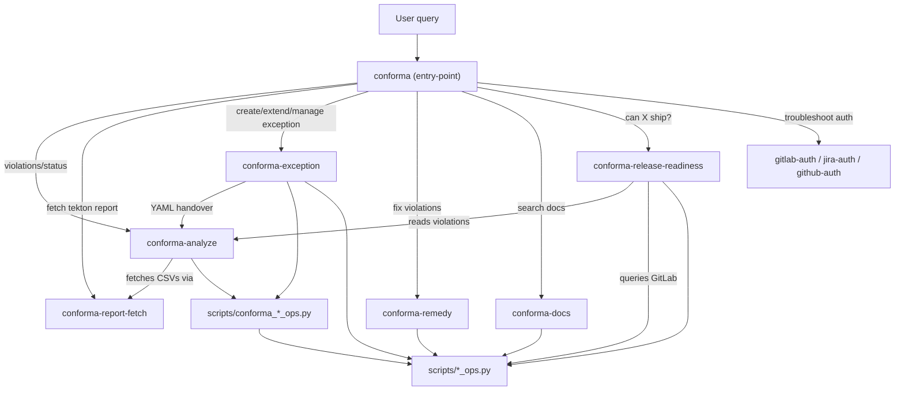

# Architecture

This document describes the design principles, structure, and key decisions behind the aiops-infra repository. Read this first to understand the system design.

For practical contributor guidance, see [CONTRIBUTING.md](CONTRIBUTING.md).

## Design Principles

1. **Skills that perform actions have Python scripts; routing and documentation skills may be SKILL.md-only.** Auth/troubleshooting skills reference shared scripts without owning them.
2. **One skill, one domain.** Each `conforma-*` skill handles a single coherent area.
3. **Shared operations live in `scripts/*_ops.py` (dual-mode).** Each file is both CLI-runnable (`argparse` + `if __name__ == "__main__"`) and importable. Generic primitives (e.g. `gitlab_ops.py`) handle any project; domain-specific shared modules (e.g. `conforma_mr_ops.py`) encapsulate cross-skill conforma logic that multiple skills need.
4. **`*_ops.py` use Python libraries** (`python-gitlab`, `jira`, `ruamel.yaml`) — matching the approach of existing onboarding scripts. Conforma skills migrate from raw REST+subprocess to library-based calls when they start importing from `*_ops.py`.
5. **Inter-skill data passes through a central `context.yaml` in `~/.conforma/`.** Each run creates a timestamped directory (`~/.conforma/YYYYMMDD-HHMMSS/`) containing a single `context.yaml`. Each skill writes a distinctive top-level key matching the skill name into this shared file.
6. **The `conforma` skill is the single entry point** — routes 20+ intents to atomic skills.
7. **Every new script (in `scripts/` OR `skills/*/scripts/`) MUST have tests.** Existing scripts are on an ignore list. `*_ops.py` replaces existing onboarding scripts over time.

## Architecture Diagram



## Skill Inventory

### User-facing atomic skills

| Skill | Purpose | Status |
|-------|---------|--------|
| `conforma-analyze` | Parse violation CSVs into YAML index, trace history | Exists |
| `conforma-report-fetch` | Fetch conforma reports: CSV from GitHub, JSON from Tekton | Exists |
| `conforma-exception` | Create/extend/manage/view/review exceptions (Jira, GitLab Merge Requests, linking, expired exception assessment) | Exists |
| `conforma-remedy` | Find and apply fixes to underlying violations | Planned |
| `conforma-docs` | Full-text search across conforma documentation and runbooks | Planned |
| `conforma-release-readiness` | "Can version X ship?" — detailed breakdown and verdict | Planned |

### Per-function skills (SKILL.md only, reference repo-root scripts)

| Skill | Script | Function |
|-------|--------|----------|
| `search-conforma-open-exception-mrs` | `conforma_mr_ops.py` | `search_open_exception_mrs` |
| `analyze-mr-component-coverage` | `conforma_mr_ops.py` | `analyze_mr_component_coverage` |
| `search-conforma-jira-tickets` | `conforma_jira_ops.py` | `prefetch_open_jira_tickets` |
| `search-conforma-slack-threads` | `conforma_slack_ops.py` | `prefetch_open_slack_threads` |
| `search-conforma-existing-exceptions` | `conforma_policy_ops.py` | `search_existing_exceptions` |
| `check-exception-coverage` | `conforma_policy_ops.py` | `check_existing_exception_gate` |

### Troubleshooting skills (SKILL.md only, no local scripts)

| Skill | Purpose |
|-------|---------|
| `gitlab-auth` | Verify and fix GitLab auth. References `scripts/gitlab_ops.py verify-auth` |
| `jira-auth` | Verify and fix Jira/acli auth. References `scripts/jira_ops.py verify-auth` |
| `github-auth` | Verify and fix GitHub/gh auth. References `scripts/github_ops.py verify-auth` |
| `slack-auth` | Verify and fix Slack auth. References `scripts/slack_ops.py verify-auth` |

### Entry-point skill

| Skill | Purpose |
|-------|---------|
| `conforma` | Intent detection and routing to atomic skills. SKILL.md-only. |
| `software-catalog-query` | Query the component-maturity catalog for component/image/Jira-component mappings. |

## Shared Scripts: Dual-Mode Design

Location: `scripts/` at repo root. These contain ONLY generic primitives — not domain-specific business logic. They use Python libraries for API calls.

### Script inventory

| Script | Functions | Library |
|--------|-----------|---------|
| `gitlab_ops.py` | `get_client`, `verify_auth`, `get_project`, `clone_repo`, `push_branch`, `create_mr`, `update_mr`, `find_mr` | `python-gitlab` |
| `jira_ops.py` | `get_client`, `verify_auth`, `create_issue`, `update_issue`, `add_watchers`, `search_user`, `link_issues`, `transition_issue` | `jira` |
| `github_ops.py` | `verify_auth`, `create_pr`, `get_file`, `get_repo`, `check_workflow_run` | `gh` CLI + `requests` |
| `slack_ops.py` | `get_client`, `verify_auth`, `search_messages` | `slack_sdk` |
| `yaml_ops.py` | `load`, `load_multi_doc`, `dump`, `dump_preserving_comments`, `merge` | `ruamel.yaml` |
| `component_catalog_ops.py` | `ensure_catalog_repo`, `load_catalog`, `resolve_jira_component`, `resolve_jira_components`, `extract_components_from_ticket`, `audit_jira_components` | `subprocess` (query.py from `data-hub/component-maturity` GitLab repo) |
| `cli_runner.py` | `run`, `run_with_retry`, `run_json`, `run_acli`, `run_glab`, `_resolve_env`, `save_token`, `resolve_method` | `subprocess` |

### Domain-specific shared modules

These `conforma_*_ops.py` modules encapsulate cross-skill conforma logic used by both `conforma-analyze` and `conforma-exception`. They follow the same dual-mode pattern as generic `*_ops.py` scripts.

| Script | Functions | Depends on |
|--------|-----------|------------|
| `conforma_mr_ops.py` | `search_open_exception_mrs`, `analyze_mr_component_coverage`, `prefetch_open_mrs`, `image_url_covers_component` | `gitlab_ops` |
| `conforma_jira_ops.py` | `prefetch_open_jira_tickets`, `_parse_acli_table`, `_extract_rule_from_summary`, `_build_release_version_patterns` | `cli_runner` |
| `conforma_slack_ops.py` | `prefetch_open_slack_threads`, `_component_search_stems` | `slack_ops` |
| `conforma_policy_ops.py` | `search_existing_exceptions`, `check_existing_exception_gate` | `conforma_mr_ops` |

### Primitive vs. domain-specific boundary

**Generic primitive** (goes in `*_ops.py`):
- `gitlab_ops.create_mr(project, branch, title, description)` — creates any MR
- `jira_ops.add_watchers(ticket_key, account_ids)` — adds watchers to any ticket
- `jira_ops.create_issue(project, summary, description, issue_type)` — creates any ticket

**Domain-specific shared** (goes in `conforma_*_ops.py`):
- `conforma_mr_ops.search_open_exception_mrs(rule)` — searches konflux-release-data Merge Requests
- `conforma_policy_ops.check_existing_exception_gate(rule, components, policy_files)` — coverage gate
- `conforma_jira_ops.prefetch_open_jira_tickets(rules, releases)` — batch Jira search

**Skill-local** (stays in skill scripts):
- `create_gitlab_mr.py::apply_exception_to_policy_file()` — conforma-specific
- `create_jira_ticket.py::_build_psx_description()` — conforma-specific template
- `create_jira_ticket.py::reconcile_ticket()` — conforma workflow logic

### Dual-mode pattern

Every `*_ops.py` script is both importable and CLI-runnable:

```python
"""gitlab_ops.py -- GitLab primitives (dual-mode: CLI + importable)."""
import argparse
import json
import gitlab

def get_client(instance_url=None, token=None):
    """Get authenticated GitLab client."""
    ...

def verify_auth(instance_url=None):
    """Check gitlab auth works. Returns {"ok": bool, "user": str, "error": str|None}."""
    ...

def create_mr(project_path, source_branch, target_branch, title, description=""):
    """Create MR. Returns {"mr_url": str, "mr_iid": int}."""
    ...

def main():
    parser = argparse.ArgumentParser(description="GitLab primitives")
    sub = parser.add_subparsers(dest="command")
    sub.add_parser("verify-auth")
    p_mr = sub.add_parser("create-mr")
    p_mr.add_argument("--project", required=True)
    p_mr.add_argument("--source-branch", required=True)
    p_mr.add_argument("--target-branch", default="main")
    p_mr.add_argument("--title", required=True)
    args = parser.parse_args()
    if args.command == "verify-auth":
        result = verify_auth()
    elif args.command == "create-mr":
        result = create_mr(args.project, args.source_branch, args.target_branch, args.title)
    print(json.dumps(result, indent=2))

if __name__ == "__main__":
    main()
```

## Path Resolution and Auto-Bootstrap

Skills that import from `scripts/` include `_setup_env.py` in their local `scripts/` directory. This module:

1. **Resolves the repo root** — walks up from its own location (4 parents: `scripts/` → `<skill>/` → `skills/` → `<repo>/`), falls back to `AIOPS_INFRA_ROOT` env var, then `~/.local/share/aiops-infra`
2. **Ensures dependencies** — uses `uv sync` if available (~200ms), falls back to `pip install -e .` with mtime-based caching, skips entirely if packages are already importable (CI)
3. **Adds `scripts/` to sys.path** — so skill scripts can `import gitlab_ops` directly

Zero user action required. First skill run bootstraps everything automatically.

## Inter-Skill Handover Pattern

Skills communicate via a shared `context.yaml` in each timestamped run directory (`~/.conforma/YYYYMMDD-HHMMSS/context.yaml`). Each skill writes a distinctive top-level key matching the producing skill:

```yaml
# ~/.conforma/20260605-100000/context.yaml
conforma-analyze:
  status: completed
  completed_at: "2026-06-05T10:00:00Z"
  violations:
    - component: model-registry
      rule: hermetic_task.hermetic
      msg: "Task is not hermetic"
      severity: failure
  violation_count: 3

conforma-exception:
  status: completed
  completed_at: "2026-06-05T10:05:00Z"
  jira_url: "https://issues.redhat.com/browse/RHOAIENG-12345"
  mr_url: "https://$GITLAB_HOST/.../merge_requests/789"
  exception_rule: hermetic_task.hermetic
```

**Rules**:
- Each skill writes ONLY its own key into the shared `context.yaml`
- Downstream skills read upstream keys from the same `context.yaml`
- All keys are composable into a single YAML representing the full pipeline state
- `status: completed | failed | pending` in every skill's key

## Key Decisions

| Decision | Rationale |
|----------|-----------|
| Python libraries over raw REST/subprocess | Type safety, pagination, error handling built in. Matches existing onboarding scripts. |
| Dual-mode scripts (`argparse` + importable) | Skills call Python functions directly; agents and humans can use CLI. No shell wrapper needed. |
| `*_ops.py` naming | Clear convention. `grep -r _ops.py` finds all shared primitives instantly. |
| Flat `scripts/` directory | Simple path resolution. No nested packages to manage. |
| `~/.conforma/` for inter-skill data | Git-ignored, machine-readable, human-inspectable. No database or service needed. Timestamped run directories keep history. |
| `.test-ignore-list` for legacy scripts | Pragmatic: existing 54 onboarding scripts work but lack tests. New scripts are gated from day one. |
| `_setup_env.py` per skill (copied, not symlinked) | Symlinks break when repo is cloned to different paths. Copies are self-contained. |
| `uv sync` preferred over `pip` | 10-50x faster dependency resolution. Falls back gracefully if `uv` is not installed. |

## Repository Layout

```
aiops-infra/
  scripts/                    # Shared scripts (54 existing + new *_ops.py)
  skills/                     # Conforma skills (.cursor/skills -> symlink)
    conforma/                 # Entry-point orchestrator (SKILL.md only)
    conforma-analyze/         # Violation report analysis
    conforma-report-fetch/    # Fetch reports: CSV from GitHub, JSON from Tekton
    conforma-exception/       # Exception management (create, extend, assess, cleanup)
    conforma-remedy/          # Fix violations in code
    conforma-docs/            # Documentation search
    conforma-release-readiness/ # Ship/no-ship verdict
    search-conforma-open-exception-mrs/ # Per-function skill (SKILL.md only)
    analyze-mr-component-coverage/     # Per-function skill (SKILL.md only)
    search-conforma-jira-tickets/      # Per-function skill (SKILL.md only)
    search-conforma-slack-threads/     # Per-function skill (SKILL.md only)
    search-conforma-existing-exceptions/ # Per-function skill (SKILL.md only)
    check-exception-coverage/          # Per-function skill (SKILL.md only)
    gitlab-auth/              # GitLab auth troubleshooting (SKILL.md only)
    jira-auth/                # Jira auth troubleshooting (SKILL.md only)
    github-auth/              # GitHub auth troubleshooting (SKILL.md only)
    slack-auth/               # Slack auth troubleshooting (SKILL.md only)
    references/               # Shared references (infrastructure setup, output presentation)
  .claude/skills/             # Onboarding pipeline skills (17 existing)
  tests/                      # Unit + integration tests
  .github/workflows/          # CI: lint + test workflows
  pyproject.toml              # Project metadata, deps, tool config
  .pre-commit-config.yaml     # Ruff + pytest + test coverage check
```
