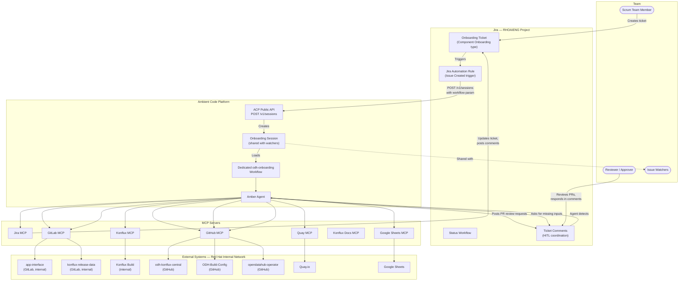
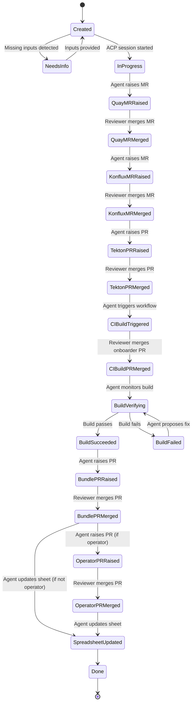
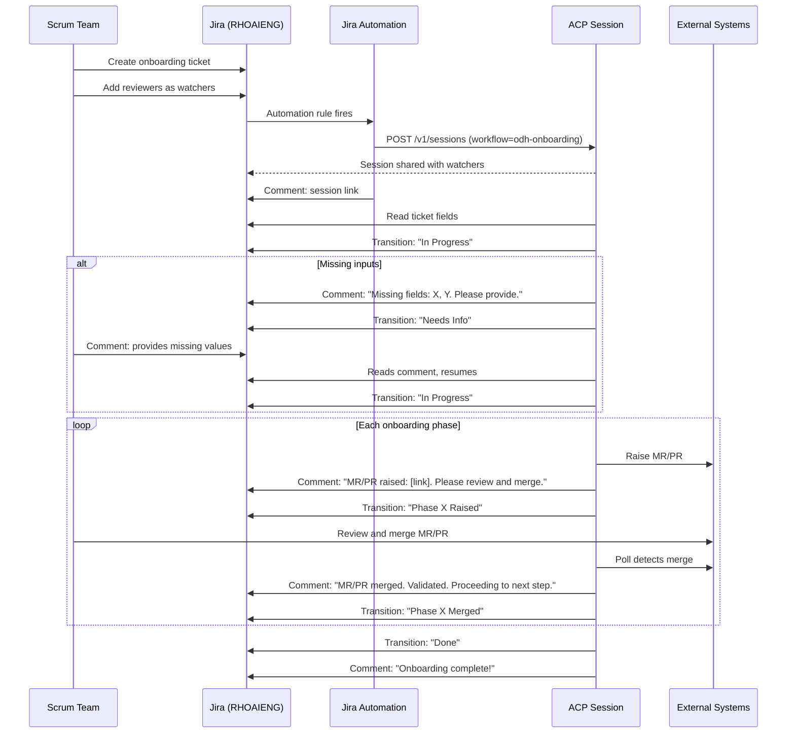

# Approach 4: Jira-Triggered Automation Pipeline

## Overview

This approach uses **Jira as the single entry point and progress tracker** for ODH component onboarding. A scrum team member creates a Jira ticket in the **RHOAIENG** project using a structured template that captures all onboarding parameters as custom fields. A **Jira Automation Rule** fires on ticket creation, validates the inputs, and calls the **Ambient Code Platform (ACP) public API** (`POST /v1/sessions`) to create a new session running the dedicated **`odh-onboarding` ACP workflow**. The ACP session is automatically shared with all Jira issue watchers. As the agent completes each phase, it updates the Jira ticket with comments (including MR/PR links) and transitions the ticket through a defined status workflow. All human-in-the-loop coordination -- PR review requests, missing-input collection, and questions -- flows through **Jira comments**, with corresponding status changes to make the ticket's state immediately visible. This provides a complete audit trail, integrates with existing team workflows in Jira, and makes onboarding status visible to everyone without requiring access to ACP.

---

## Architecture Diagram



---

## Prerequisites

| # | Prerequisite | Details |
|---|-------------|---------|
| 1 | **RHOAIENG Jira project configured** | The RHOAIENG Jira project must have a custom issue type "Component Onboarding" with custom fields for all input parameters (see User Inputs section). |
| 2 | **Jira status workflow** | A custom workflow with statuses matching each onboarding phase (see Jira Workflow section below). |
| 3 | **Jira Automation Rule** | A project-level automation rule triggered on "Issue created" for issue type "Component Onboarding". The rule calls the ACP public API to create a session. See Jira Automation Rule section below. |
| 4 | **ACP instance with workspace** | An ACP workspace with all required MCP servers configured and Red Hat internal network access enabled. |
| 5 | **Dedicated `odh-onboarding` ACP workflow** | A custom ACP workflow defined for the ODH onboarding pipeline, loadable via the `workflow` parameter in the `POST /v1/sessions` API. |
| 6 | **ACP API credentials in Jira** | The ACP API URL and authentication token must be accessible to the Jira Automation Rule (stored as rule configuration or via a relay endpoint). |
| 7 | **All MCP servers configured in ACP** | Jira, GitLab, GitHub, Quay, Konflux, Konflux Docs, Google Sheets MCP servers must all be registered in the ACP workspace. |
| 8 | **Red Hat internal network access** | ACP sessions and MCP servers must be able to reach Red Hat internal services (GitLab `gitlab.cee.redhat.com`, Konflux, etc.). |

---

## Dependencies

### External Services

- **Jira (RHOAIENG project)** -- the primary interface for initiating and tracking onboarding
- **Ambient Code Platform** -- session runtime; must support the `workflow` parameter in `POST /v1/sessions`
- **Red Hat internal network** -- required for GitLab (`gitlab.cee.redhat.com`), Konflux, and other internal services
- All downstream systems: internal GitLab, GitHub repos, Quay, Konflux, Google Sheets

### MCP Servers

| MCP Server | Status | Required Network | Role in this approach |
|-----------|--------|-----------------|----------------------|
| **Jira MCP** | Available (`user-Jira`, 20+ tools) | External (Jira Cloud) | Read ticket fields, post comments, transition statuses, collect missing inputs |
| **GitLab MCP** | **Needs configuration in ACP** | **Red Hat internal** (`gitlab.cee.redhat.com`) | Raise MRs to `app-interface` and `konflux-release-data` |
| **GitHub MCP** | **Needs integration in ACP** | External (github.com) | Raise PRs, trigger workflows, read CI status |
| **Quay MCP** | Available (`user-quay`) | External (quay.io) | Validate repos, get image digests |
| **Konflux MCP** | **Needs to be built** | **Red Hat internal** (Konflux API) | Monitor builds, check component registration, retrieve build logs |
| **Konflux Docs MCP** | **Needs to be built** | External or internal | Look up fixes for build failures |
| **Google Sheets MCP** | **Needs to be built** | External (Google APIs) | Update ODH Component Images spreadsheet |

### ACP Requirements

| Requirement | Detail | Status |
|------------|--------|--------|
| **`workflow` parameter in `POST /v1/sessions`** | The ACP public API must accept a `workflow` parameter so the Jira Automation Rule can specify which workflow to load (e.g., `odh-onboarding`). This is critical for the Jira-to-ACP integration since the automation rule cannot interactively select a workflow. | **Required — confirm with ACP team** |
| **Red Hat internal network access** | ACP sessions must be able to reach `gitlab.cee.redhat.com`, Konflux APIs, and other internal Red Hat services. MCP servers (GitLab MCP, Konflux MCP) also need this access. | **Required — confirm ACP network policy** |
| **Session sharing via API** | The `POST /v1/sessions` API (or a follow-up call) must support sharing the session with a list of users (derived from Jira issue watchers). | **Required — confirm API capability** |
| **GitLab MCP integration** | A GitLab MCP server must be available in ACP workspaces, configured to authenticate against `gitlab.cee.redhat.com`. | **Needs to be enabled in ACP** |
| **GitHub MCP integration** | A GitHub MCP server (or native ACP GitHub integration) must be available in ACP workspaces for interacting with `opendatahub-io` repos. | **Needs to be enabled in ACP** |
| **Konflux MCP server** | A new MCP server providing tools for Konflux component queries, build status monitoring, and log retrieval. Must operate within Red Hat internal network. | **Needs to be built** |
| **Konflux Docs MCP server** | A new MCP server providing searchable access to Konflux documentation for diagnosing build failures. | **Needs to be built** |
| **Google Sheets MCP server** | A new MCP server providing tools to read/write Google Sheets (for the ODH Component Images spreadsheet). | **Needs to be built** |

---

## User Inputs and Configuration

### Jira Issue Type: "Component Onboarding" (RHOAIENG project)

A custom Jira issue type in the RHOAIENG project with these fields:

| Field | Type | Required | Example |
|-------|------|----------|---------|
| Summary | Text | Yes | "Onboard odh-dashboard to ODH CI builds" |
| Component Name | Text (custom) | Yes | `odh-dashboard-ci` |
| Repository URL | URL (custom) | Yes | `https://github.com/opendatahub-io/odh-dashboard` |
| Quay Repo Name | Text (custom) | Yes | `odh-dashboard` |
| Context Path | Text (custom) | No (default: `./`) | `./` |
| Dockerfile Path | Text (custom) | No (default: `Dockerfile`) | `Dockerfile` |
| Branch | Text (custom) | No (default: `main`) | `main` |
| Is Operator | Checkbox (custom) | No (default: unchecked) | unchecked |
| Operator Manifest Src | Text (custom) | Conditional | `config/manifests` |
| Operator Manifest Dest | Text (custom) | Conditional | `odh-dashboard` |
| Watchers | User list | Recommended | Reviewers and stakeholders who should have ACP session access |

### Jira Automation Rule Configuration

A project-level Jira Automation Rule in RHOAIENG:

```
RULE: Create ACP onboarding session on ticket creation
│
├── TRIGGER: Issue created
│
├── CONDITION: Issue Type = "Component Onboarding"
│
├── CONDITION: Component Name (custom field) is not empty
│
├── ACTION: Send web request
│   ├── POST  <ACP_URL>/v1/sessions
│   ├── Headers:
│   │   ├── Authorization: Bearer <ACP_API_TOKEN>
│   │   └── Content-Type: application/json
│   └── Body:
│       {
│         "workflow": "odh-onboarding",
│         "environment": {
│           "JIRA_TICKET_KEY": "{{issue.key}}",
│           "COMPONENT_NAME": "{{issue.customfield_XXXXX}}",
│           "REPO_URL": "{{issue.customfield_XXXXX}}",
│           "QUAY_REPO_NAME": "{{issue.customfield_XXXXX}}",
│           "CONTEXT_PATH": "{{issue.customfield_XXXXX}}",
│           "DOCKERFILE_PATH": "{{issue.customfield_XXXXX}}",
│           "BRANCH": "{{issue.customfield_XXXXX}}",
│           "IS_OPERATOR": "{{issue.customfield_XXXXX}}",
│           "OPERATOR_MANIFEST_SRC": "{{issue.customfield_XXXXX}}",
│           "OPERATOR_MANIFEST_DEST": "{{issue.customfield_XXXXX}}",
│           "WATCHERS": "{{issue.watchers}}"
│         },
│         "share_with": ["{{issue.watchers}}"]
│       }
│
├── IF: Response status = 200 or 201
│   └── ACTION: Add comment
│       "ACP onboarding session created. Session link: {{webhookResponse.body.session_url}}"
│
└── ELSE:
    ├── ACTION: Add comment
    │   "Failed to create ACP session (HTTP {{webhookResponse.status}}). Please contact DevOps."
    └── ACTION: Transition to "Failed"
```

> **Note**: Replace `customfield_XXXXX` with actual Jira custom field IDs. The `share_with` parameter assumes ACP supports sharing sessions with a list of user identifiers derived from Jira watchers.

### Jira Workflow (Status Transitions)



Status transitions reflect the **current state of the onboarding process**. Unlike the previous design where status transitions serve as approval gates, this design uses **Jira comments** for all HITL coordination (PR review requests, input collection, questions). The agent transitions the ticket status to keep it accurate, and monitors comments for reviewer responses.

---

## End-to-End Flow

### Phase 0: Ticket Creation and Session Bootstrap

| Aspect | Detail |
|--------|--------|
| **Trigger** | A scrum team member creates a "Component Onboarding" ticket in the RHOAIENG Jira project with all required fields and adds relevant reviewers/stakeholders as watchers. |
| **Jira Automation** | The automation rule fires on issue creation. It validates the issue type, sends a `POST /v1/sessions` request to the ACP API with the `workflow: "odh-onboarding"` parameter and all ticket field values as environment variables, and requests the session be shared with all issue watchers. |
| **Session startup** | ACP creates a session running the `odh-onboarding` workflow. The session is shared with all Jira issue watchers. The automation rule posts the session link as a Jira comment. |
| **Agent action** | Agent reads `JIRA_TICKET_KEY` from env, uses Jira MCP `getJiraIssue` to fetch all custom field values. Posts a comment: "Onboarding session started. Beginning input validation." Transitions ticket to "In Progress". |
| **Input validation** | Agent validates all required fields. If any are missing or invalid, it posts a comment listing the missing fields with a request to provide them, transitions to "Needs Info", and polls for a response comment. When the scrum team member responds with the missing values in a comment, the agent reads them, transitions back to "Created" → "In Progress", and proceeds. |

### Step 1: Create Quay Repository

| Aspect | Detail |
|--------|--------|
| **Agent action** | Use GitLab MCP to raise MR to `app-interface` (`gitlab.cee.redhat.com`). Post MR link as a Jira comment with a review request: *"MR raised for Quay repo creation: [MR link]. Requesting review and merge."* Transition ticket to "Quay MR Raised". |
| **MCP tools** | GitLab MCP, Jira MCP (`addCommentToJiraIssue`, `transitionJiraIssue`) |
| **HITL gate** | Reviewer sees the Jira comment (notified as a watcher), reviews the MR in GitLab, merges it, and replies in the Jira comment: *"MR merged"* (or the agent detects the MR merge status via GitLab MCP polling). |
| **Agent detection** | Agent polls MR status via GitLab MCP. On merge detection, transitions ticket to "Quay MR Merged". |
| **Validation** | Quay MCP `get_repository` confirms repo exists. Agent posts confirmation comment. |

### Step 2: Add to konflux-release-data

| Aspect | Detail |
|--------|--------|
| **Agent action** | Render Konflux Component YAML. Raise MR to `konflux-release-data` (`gitlab.cee.redhat.com`). Post MR link and review request as Jira comment. Transition to "Konflux MR Raised". |
| **MCP tools** | GitLab MCP, Jira MCP |
| **HITL gate** | Reviewer merges MR. Agent detects via GitLab MCP polling. |
| **Agent detection** | On merge detection, transition to "Konflux MR Merged". Post confirmation comment. |
| **Validation** | Konflux MCP confirms component registration (`oc get component`). Agent posts confirmation. |

### Steps 3-4: Tekton Changes + Onboarder Update

| Aspect | Detail |
|--------|--------|
| **Agent action** | Generate pipelinerun YAMLs (on-push and pull-request). Add repo to the onboarder workflow file. Raise PR to `odh-konflux-central`. Post PR link and review request as Jira comment. Transition to "Tekton PR Raised". |
| **MCP tools** | GitHub MCP, Jira MCP |
| **HITL gate** | Reviewer reviews and merges PR. Agent detects via GitHub MCP polling. |
| **Agent detection** | On merge detection, transition to "Tekton PR Merged". Post confirmation comment. |
| **Validation** | PR CI passes before merge. |

### Step 5: Run CI Build Onboarding

| Aspect | Detail |
|--------|--------|
| **Agent action** | Trigger `odh-konflux-onboarder.yml` workflow via GitHub MCP. Post workflow run link as Jira comment. Transition to "CI Build Triggered". When workflow completes and raises a PR, post the PR link as a comment requesting review. |
| **MCP tools** | GitHub MCP, Jira MCP |
| **HITL gate** | Reviewer merges the onboarder PR. Agent detects via GitHub MCP polling. |
| **Agent detection** | On merge detection, transition to "CI Build PR Merged". Post confirmation comment. |
| **Validation** | Workflow completes successfully. |

### Step 6: Verify Konflux Build

| Aspect | Detail |
|--------|--------|
| **Agent action** | Monitor build status via Konflux MCP. Post status updates as Jira comments. Transition to "Build Verifying". If build succeeds, transition to "Build Succeeded". If build fails, post error details and a suggested fix (using Konflux Docs MCP for diagnosis), transition to "Build Failed". |
| **MCP tools** | Konflux MCP, Konflux Docs MCP, Quay MCP, Jira MCP |
| **HITL gate** | If a fix is needed, agent posts the proposed fix as a Jira comment and asks for approval. Reviewer replies with approval or an alternative. Agent applies fix, pushes, and re-monitors. |
| **Validation** | Build succeeds. Image present in Quay. |

### Step 7: Bundle Patch Changes

| Aspect | Detail |
|--------|--------|
| **Agent action** | Get image digest from Quay MCP. Add `relatedImages` entry to `bundle-patch.yaml`. Raise PR to `ODH-Build-Config`. Post PR link and review request as Jira comment. Transition to "Bundle PR Raised". |
| **MCP tools** | Quay MCP, GitHub MCP, Jira MCP |
| **HITL gate** | Reviewer reviews and merges PR. Agent detects via GitHub MCP. |
| **Agent detection** | On merge detection, transition to "Bundle PR Merged". Post confirmation. |
| **Validation** | PR CI passes. |

### Step 8: Operator Changes (conditional)

| Aspect | Detail |
|--------|--------|
| **Agent action** | If `IS_OPERATOR = true`: edit `manifests-config.yaml` in `opendatahub-operator`, raise PR, post link and review request as Jira comment, transition to "Operator PR Raised". If not operator: skip to Step 9. |
| **MCP tools** | GitHub MCP, Jira MCP |
| **HITL gate** | Reviewer merges PR. Agent detects via GitHub MCP. |
| **Agent detection** | On merge detection, transition to "Operator PR Merged". Post confirmation. |
| **Validation** | PR CI passes. |

### Step 9: Update Spreadsheet

| Aspect | Detail |
|--------|--------|
| **Agent action** | Update ODH Component Images Google Sheet via Google Sheets MCP. Post confirmation comment. Transition ticket to "Done". |
| **MCP tools** | Google Sheets MCP, Jira MCP |
| **HITL gate** | None (final step). |
| **Validation** | Spreadsheet row present with correct values. |

---

## Human-in-the-Loop (HITL) Model



### Key Characteristics

- **Jira comments as the HITL channel**: All coordination happens through Jira comments -- PR review requests, missing-input collection, questions, fix approvals, and status updates. Watchers are notified automatically on every comment.
- **Status reflects reality**: The agent transitions status to accurately reflect the current phase. Statuses are informational, not approval gates.
- **MR/PR merge detection via MCP polling**: The agent detects when MRs/PRs are merged by polling GitLab MCP and GitHub MCP, rather than waiting for a human to transition the Jira status. This removes friction for reviewers.
- **Missing-input collection**: If inputs are incomplete, the agent transitions to "Needs Info" and posts a specific question as a Jira comment. The scrum team responds in a comment. The agent reads the response and resumes.
- **Session shared with watchers**: All Jira issue watchers get access to the ACP session for full visibility into the agent's actions.
- **Asynchronous**: The agent runs in ACP and polls for MR/PR merges and Jira comment responses. Reviewers act on their own schedule.
- **Full audit trail**: Every action, question, response, and artifact link is recorded as a Jira comment.

---

## Error Handling and Recovery

| Failure Scenario | Detection | Recovery |
|-----------------|-----------|----------|
| Missing Jira fields | Agent reads ticket, finds nulls | Agent posts comment listing missing fields with specific questions. Transitions to "Needs Info". Scrum team responds in a comment. Agent reads response and resumes. |
| Jira Automation Rule fails | Automation audit log shows failure | Automation rule has built-in retry. If all retries fail, the rule posts a failure comment on the ticket. Manual re-trigger by transitioning the ticket back to "Created". |
| ACP session fails to create | `POST /v1/sessions` returns non-2xx | Automation rule posts the error as a Jira comment. DevOps team investigates. Retry by re-triggering the automation rule (e.g., clone the ticket or manually call the API). |
| ACP session cannot reach internal network | MCP tool calls to GitLab/Konflux fail | Agent posts error as Jira comment: "Cannot reach gitlab.cee.redhat.com. Please verify ACP network configuration." Transitions to "Blocked". |
| MR/PR CI fails | Agent polls CI status via GitLab/GitHub MCP | Agent posts failure logs as Jira comment. Proposes fix. Asks for approval in a comment. Pushes amended commit after approval. |
| Konflux build fails | Build status polling via Konflux MCP | Agent posts error + suggested fix (from Konflux Docs MCP) as Jira comment. Transitions to "Build Failed". After fix is applied, transitions back to "Build Verifying". |
| Agent loses track of state | Session restart | Agent reads ticket status and comment history from Jira to determine the current phase. Resumes from the correct step. Jira ticket is the single source of truth. |
| Reviewer does not act | MR/PR stays open, no merge detected | Agent posts reminder comments after a configurable delay (e.g., 24 hours). Can mention specific watchers. |
| MCP server unavailable | Tool call error | Agent falls back to direct API calls via shell `curl` where possible. Posts fallback notice as Jira comment. |

---

## Pros

- **Jira-native experience** -- scrum teams create tickets in RHOAIENG, a project they already use. No new tools or interfaces to learn for initiating onboarding.
- **Comment-based HITL** -- all coordination (PR reviews, questions, missing inputs) happens in Jira comments. Watchers are automatically notified. No need for reviewers to learn Jira status transitions as an approval mechanism.
- **Full audit trail** -- every action, question, response, and artifact link is recorded as a Jira comment with timestamps.
- **Broad visibility** -- managers, stakeholders, and scrum team members who don't use ACP can track onboarding progress in Jira.
- **Session sharing** -- all Jira watchers get access to the ACP session for deep inspection when needed.
- **Asynchronous by design** -- the agent and reviewers operate on different schedules. No requirement for simultaneous presence.
- **Single source of truth for state** -- the Jira ticket status + comment history is the canonical record. If the ACP session restarts, it reads the ticket to resume.
- **Scalable tracking** -- multiple onboarding tickets can be tracked independently on a Jira board.
- **No GitHub Actions dependency** -- the Jira Automation Rule calls ACP directly, removing the GitHub Actions intermediary layer.
- **Dedicated ACP workflow** -- a purpose-built `odh-onboarding` workflow encapsulates all pipeline logic, making it versionable, testable, and reusable.

---

## Cons

- **ACP API requirements** -- the `POST /v1/sessions` API must support the `workflow` parameter and session sharing. These may not be available today and require ACP team coordination.
- **Red Hat internal network access** -- ACP sessions and MCP servers must reach `gitlab.cee.redhat.com`, Konflux APIs, etc. Network policy changes may be needed.
- **Missing MCP servers** -- Konflux MCP, Konflux Docs MCP, and Google Sheets MCP need to be built. GitLab MCP and GitHub MCP need to be configured/enabled in the ACP workspace.
- **Jira configuration overhead** -- creating custom issue types, fields, and workflows in RHOAIENG requires coordination with Jira admins.
- **Status explosion** -- the Jira workflow has many statuses (14+). This can feel heavyweight for a process that happens a few times per quarter.
- **Polling latency** -- the agent polls for MR/PR merges and comment responses. There is an inherent delay between a reviewer action and the agent detecting it.
- **Not interactive** -- unlike the Cursor Skill or Manual Ambient approaches, the scrum team cannot have a real-time conversation with the agent. Communication is through Jira comments (asynchronous, less fluid).
- **Jira Automation security** -- the ACP API token is stored in the Jira Automation Rule configuration. This is less secure than a secrets manager. A relay endpoint can mitigate this.
- **Dual-platform dependency** -- depends on both Jira and ACP being operational.
- **Debugging distance** -- if something goes wrong in the ACP session, the team member must leave Jira and inspect the ACP session. Jira comments provide a summary but not full diagnostic detail (though session sharing helps).

---

## Effort Estimate

| Work Item | Effort |
|-----------|--------|
| Configure Jira (RHOAIENG): custom issue type, fields, workflow | 2-3 days |
| Create Jira Automation Rule (trigger + ACP API call) | 1 day |
| Develop dedicated `odh-onboarding` ACP workflow | 4-5 days |
| Build Jira-aware agent logic (comment-based HITL, input collection, status management) | 3-4 days |
| Configure ACP workspace with all MCP servers | 2-3 days |
| Enable ACP internal network access (coordinate with ACP team) | 1-2 days |
| Confirm/implement `workflow` parameter in ACP `POST /v1/sessions` API | 1-2 days (coordination) |
| Implement session sharing with Jira watchers | 1 day (coordination) |
| Build / source missing MCP servers (Konflux, Konflux Docs, Google Sheets) | 3-5 days each |
| Enable GitLab MCP and GitHub MCP in ACP workspace | 1-2 days |
| End-to-end testing with a real component | 3-4 days |
| Documentation and team onboarding | 1-2 days |
| **Total** | **~5-7 weeks** |

### Critical Path Items (ACP Team Dependencies)

| Item | Dependency | Impact if Blocked |
|------|-----------|-------------------|
| `workflow` parameter in `POST /v1/sessions` | ACP team must implement or confirm availability | **Blocker** -- cannot create sessions from Jira Automation without this |
| Red Hat internal network access from ACP | ACP team / network team | **Blocker** -- GitLab MCP and Konflux MCP cannot function without internal network |
| Session sharing API | ACP team | **Degraded** -- watchers would need manual session link sharing |
| GitLab MCP in ACP | ACP team must enable | **Blocker** -- cannot raise MRs to internal GitLab repos |
| GitHub MCP in ACP | ACP team must enable | **Blocker** -- cannot raise PRs or trigger workflows |
