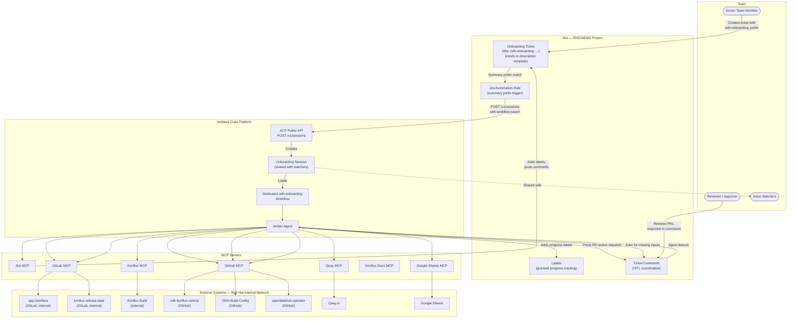
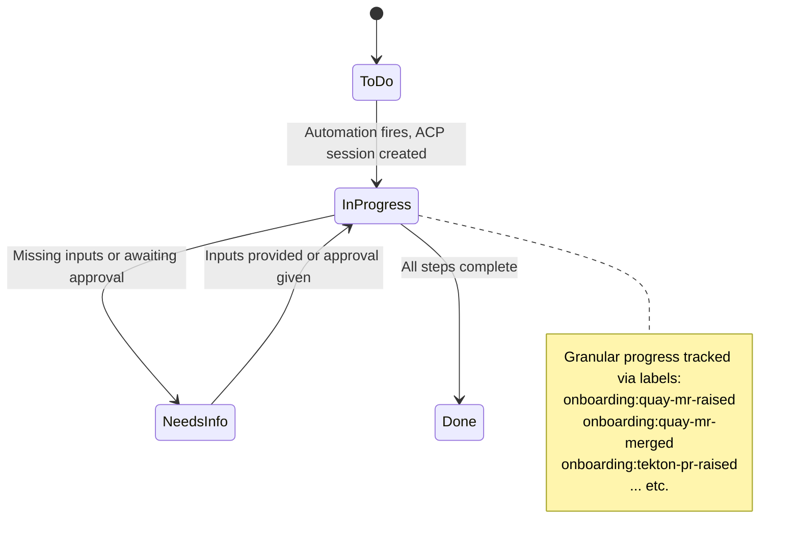
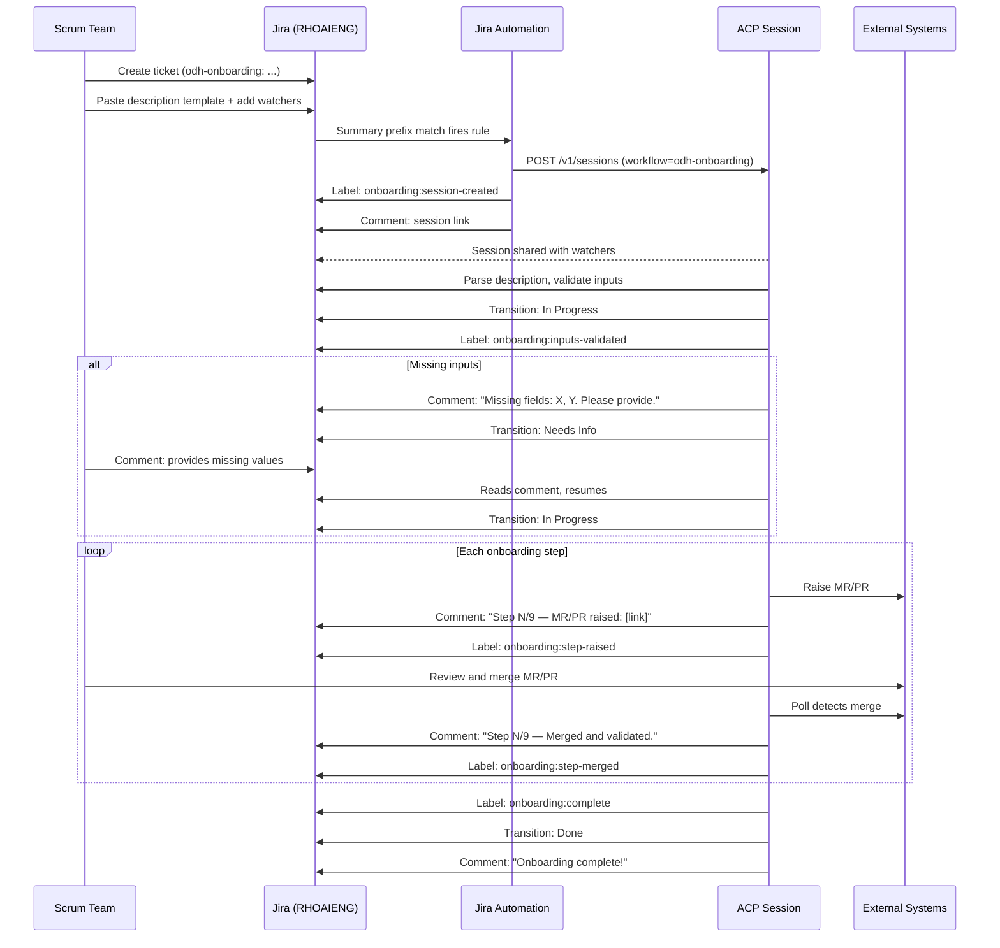

# Approach 1: Jira-Triggered Automation Pipeline

## Overview

This approach uses **Jira as the single entry point and progress tracker** for ODH component onboarding. A scrum team member creates a standard Jira ticket (Story or Task) in the **RHOAIENG** project with the **title prefix `odh-onboarding:`** and fills in a **structured description template** containing all onboarding parameters. A **Jira Automation Rule** fires when it detects a new issue whose summary starts with `odh-onboarding:`, parses the inputs from the description, and calls the **Ambient Code Platform (ACP) public API** (`POST /v1/sessions`) to create a new session running the dedicated **`odh-onboarding` ACP workflow**. The ACP session is automatically shared with all Jira issue watchers.

As the agent completes each phase, it updates the Jira ticket by **adding labels** (e.g., `onboarding:quay-mr-raised`) to reflect granular progress and posting **explicit comments** with MR/PR links and status summaries. The ticket uses **standard Jira statuses** (To Do, In Progress, Needs Info, Done) rather than a custom workflow with dozens of phase-specific statuses. This eliminates the need for custom issue types, custom fields, and custom workflows -- making adoption far simpler while still providing a complete audit trail in Jira.

---

## Architecture Diagram



---

## Prerequisites

| # | Prerequisite | Details |
|---|-------------|---------|
| 1 | **RHOAIENG Jira project** | The standard RHOAIENG Jira project. No custom issue type or custom fields required. |
| 2 | **Jira description template** | A shared description template (pinned in Confluence, Slack, or Jira's issue template feature) that the scrum team copies when creating an onboarding ticket. |
| 3 | **Jira Automation Rule** | A project-level automation rule that triggers when a new issue's summary starts with `odh-onboarding:`. The rule calls the ACP public API. See Automation Rule section below. |
| 4 | **ACP instance with workspace** | An ACP workspace with all required MCP servers configured and Red Hat internal network access enabled. |
| 5 | **Dedicated `odh-onboarding` ACP workflow** | A custom ACP workflow defined for the ODH onboarding pipeline, loadable via the `workflow` parameter in the `POST /v1/sessions` API. |
| 6 | **ACP API credentials in Jira** | The ACP API URL and authentication token accessible to the Jira Automation Rule. |
| 7 | **All MCP servers configured in ACP** | Jira, GitLab, GitHub, Quay, Konflux, Konflux Docs, Google Sheets MCP servers must all be registered in the ACP workspace. |
| 8 | **Red Hat internal network access** | ACP sessions and MCP servers must be able to reach Red Hat internal services. |

> **Key simplification**: No custom issue type, no custom fields, and no custom Jira workflow are required. The ticket is a standard Story or Task, inputs live in the description, and progress is tracked via labels + standard statuses.

---

## Dependencies

### External Services

- **Jira (RHOAIENG project)** -- the primary interface for initiating and tracking onboarding
- **Ambient Code Platform** -- session runtime; must support the `workflow` parameter in `POST /v1/sessions`
- **Red Hat internal network** -- required for GitLab (`gitlab.cee.redhat.com`), Konflux, and other internal services
- All downstream systems: internal GitLab, GitHub repos, Quay, Konflux, Google Sheets

### MCP Servers

| MCP Server | Status | Required Network | Role in this approach |
|-----------|--------|-----------------|----------------------|
| **Jira MCP** | Available (`user-Jira`, 20+ tools) | External (Jira Cloud) | Read description, post comments, add/remove labels, transition statuses |
| **GitLab MCP** | **Needs configuration in ACP** | **Red Hat internal** (`gitlab.cee.redhat.com`) | Raise MRs to `app-interface` and `konflux-release-data` |
| **GitHub MCP** | **Needs integration in ACP** | External (github.com) | Raise PRs, trigger workflows, read CI status |
| **Quay MCP** | Available (`user-quay`) | External (quay.io) | Validate repos, get image digests |
| **Konflux MCP** | **Needs to be built** | **Red Hat internal** (Konflux API) | Monitor builds, check component registration, retrieve build logs |
| **Konflux Docs MCP** | **Needs to be built** | External or internal | Look up fixes for build failures |
| **Google Sheets MCP** | **Needs to be built** | External (Google APIs) | Update ODH Component Images spreadsheet |

### ACP Requirements

| Requirement | Detail | Status |
|------------|--------|--------|
| **`workflow` parameter in `POST /v1/sessions`** | The ACP public API must accept a `workflow` parameter so the Jira Automation Rule can specify which workflow to load. | **Required — confirm with ACP team** |
| **Red Hat internal network access** | ACP sessions must reach `gitlab.cee.redhat.com`, Konflux APIs, and other internal services. | **Required — confirm ACP network policy** |
| **Session sharing via API** | The `POST /v1/sessions` API must support sharing the session with users derived from Jira watchers. | **Required — confirm API capability** |
| **GitLab MCP integration** | Must be available in ACP, configured for `gitlab.cee.redhat.com`. | **Needs to be enabled in ACP** |
| **GitHub MCP integration** | Must be available in ACP for `opendatahub-io` repos. | **Needs to be enabled in ACP** |
| **Konflux MCP server** | Needs to be built. Must operate within Red Hat internal network. | **Needs to be built** |
| **Konflux Docs MCP server** | Needs to be built. | **Needs to be built** |
| **Google Sheets MCP server** | Needs to be built. | **Needs to be built** |

---

## User Inputs and Configuration

### Title Convention

The ticket summary must start with the prefix `odh-onboarding:` followed by a brief description:

```
odh-onboarding: Onboard odh-dashboard to ODH CI builds
```

The Jira Automation Rule triggers on this prefix. Any standard issue type (Story, Task, etc.) can be used.

### Description Template

All onboarding inputs are provided in the Jira description body using a structured YAML block inside a code fence. The scrum team copies this template when creating the ticket:

```yaml
# ODH Component Onboarding Request
# Fill in the fields below. Remove comments before submitting.

component_name: odh-dashboard-ci
repo_url: https://github.com/opendatahub-io/odh-dashboard
quay_repo: odh-dashboard
context_path: ./                    # optional, default: ./
dockerfile_path: Dockerfile         # optional, default: Dockerfile
branch: main                       # optional, default: main
is_operator: false                  # true if this component is an operator
# operator_manifest_src: config/manifests   # required if is_operator: true
# operator_manifest_dest: odh-dashboard     # required if is_operator: true
```

**Example full ticket:**

> **Summary**: `odh-onboarding: Onboard odh-dashboard to ODH CI builds`
>
> **Description**:
> ```yaml
> component_name: odh-dashboard-ci
> repo_url: https://github.com/opendatahub-io/odh-dashboard
> quay_repo: odh-dashboard
> context_path: ./
> dockerfile_path: Dockerfile
> branch: main
> is_operator: false
> ```

The ACP agent parses this YAML block from the description at session startup. If any required field is missing or malformed, the agent posts a comment asking for clarification and transitions the ticket to "Needs Info".

### Jira Automation Rule Configuration

A project-level Jira Automation Rule in RHOAIENG:

```
RULE: Trigger ODH onboarding on ticket creation
│
├── TRIGGER: Issue created
│
├── CONDITION: Summary contains "odh-onboarding:"
│
├── ACTION: Send web request
│   ├── POST  <ACP_URL>/v1/sessions
│   ├── Headers:
│   │   ├── Authorization: Bearer <ACP_API_TOKEN>
│   │   └── Content-Type: application/json
│   └── Body:
│       {
│         "workflow": "odh-onboarding",
│         "environment": {
│           "JIRA_TICKET_KEY": "{{issue.key}}",
│           "JIRA_DESCRIPTION": "{{issue.description}}"
│         },
│         "share_with": ["{{issue.watchers}}"]
│       }
│
├── IF: Response status = 200 or 201
│   ├── ACTION: Add comment
│   │   "ACP onboarding session created. Session link: {{webhookResponse.body.session_url}}"
│   └── ACTION: Add label "onboarding:session-created"
│
└── ELSE:
    ├── ACTION: Add comment
    │   "Failed to create ACP session (HTTP {{webhookResponse.status}}). Please contact DevOps."
    └── ACTION: Add label "onboarding:session-failed"
```

> **Key simplification**: The rule matches on the summary prefix (`odh-onboarding:`), not on a custom issue type. It passes the raw description to the ACP session, which parses the YAML block itself. No custom field IDs need to be mapped.

### Progress Tracking: Labels + Standard Statuses

Instead of a custom Jira workflow with 14+ statuses, the approach uses **two mechanisms**:

#### Standard Jira Statuses (high-level)

Only 4 standard statuses are used, matching what most RHOAIENG workflows already have:

| Jira Status | Meaning | When |
|-------------|---------|------|
| **To Do** | Ticket created, automation not yet triggered | Initial state |
| **In Progress** | ACP session is actively working | After session starts |
| **Needs Info** | Agent is waiting for input from the scrum team | Missing fields, question, or approval needed |
| **Done** | All onboarding steps complete | Final state |

#### Labels (granular progress)

The agent adds and removes labels to track exactly which phase the onboarding is in. Labels follow the convention `onboarding:<step>-<state>`:

| Label | Meaning |
|-------|---------|
| `onboarding:session-created` | ACP session successfully created |
| `onboarding:inputs-validated` | All inputs parsed and validated |
| `onboarding:quay-mr-raised` | Quay repo MR raised to app-interface |
| `onboarding:quay-mr-merged` | Quay repo MR merged, repo verified |
| `onboarding:konflux-mr-raised` | Konflux release-data MR raised |
| `onboarding:konflux-mr-merged` | Konflux MR merged, component verified |
| `onboarding:tekton-pr-raised` | Tekton + Onboarder PR raised |
| `onboarding:tekton-pr-merged` | Tekton PR merged |
| `onboarding:ci-build-triggered` | Onboarder workflow triggered |
| `onboarding:ci-build-pr-merged` | Onboarder PR merged |
| `onboarding:build-verifying` | Konflux build in progress |
| `onboarding:build-succeeded` | Konflux build passed |
| `onboarding:build-failed` | Konflux build failed |
| `onboarding:bundle-pr-raised` | Bundle patch PR raised |
| `onboarding:bundle-pr-merged` | Bundle patch PR merged |
| `onboarding:operator-pr-raised` | Operator PR raised (if applicable) |
| `onboarding:operator-pr-merged` | Operator PR merged |
| `onboarding:spreadsheet-updated` | Spreadsheet updated |
| `onboarding:complete` | All steps done |

Each label addition is accompanied by an **explicit Jira comment** explaining what happened, including relevant links. This provides both machine-readable state (labels) and human-readable context (comments).



---

## End-to-End Flow

### Phase 0: Ticket Creation and Session Bootstrap

| Aspect | Detail |
|--------|--------|
| **Trigger** | A scrum team member creates a ticket in RHOAIENG with summary starting with `odh-onboarding:` and pastes the description template with all inputs filled in. Adds reviewers as watchers. |
| **Jira Automation** | The automation rule fires on the summary prefix match. It sends a `POST /v1/sessions` request to the ACP API with `workflow: "odh-onboarding"` and the full description as an environment variable. It requests the session be shared with all watchers. |
| **Session startup** | ACP creates a session running the `odh-onboarding` workflow. The session is shared with all Jira issue watchers. The automation rule adds label `onboarding:session-created` and posts the session link as a comment. |
| **Agent action** | Agent reads `JIRA_TICKET_KEY` and `JIRA_DESCRIPTION` from env. Parses the YAML block from the description to extract all input fields. Transitions ticket to "In Progress". Posts comment: *"Onboarding session started. Parsing inputs from description."* |
| **Input validation** | Agent validates all required fields. If any are missing, it posts a comment listing them with a request to provide them, transitions to "Needs Info", and polls for a response comment. When the scrum team responds, the agent reads the values, transitions back to "In Progress", and adds label `onboarding:inputs-validated`. |

### Step 1: Create Quay Repository

| Aspect | Detail |
|--------|--------|
| **Agent action** | Use GitLab MCP to raise MR to `app-interface` (`gitlab.cee.redhat.com`). Post MR link as a Jira comment: *"Step 1/9 — Quay repo creation: MR raised: [link]. Please review and merge."* Add label `onboarding:quay-mr-raised`. |
| **MCP tools** | GitLab MCP, Jira MCP |
| **HITL gate** | Reviewer sees comment (notified as watcher), reviews MR in GitLab, merges. Agent detects merge via GitLab MCP polling. |
| **On completion** | Post comment: *"Step 1/9 — Quay repo created and verified."* Replace label `onboarding:quay-mr-raised` with `onboarding:quay-mr-merged`. |
| **Validation** | Quay MCP `get_repository` confirms repo exists. |

### Step 2: Add to konflux-release-data

| Aspect | Detail |
|--------|--------|
| **Agent action** | Render Konflux Component YAML. Raise MR to `konflux-release-data`. Post comment: *"Step 2/9 — Konflux release-data: MR raised: [link]. Please review and merge."* Add label `onboarding:konflux-mr-raised`. |
| **MCP tools** | GitLab MCP, Jira MCP |
| **HITL gate** | Reviewer merges MR. Agent detects via GitLab MCP polling. |
| **On completion** | Comment: *"Step 2/9 — Konflux component registered and verified."* Replace label with `onboarding:konflux-mr-merged`. |
| **Validation** | Konflux MCP confirms component registration. |

### Steps 3-4: Tekton Changes + Onboarder Update

| Aspect | Detail |
|--------|--------|
| **Agent action** | Generate pipelinerun YAMLs. Add repo to onboarder. Raise PR to `odh-konflux-central`. Post comment: *"Steps 3-4/9 — Tekton + Onboarder: PR raised: [link]. Please review and merge."* Add label `onboarding:tekton-pr-raised`. |
| **MCP tools** | GitHub MCP, Jira MCP |
| **HITL gate** | Reviewer reviews and merges PR. Agent detects via GitHub MCP polling. |
| **On completion** | Comment: *"Steps 3-4/9 — Tekton PR merged."* Replace label with `onboarding:tekton-pr-merged`. |

### Step 5: Run CI Build Onboarding

| Aspect | Detail |
|--------|--------|
| **Agent action** | Trigger `odh-konflux-onboarder.yml` workflow via GitHub MCP. Post comment: *"Step 5/9 — CI Build: Onboarder workflow triggered: [run link]."* Add label `onboarding:ci-build-triggered`. When workflow raises a PR, post PR link and request review. |
| **MCP tools** | GitHub MCP, Jira MCP |
| **HITL gate** | Reviewer merges the onboarder PR. Agent detects via GitHub MCP. |
| **On completion** | Comment: *"Step 5/9 — Onboarder PR merged."* Replace label with `onboarding:ci-build-pr-merged`. |

### Step 6: Verify Konflux Build

| Aspect | Detail |
|--------|--------|
| **Agent action** | Monitor build status via Konflux MCP. Add label `onboarding:build-verifying`. Post periodic status comments. If build fails, post error details + suggested fix, add label `onboarding:build-failed`, transition to "Needs Info" to request approval for the fix. |
| **MCP tools** | Konflux MCP, Konflux Docs MCP, Quay MCP, Jira MCP |
| **HITL gate** | If fix needed: post proposed fix as comment, wait for approval. On approval, apply fix and re-monitor. |
| **On completion** | Comment: *"Step 6/9 — Konflux build succeeded. Image verified in Quay."* Replace label with `onboarding:build-succeeded`. Transition back to "In Progress" if was in "Needs Info". |

### Step 7: Bundle Patch Changes

| Aspect | Detail |
|--------|--------|
| **Agent action** | Get image digest from Quay MCP. Add `relatedImages` entry. Raise PR to `ODH-Build-Config`. Post comment: *"Step 7/9 — Bundle patch: PR raised: [link]. Please review and merge."* Add label `onboarding:bundle-pr-raised`. |
| **MCP tools** | Quay MCP, GitHub MCP, Jira MCP |
| **HITL gate** | Reviewer reviews and merges PR. Agent detects via GitHub MCP. |
| **On completion** | Comment: *"Step 7/9 — Bundle patch PR merged."* Replace label with `onboarding:bundle-pr-merged`. |

### Step 8: Operator Changes (conditional)

| Aspect | Detail |
|--------|--------|
| **Agent action** | If `is_operator = true`: edit `manifests-config.yaml`, raise PR, post comment: *"Step 8/9 — Operator config: PR raised: [link]."* Add label `onboarding:operator-pr-raised`. If not operator: post comment *"Step 8/9 — Skipped (not an operator component)."* |
| **MCP tools** | GitHub MCP, Jira MCP |
| **HITL gate** | Reviewer merges PR. |
| **On completion** | Comment + replace label with `onboarding:operator-pr-merged`. |

### Step 9: Update Spreadsheet

| Aspect | Detail |
|--------|--------|
| **Agent action** | Update ODH Component Images spreadsheet via Google Sheets MCP. Post comment: *"Step 9/9 — Spreadsheet updated. Onboarding complete!"* Add label `onboarding:spreadsheet-updated` and `onboarding:complete`. Transition ticket to "Done". |
| **MCP tools** | Google Sheets MCP, Jira MCP |

---

## Human-in-the-Loop (HITL) Model



### Key Characteristics

- **No custom Jira configuration**: Uses a standard issue type with a title prefix convention. No custom fields, no custom workflow. Any RHOAIENG team member can create a ticket.
- **Description-based inputs**: All parameters are in a YAML block in the description. Easy to copy-paste from a template. The agent parses them at runtime.
- **Labels for granular tracking**: `onboarding:*` labels provide machine-readable progress without requiring custom statuses. Labels can be used in JQL queries and Jira board filters (e.g., `labels = "onboarding:build-verifying"`).
- **Standard statuses for high-level state**: Only To Do → In Progress → Needs Info → Done. Compatible with any existing RHOAIENG workflow.
- **Comments for context**: Every label change is accompanied by an explicit comment with links and explanations. Comments are the primary HITL channel.
- **Asynchronous**: The agent runs in ACP and polls for MR/PR merges and Jira comment responses.
- **Full audit trail**: Labels + comments provide a complete history.

---

## Error Handling and Recovery

| Failure Scenario | Detection | Recovery |
|-----------------|-----------|----------|
| Description missing YAML block | Agent parses description, finds no YAML | Agent posts comment: *"No onboarding config found in description. Please add the YAML template."* Transition to "Needs Info". |
| Required fields missing in YAML | Agent validates parsed values | Agent posts comment listing missing fields. Transition to "Needs Info". Scrum team responds in a comment. Agent reads response and resumes. |
| Jira Automation Rule fails | Automation audit log shows failure | Built-in retry. If all retries fail, rule posts failure comment. Manual re-trigger by editing and re-saving the ticket summary. |
| ACP session fails to create | `POST /v1/sessions` returns non-2xx | Automation rule posts error as comment and adds label `onboarding:session-failed`. DevOps investigates. |
| ACP session cannot reach internal network | MCP tool calls to GitLab/Konflux fail | Agent posts error comment. Adds label `onboarding:blocked`. |
| MR/PR CI fails | Agent polls CI status | Agent posts failure logs as comment. Proposes fix. Transition to "Needs Info" for approval. |
| Konflux build fails | Build status polling | Agent posts error + suggested fix as comment. Adds label `onboarding:build-failed`. Transition to "Needs Info". After fix, back to "In Progress". |
| Agent loses track of state | Session restart | Agent reads ticket labels and comment history to determine current phase. Labels are the machine-readable source of truth. Resumes from last completed step. |
| Reviewer does not act | MR/PR stays open, no merge detected | Agent posts reminder comments after configurable delay (e.g., 24 hours). |
| MCP server unavailable | Tool call error | Agent falls back to direct API calls via shell `curl`. Posts fallback notice as comment. |

---

## Pros

- **Zero Jira admin overhead** -- no custom issue types, no custom fields, no custom workflows. Uses standard Stories/Tasks with a title prefix and description template.
- **Easy to adopt** -- any team member who can create a Jira ticket can trigger onboarding. Just copy-paste the description template.
- **Label-based tracking avoids status explosion** -- 4 standard statuses instead of 14+. Granular progress is captured in labels, which are queryable via JQL without requiring workflow changes.
- **Jira-native experience** -- scrum teams create tickets in RHOAIENG, a project they already use.
- **Full audit trail** -- labels + comments provide complete history with timestamps and links.
- **Broad visibility** -- anyone with Jira access can track progress by looking at labels and comments.
- **Session sharing** -- all Jira watchers get access to the ACP session.
- **Asynchronous by design** -- no requirement for simultaneous presence.
- **Resumable** -- labels serve as machine-readable state. If ACP session restarts, it reads labels and comments to determine where to resume.
- **JQL-queryable progress** -- `labels in ("onboarding:build-verifying")` finds all tickets currently waiting on builds. Useful for dashboards.
- **No GitHub Actions dependency** -- Jira Automation Rule calls ACP directly.
- **Dedicated ACP workflow** -- purpose-built, versionable, testable.

---

## Cons

- **ACP API requirements** -- the `POST /v1/sessions` API must support the `workflow` parameter and session sharing. These may not be available today.
- **Red Hat internal network access** -- ACP sessions and MCP servers must reach `gitlab.cee.redhat.com`, Konflux APIs, etc.
- **Missing MCP servers** -- Konflux MCP, Konflux Docs MCP, and Google Sheets MCP need to be built. GitLab MCP and GitHub MCP need to be configured in ACP.
- **Description parsing fragility** -- the agent must parse a YAML block from a free-text Jira description. Users may format it incorrectly (wrong indentation, missing code fence, extra text). The agent must handle these gracefully.
- **No input validation at creation time** -- unlike custom fields (which enforce types and required-ness), the description template relies on the user to fill it correctly. Validation happens at runtime, not at ticket creation.
- **Polling latency** -- inherent delay between a reviewer action and the agent detecting it.
- **Not interactive** -- communication is through async Jira comments, not a real-time conversation.
- **Jira Automation security** -- the ACP API token is stored in the rule configuration.
- **Dual-platform dependency** -- depends on both Jira and ACP being operational.
- **Debugging distance** -- if something goes wrong in ACP, the team member must leave Jira and inspect the session.

---

## Effort Estimate

| Work Item | Effort |
|-----------|--------|
| Create description template + team documentation | 0.5 day |
| Create Jira Automation Rule (summary prefix trigger + ACP API call) | 1 day |
| Develop dedicated `odh-onboarding` ACP workflow (including YAML description parser) | 4-5 days |
| Build Jira-aware agent logic (comment-based HITL, label management, input parsing) | 3-4 days |
| Configure ACP workspace with all MCP servers | 2-3 days |
| Enable ACP internal network access (coordinate with ACP team) | 1-2 days |
| Confirm/implement `workflow` parameter in ACP `POST /v1/sessions` API | 1-2 days (coordination) |
| Implement session sharing with Jira watchers | 1 day (coordination) |
| Build / source missing MCP servers (Konflux, Konflux Docs, Google Sheets) | 3-5 days each |
| Enable GitLab MCP and GitHub MCP in ACP workspace | 1-2 days |
| End-to-end testing with a real component | 3-4 days |
| Documentation and team onboarding | 1 day |
| **Total** | **~4-6 weeks** |

> **Reduced from 5-7 weeks** in the previous version because Jira configuration (custom issue type, custom fields, custom workflow) is eliminated entirely.

### Critical Path Items (ACP Team Dependencies)

| Item | Dependency | Impact if Blocked |
|------|-----------|-------------------|
| `workflow` parameter in `POST /v1/sessions` | ACP team must implement or confirm | **Blocker** |
| Red Hat internal network access from ACP | ACP team / network team | **Blocker** |
| Session sharing API | ACP team | **Degraded** -- manual link sharing |
| GitLab MCP in ACP | ACP team must enable | **Blocker** |
| GitHub MCP in ACP | ACP team must enable | **Blocker** |
