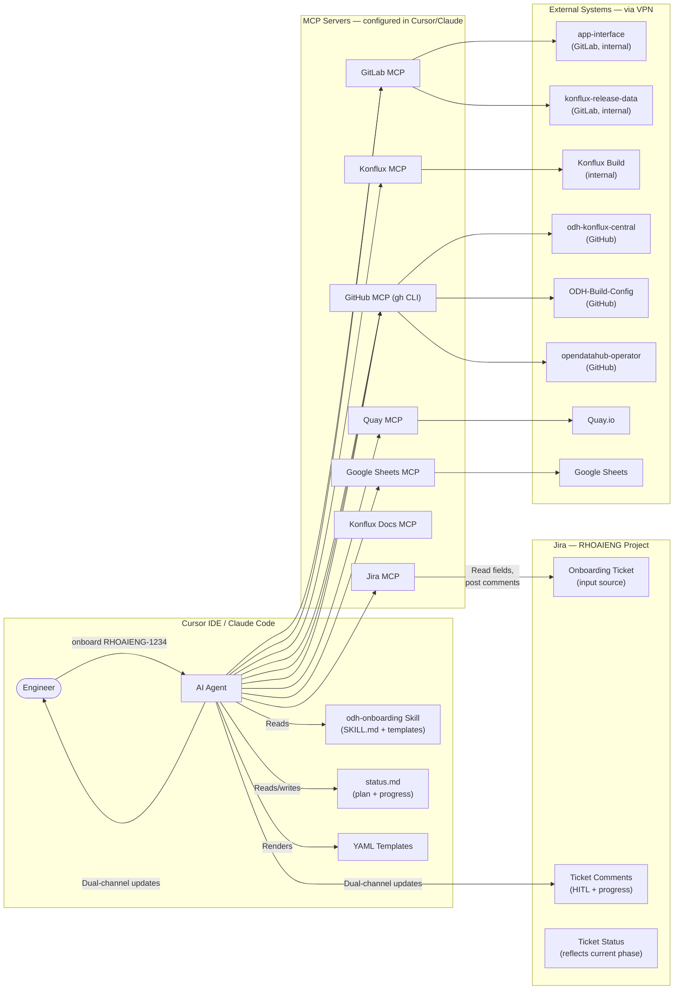
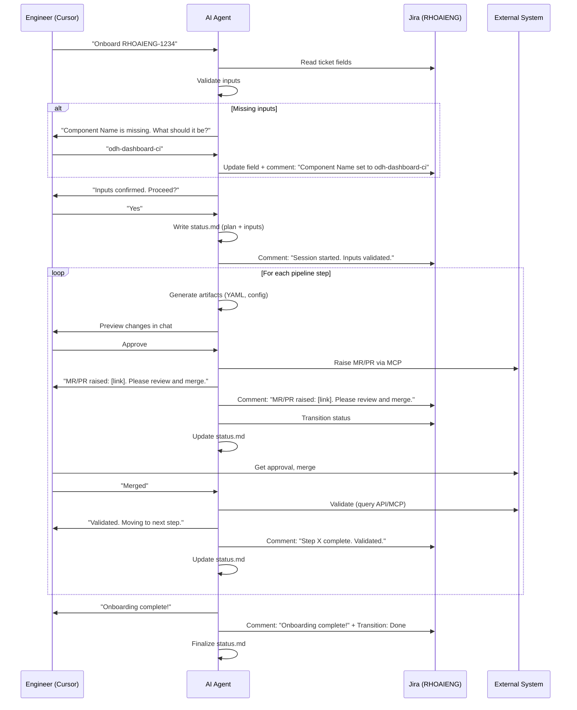

# Approach 2: Cursor / Claude Code Skill

## Overview

This approach packages the entire ODH Component Onboarding workflow as a **Cursor Agent Skill** (or equivalently, a Claude Code `AGENTS.md` / `CLAUDE.md` directive). A scrum team member creates a Jira ticket in the **RHOAIENG** project with all onboarding parameters, then invokes the skill in Cursor by passing the **Jira ticket key as an argument**. The skill reads the ticket fields via Jira MCP, validates the inputs (collecting any missing values interactively in the Cursor chat and writing them back to Jira), generates all necessary YAML manifests from parameterized templates, and raises MRs/PRs to the correct repositories via MCP tools. After each step, the agent **updates the Jira ticket** with a status comment and posts the same information in the Cursor chat. All HITL coordination -- PR review requests, questions, approvals -- is communicated through **both Jira comments and the Cursor chat window** so that the person running the skill and any Jira watchers stay synchronized. A **`status.md`** file is continuously maintained with the current plan, progress, and state so the workflow can be **resumed from any interruption** by re-invoking the skill.

---

## Architecture Diagram



---

## Prerequisites

| # | Prerequisite | Details |
|---|-------------|---------|
| 1 | **Cursor IDE or Claude Code installed** | The engineer must be running Cursor with agent mode enabled, or Claude Code CLI. |
| 2 | **VPN connected** | The engineer must be connected to the Red Hat VPN to reach internal services (`gitlab.cee.redhat.com`, Konflux APIs). |
| 3 | **All MCP servers configured** | All seven MCP servers (Jira, GitLab, GitHub/gh CLI, Quay, Konflux, Konflux Docs, Google Sheets) must be registered in the Cursor workspace settings (`.cursor/mcp.json` or global settings). See MCP Setup Documentation section. |
| 4 | **Authentication tokens** | Valid tokens/credentials for: Jira (RHOAIENG project), GitLab (internal CEE), GitHub (opendatahub-io org), Quay.io (opendatahub org), Konflux API, Google OAuth. Stored securely (env vars, credential helpers). |
| 5 | **Skill installed** | The `odh-onboarding` skill directory must exist at `~/.cursor/skills/odh-onboarding/` (personal) or `.cursor/skills/odh-onboarding/` (project-shared). |
| 6 | **RHOAIENG Jira ticket created** | A scrum team member must have created a "Component Onboarding" ticket in the RHOAIENG project with the required custom fields populated. |
| 7 | **Repository access** | The engineer (or the bot identity used by MCP) must have write/fork access to all target repos. |
| 8 | **Konflux workspace access** | Access to the `open-data-hub-tenant` Konflux workspace for running `oc` commands. |
| 9 | **`kustomize` available** | Needed locally or via shell to run `build-single.sh` in the `konflux-release-data` repo. |

---

## Dependencies

### External Services

- **Jira (RHOAIENG project)**: Ticket source, progress tracking, and HITL coordination
- **GitLab (internal)**: `gitlab.cee.redhat.com` -- hosts `app-interface` and `konflux-release-data` (requires VPN)
- **GitHub**: `github.com/opendatahub-io` -- hosts `odh-konflux-central`, `ODH-Build-Config`, `opendatahub-operator`
- **Quay.io**: Container image registry under the `opendatahub` organization
- **Konflux**: Build platform with Tekton pipelines and ArgoCD reconciliation (requires VPN)
- **Google Sheets**: ODH Component Images tracking spreadsheet

### Network Requirements

| Resource | Network | Access Method |
|----------|---------|---------------|
| `gitlab.cee.redhat.com` | Red Hat internal | **VPN required** |
| Konflux APIs / `oc` endpoint | Red Hat internal | **VPN required** |
| `github.com` | Public internet | Direct |
| `quay.io` | Public internet | Direct |
| Jira (issues.redhat.com) | Red Hat SSO | **VPN or SSO auth** |
| Google Sheets API | Public internet | OAuth |

### MCP Servers

| MCP Server | Status | Required Network | Fallback if unavailable |
|-----------|--------|-----------------|------------------------|
| **Jira MCP** | Available (`user-Jira`, 20+ tools) | VPN / SSO | **Preferred for writes**: `jira_comment.sh` / `jira_transition.sh` / `jira_update_field.py` (see Script-Based Write Utilities). MCP used for reads; scripts preferred for writes. |
| **GitLab MCP** | Available (`user-GitLab`) -- needs config | **VPN required** | `glab` CLI via Shell tool |
| **Quay MCP** | Available (`user-quay`) -- 70+ tools | Public | Direct Quay API calls via Shell |
| **GitHub MCP** | Not configured as MCP; use `gh` CLI | Public | `gh` CLI via Shell tool (fully functional) |
| **Konflux MCP** | **Needs to be built** | **VPN required** | `oc` CLI commands via Shell tool |
| **Konflux Docs MCP** | **Needs to be built** | Public or internal | Web search or embedded docs in skill |
| **Google Sheets MCP** | **Needs to be built** | Public (Google APIs) | **Preferred**: `sheets_update.py` script (see Script-Based Write Utilities). Manual update as last resort. |

### Software Tools

- `gh` CLI (GitHub CLI) -- installed and authenticated
- `glab` CLI (GitLab CLI) -- installed and authenticated (or use GitLab MCP)
- `oc` CLI (OpenShift) -- for Konflux component verification (requires VPN)
- `kustomize` -- for running `build-single.sh`

### Script-Based Write Utilities (Preferred for Jira & Google Sheets)

For **write operations** to Jira and Google Sheets, the preferred approach is to use **lightweight Python/bash helper scripts** invoked by the agent via the Shell tool, rather than relying on MCP servers. MCP servers remain a valid alternative but introduce additional setup burden and dependency; scripts are self-contained, version-controlled alongside the skill, and easier for engineers to debug and extend.

| Script | Purpose | Invocation |
|--------|---------|------------|
| `jira_comment.sh` | Post a comment to a Jira ticket | `bash jira_comment.sh RHOAIENG-1234 "Step 1 complete. MR: <link>"` |
| `jira_transition.sh` | Transition a Jira ticket to a new status | `bash jira_transition.sh RHOAIENG-1234 "In Progress"` |
| `jira_update_field.py` | Update custom fields on a Jira ticket | `python jira_update_field.py RHOAIENG-1234 --field component_name --value odh-dashboard-ci` |
| `sheets_update.py` | Append/update a row in the ODH Component Images spreadsheet | `python sheets_update.py --component odh-dashboard-ci --quay-repo odh-dashboard --status complete` |

**Implementation notes:**

- **Jira scripts** use the Jira REST API (`https://issues.redhat.com/rest/api/2/`) with a Personal Access Token stored in the `JIRA_API_TOKEN` environment variable. Bash scripts use `curl`; the Python script uses the `jira` library for complex field updates.
- **Google Sheets script** uses the `gspread` Python library with a Google Service Account JSON key (path in `GOOGLE_SA_KEY_PATH` env var) or OAuth credentials. It can also fall back to `curl` calls against the Google Sheets API v4.
- All scripts are stored in the skill directory (`~/.cursor/skills/odh-onboarding/scripts/`) and are version-controlled.
- The agent invokes these scripts via the Shell tool, passing arguments derived from the onboarding context.
- **Alternative**: If Jira MCP or Google Sheets MCP are configured and available, the agent may use those instead. The skill instructions should prefer scripts but allow MCP as a fallback.

---

## MCP Setup Documentation Requirement

As part of this approach's implementation, a **thorough MCP server setup guide** must be produced. This is a key deliverable because every engineer using the skill must configure all MCP servers locally. The documentation will cover:

| Section | Contents |
|---------|----------|
| **Overview** | Purpose of each MCP server, what it enables, and which onboarding steps use it. |
| **Jira MCP** | Installation, configuration in `.cursor/mcp.json`, Jira API token generation (issues.redhat.com), RHOAIENG project permissions. |
| **GitLab MCP** | Installation, configuration, Personal Access Token for `gitlab.cee.redhat.com`, VPN requirements, testing connectivity. |
| **GitHub MCP / `gh` CLI** | `gh` CLI installation, `gh auth login`, opendatahub-io org permissions, `.cursor/mcp.json` integration if using MCP wrapper. |
| **Quay MCP** | Installation, configuration, API token for `opendatahub` org, read vs. write permissions. |
| **Konflux MCP** | Build/installation instructions (when available), `oc login` for Konflux workspace, VPN requirements. |
| **Konflux Docs MCP** | Build/installation instructions (when available), data source configuration. |
| **Google Sheets MCP** | Build/installation instructions (when available), Google OAuth setup, spreadsheet ID configuration. |
| **Troubleshooting** | Common errors (VPN not connected, token expired, MCP server not responding), diagnostic commands, fallback CLI instructions. |
| **Verification checklist** | A script or set of commands that validates all MCP servers are reachable and authenticated. |

This documentation will be maintained alongside the skill in the `odh-onboarding` skill directory (e.g., `mcp-setup-guide.md`).

---

## User Inputs and Configuration

### Jira Ticket as Input Source (RHOAIENG project)

The skill takes a **Jira ticket key** as its input argument. The ticket must be of type "Component Onboarding" in the RHOAIENG project with these fields:

| Field | Type | Required | Example |
|-------|------|----------|---------|
| Summary | Text | Yes | "Onboard odh-dashboard to ODH CI builds" |
| Component Name | Text (custom) | Yes | `odh-dashboard-ci` |
| Repository URL | URL (custom) | Yes | `https://github.com/opendatahub-io/odh-dashboard` |
| Quay Repo Name | Text (custom) | Yes | `odh-dashboard` |
| Context Path | Text (custom) | No (default: `./`) | `./` |
| Dockerfile Path | Text (custom) | No (default: `Dockerfile`) | `Dockerfile` |
| Branch | Text (custom) | No (default: `main`) | `main` |
| Is Operator | Checkbox (custom) | No (default: unchecked) | unchecked |
| Operator Manifest Src | Text (custom) | Conditional | `config/manifests` |
| Operator Manifest Dest | Text (custom) | Conditional | `odh-dashboard` |

### Invocation

The engineer invokes the skill by referencing the Jira ticket key:

```
Onboard component from RHOAIENG-1234
```

The agent reads the skill instructions, then uses Jira MCP to fetch the ticket fields. If any required field is missing or ambiguous, the agent asks the engineer interactively in the Cursor chat and **writes the collected value back to the Jira ticket** (preferred: `jira_update_field.py` via Shell tool; alternative: Jira MCP `updateJiraIssue`) to keep all sources synchronized.

### YAML Configuration File (alternative)

Users may also provide a pre-filled YAML configuration file in addition to the Jira ticket:

```yaml
# onboarding-config.yaml
component:
  name: odh-dashboard-ci
  repo_url: https://github.com/opendatahub-io/odh-dashboard
  quay_repo: odh-dashboard
  context_path: ./
  dockerfile_path: Dockerfile
  branch: main
  is_operator: false
```

If both a YAML file and a Jira ticket are provided, the YAML file values take precedence and are synced back to the Jira ticket.

---

## The `status.md` File

The agent maintains a **`status.md`** file in the working directory throughout the onboarding process. This file serves as the persistent state record that enables **resumption after any interruption** (session crash, Cursor restart, network loss, etc.).

### Structure

```markdown
# ODH Onboarding Status: RHOAIENG-1234

## Inputs
- Jira Ticket: RHOAIENG-1234
- Component Name: odh-dashboard-ci
- Repository URL: https://github.com/opendatahub-io/odh-dashboard
- Quay Repo Name: odh-dashboard
- Context Path: ./
- Dockerfile Path: Dockerfile
- Branch: main
- Is Operator: false

## Plan
1. [x] Validate inputs
2. [x] Create Quay repo (MR: https://gitlab.cee.redhat.com/.../merge_requests/456)
3. [x] Add to konflux-release-data (MR: https://gitlab.cee.redhat.com/.../merge_requests/789)
4. [ ] Tekton + Onboarder changes (IN PROGRESS)
5. [ ] Run CI Build Onboarding
6. [ ] Verify Konflux Build
7. [ ] Bundle Patch changes
8. [ ] Operator changes (skipped — not operator)
9. [ ] Update spreadsheet

## Current Step
Step 4: Tekton + Onboarder changes
- Status: PR raised, awaiting review
- PR: https://github.com/opendatahub-io/odh-konflux-central/pull/123
- Jira status: Tekton PR Raised

## Log
- 2026-04-04 10:15 — Session started. Inputs validated.
- 2026-04-04 10:18 — Quay MR raised: https://gitlab.cee.redhat.com/.../merge_requests/456
- 2026-04-04 10:45 — Quay MR merged. Quay repo verified.
- 2026-04-04 10:50 — Konflux MR raised: https://gitlab.cee.redhat.com/.../merge_requests/789
- 2026-04-04 11:30 — Konflux MR merged. Component verified via oc get component.
- 2026-04-04 11:35 — Tekton PR raised: https://github.com/.../pull/123
```

### Behavior

- **Written at startup**: Agent creates `status.md` with the full plan and validated inputs.
- **Updated after each step**: As steps complete or change state, the file is updated.
- **Resume on re-invocation**: When the skill is re-invoked with the same Jira ticket key, the agent reads `status.md` (if it exists) and the Jira ticket status to determine where to resume. It does not repeat completed steps.
- **Conflict resolution**: If `status.md` and the Jira ticket disagree on the current step, the agent compares both, posts the discrepancy in the chat, and asks the engineer which to trust.

---

## End-to-End Flow

### Step 0: Read Jira Ticket and Validate Inputs

| Aspect | Detail |
|--------|--------|
| **Agent action** | Read the skill instructions. Use Jira MCP `getJiraIssue` to fetch all fields from the RHOAIENG ticket. Validate that all required fields are present and correctly formatted. If any are missing, ask the engineer interactively in the Cursor chat, then write the values back to the Jira ticket. |
| **MCP tools** | Jira MCP (`getJiraIssue`) for **reading** ticket fields. |
| **Jira writes** | **Preferred**: `jira_update_field.py` to write back missing values; `jira_comment.sh` to post session-started comment; `jira_transition.sh` to move ticket to "In Progress". **Alternative**: Jira MCP (`updateJiraIssue`, `addCommentToJiraIssue`). |
| **HITL gate** | Engineer confirms the collected/parsed inputs before proceeding. |
| **Jira update** | Post a comment: *"Onboarding session started by [engineer]. Inputs validated. Beginning with Quay repo creation."* Transition ticket to "In Progress". |
| **status.md** | Create `status.md` with the full plan, inputs, and Step 0 marked complete. |
| **Validation** | Verify repo URL is accessible. Verify component name follows naming conventions (no POC or version identifiers). |

> **Note — Jira write pattern for all steps**: Every subsequent step posts Jira comments and transitions ticket status. Unless otherwise noted, the preferred method is the **script-based approach** (`jira_comment.sh` and `jira_transition.sh` via Shell tool), with **Jira MCP** as the alternative. The "Jira update" row in each step describes *what* is written; the *how* follows this pattern throughout.

### Step 1: Create Quay Repository

| Aspect | Detail |
|--------|--------|
| **Agent action** | Clone or read the `app-interface` repo. Locate `data/services/rhoai/quay/opendatahub.yml`. Append a new Quay repo entry. Commit to a new branch. Raise a Merge Request targeting `master`. |
| **MCP tools** | GitLab MCP (`create_branch`, `edit_file`, `create_merge_request`), Jira MCP |
| **HITL gate** | Agent posts MR link **in both Jira comment and Cursor chat**: *"MR raised for Quay repo creation: [link]. Please review and merge."* Agent waits for merge confirmation. |
| **Jira update** | Comment with MR link. Transition ticket to "Quay MR Raised". On merge: comment confirmation, transition to "Quay MR Merged". |
| **status.md** | Update with MR link, mark step in progress. On completion, mark step done with validation result. |
| **Validation** | After merge, call Quay MCP `get_repository` to verify the repo exists. Retry with backoff if not propagated. |

**Template -- Quay repo entry** (appended to `opendatahub.yml`):
```yaml
- name: <quay_repo_name>
  description: ODH component image for <component_name>
  public: true
```

### Step 2: Add Component to konflux-release-data

| Aspect | Detail |
|--------|--------|
| **Agent action** | Clone `konflux-release-data`. Create a branch. Render the Konflux Component YAML from template with user inputs. Append to `opendatahub-ci-components.yaml`. Run `bash build-single.sh open-data-hub-tenant`. Commit all changes. Raise MR. |
| **MCP tools** | GitLab MCP, Shell (`build-single.sh`), Jira MCP |
| **HITL gate** | MR link posted in both Jira comment and Cursor chat. Engineer gets it reviewed and merged. |
| **Jira update** | Comment with MR link. Transition to "Konflux MR Raised". On merge: transition to "Konflux MR Merged". |
| **status.md** | Update with MR link, step status, and validation result. |
| **Validation** | After merge + ArgoCD reconciliation, verify via Konflux MCP or `oc get component <component_name>`. |

**Template -- Konflux Component YAML**:
```yaml
apiVersion: appstudio.redhat.com/v1alpha1
kind: Component
metadata:
  annotations:
    build.appstudio.openshift.io/request: configure-pac-no-mr
    mintmaker.appstudio.redhat.com/disabled: "true"
    build.appstudio.openshift.io/pipeline: '{"name":"docker-build-multi-platform-oci-ta","bundle":"latest"}'
  name: <component_name>
spec:
  application: opendatahub-builds
  componentName: <component_name>
  containerImage: quay.io/opendatahub/<quay_repo_name>
  source:
    git:
      context: <context_path>
      dockerfileUrl: <dockerfile_path>
      revision: "<branch>"
      url: <repo_url>
```

### Step 3: Tekton PipelineRun Changes

| Aspect | Detail |
|--------|--------|
| **Agent action** | Clone `odh-konflux-central`. Create a branch. Under `pipelineruns/`, create a folder named after the repository (skip if exists). Copy and render push and pull-request templates. Verify ServiceAccount name via `oc get sa`. Commit changes. |
| **MCP tools** | GitHub MCP (`gh` CLI), Shell (`oc get sa`), Jira MCP |
| **HITL gate** | PR link posted in both Jira comment and Cursor chat. Engineer reviews and merges. |
| **Jira update** | Comment with PR link. Transition to "Tekton PR Raised". On merge: transition to "Tekton PR Merged". |
| **status.md** | Update with PR link and step status. |
| **Validation** | PR CI checks pass. |

**Template -- Push PipelineRun** (`<component_name>-on-push.yaml`):
```yaml
apiVersion: tekton.dev/v1
kind: PipelineRun
metadata:
  annotations:
    build.appstudio.openshift.io/repo: <repo_url>?rev={{revision}}
    build.appstudio.redhat.com/commit_sha: '{{revision}}'
    build.appstudio.redhat.com/target_branch: '{{target_branch}}'
    pipelinesascode.tekton.dev/cancel-in-progress: "false"
    pipelinesascode.tekton.dev/max-keep-runs: "3"
    pipelinesascode.tekton.dev/on-cel-expression: event == "push" && target_branch
      == "$$TARGET_BRANCH$$"
  creationTimestamp: null
  labels:
    appstudio.openshift.io/application: opendatahub-builds
    appstudio.openshift.io/component: <component_name>
    pipelines.appstudio.openshift.io/type: build
  name: <component_name>-on-push
  namespace: open-data-hub-tenant
spec:
  params:
  - name: git-url
    value: '{{source_url}}'
  - name: revision
    value: '{{revision}}'
  - name: output-image
    value: quay.io/opendatahub/<quay_repo_name>:$$OUTPUT_IMAGE_TAG$$
  - name: dockerfile
    value: <dockerfile_path>
  - name: path-context
    value: <context_path>
  pipelineRef:
    resolver: git
    params:
    - name: url
      value: https://github.com/opendatahub-io/odh-konflux-central.git
    - name: revision
      value: main
    - name: pathInRepo
      value: pipeline/multi-arch-container-build.yaml
  taskRunTemplate:
    serviceAccountName: build-pipeline-<component_name>
  workspaces:
  - name: git-auth
    secret:
      secretName: '{{ git_auth_secret }}'
status: {}
```

**Template -- Pull Request PipelineRun** (`<component_name>-on-pull-request.yaml`):
```yaml
apiVersion: tekton.dev/v1
kind: PipelineRun
metadata:
  annotations:
    build.appstudio.openshift.io/repo: <repo_url>?rev={{revision}}
    build.appstudio.redhat.com/commit_sha: '{{revision}}'
    build.appstudio.redhat.com/target_branch: '{{target_branch}}'
    build.appstudio.redhat.com/pull_request_number: '{{pull_request_number}}'
    pipelinesascode.tekton.dev/cancel-in-progress: "true"
    pipelinesascode.tekton.dev/max-keep-runs: "3"
    pipelinesascode.tekton.dev/on-cel-expression: event == "pull_request" && target_branch
      == "$$TARGET_BRANCH$$"
  creationTimestamp: null
  labels:
    appstudio.openshift.io/application: opendatahub-builds
    appstudio.openshift.io/component: <component_name>
    pipelines.appstudio.openshift.io/type: build
  name: <component_name>-on-pull-request
  namespace: open-data-hub-tenant
spec:
  params:
  - name: git-url
    value: '{{source_url}}'
  - name: revision
    value: '{{revision}}'
  - name: output-image
    value: quay.io/opendatahub/<quay_repo_name>:odh-pr
  - name: dockerfile
    value: <dockerfile_path>
  - name: path-context
    value: <context_path>
  - name: pipeline-type
    value: pull-request
  - name: additional-tags
    value:
    - 'odh-pr-{{revision}}'
  pipelineRef:
    resolver: git
    params:
    - name: url
      value: https://github.com/opendatahub-io/odh-konflux-central.git
    - name: revision
      value: main
    - name: pathInRepo
      value: pipeline/multi-arch-container-build.yaml
  taskRunTemplate:
    serviceAccountName: build-pipeline-<component_name>
  workspaces:
  - name: git-auth
    secret:
      secretName: '{{ git_auth_secret }}'
status: {}
```

### Step 4: Update Konflux Onboarder Workflow

| Aspect | Detail |
|--------|--------|
| **Agent action** | In the same branch/PR as Step 3 (or a separate commit), add the repository name to the `odh-konflux-onboarder.yml` workflow file's repo list. Skip if already listed. |
| **MCP tools** | GitHub MCP (`gh` CLI) -- same PR as Step 3. |
| **HITL gate** | Combined with Step 3's PR review. |
| **Jira update** | Included in Step 3's Jira comment. |
| **status.md** | Updated as part of Step 3. |
| **Validation** | Verify repo name appears in the onboarder's dropdown inputs. |

### Step 5: Run CI/Nightly Build Onboarding

| Aspect | Detail |
|--------|--------|
| **Agent action** | Trigger `odh-konflux-onboarder.yml` workflow via GitHub Actions API with inputs: repo name, target branch, build type = `CI`. Monitor the workflow run. Post workflow link in both Jira and Cursor. When complete, post the resulting PR link. |
| **MCP tools** | GitHub MCP (`gh workflow run`, `gh run watch`), Jira MCP |
| **HITL gate** | PR link posted in both Jira comment and Cursor chat. Engineer merges the PR to the component repo. |
| **Jira update** | Comment with workflow link, then PR link. Transition to "CI Build Triggered". On merge: transition to "CI Build PR Merged". |
| **status.md** | Update with workflow link, PR link, step status. |
| **Validation** | Workflow completes successfully. PR is created against the target branch. |

### Step 6: Verify Konflux Build

| Aspect | Detail |
|--------|--------|
| **Agent action** | After the component-repo PR is merged, monitor the Konflux build. Poll for build status. If build fails, retrieve logs, analyze error, suggest fix using Konflux Docs MCP. Post all status updates to both Jira and Cursor. |
| **MCP tools** | Konflux MCP (or `oc get pipelinerun`, `oc logs`), Konflux Docs MCP, Quay MCP, Jira MCP |
| **HITL gate** | If a fix is needed, agent proposes the change in both Jira comment and Cursor chat. Asks for approval before pushing. |
| **Jira update** | Comment with build status updates. Transition to "Build Verifying", then "Build Succeeded" or "Build Failed". |
| **status.md** | Update with build status, error details if failed, fix applied. |
| **Validation** | Build completes with status `Succeeded`. Image available in Quay (verified via Quay MCP). |

### Step 7: Bundle Patch Changes

| Aspect | Detail |
|--------|--------|
| **Agent action** | Fetch latest image digest from Quay MCP. Clone `ODH-Build-Config`. Add new `relatedImages` entry to `bundle/bundle-patch.yaml`. Raise PR. |
| **MCP tools** | Quay MCP (`get_manifest`), GitHub MCP (`gh` CLI), Jira MCP |
| **HITL gate** | PR link posted in both Jira comment and Cursor chat. Engineer reviews and merges. |
| **Jira update** | Comment with PR link. Transition to "Bundle PR Raised". On merge: transition to "Bundle PR Merged". |
| **status.md** | Update with PR link and step status. |
| **Validation** | PR passes CI checks. `RELATED_IMAGE_*` name follows convention. |

**Template -- bundle-patch entry**:
```yaml
- name: RELATED_IMAGE_<COMPONENT_NAME_UPPER_SNAKE>_IMAGE
  value: quay.io/opendatahub/<quay_repo_name>@sha256:<image_digest>
```

### Step 8: Operator Manifest Changes (conditional)

| Aspect | Detail |
|--------|--------|
| **Agent action** | Only if `is_operator = true`. Clone `opendatahub-operator`. Add entry to `build/manifests-config.yaml`. Raise PR. Ensure changes synced to `stable` branch. |
| **MCP tools** | GitHub MCP (`gh` CLI), Jira MCP |
| **HITL gate** | PR link posted in both Jira comment and Cursor chat. Engineer reviews and merges. |
| **Jira update** | Comment with PR link. Transition to "Operator PR Raised". On merge: transition to "Operator PR Merged". If skipped: comment noting this step is not applicable. |
| **status.md** | Update with PR link or "skipped" notation. |
| **Validation** | PR passes CI. Manifest config is valid YAML. |

### Step 9: Update Components Spreadsheet

| Aspect | Detail |
|--------|--------|
| **Agent action** | Update the [ODH Component Images spreadsheet](https://docs.google.com/spreadsheets/d/1L9DLtULjhoTGmkOVnjXKJAihIDu2eDrvemYsqArth9c/edit?gid=0#gid=0) with the new component details. |
| **Sheets write** | **Preferred**: `sheets_update.py` via Shell tool — appends a row with component name, Quay repo, image digest, onboarding date, and Jira ticket key. Uses `gspread` + Google Service Account credentials. **Alternative**: Google Sheets MCP (if available). |
| **Fallback** | If neither script nor MCP can authenticate, the agent provides the data in a formatted table in both Jira comment and Cursor chat and asks the user to paste it manually. |
| **Jira update** | Comment confirming spreadsheet update. Transition ticket to "Done". (Via `jira_comment.sh` / `jira_transition.sh`; alternative: Jira MCP.) |
| **status.md** | Mark step complete. Mark overall onboarding as "Done". |
| **Validation** | Verify the row was added by reading the sheet back (via `sheets_update.py --verify` or Google Sheets MCP read). |

---

## Human-in-the-Loop (HITL) Model



### Key HITL Principles

- **Dual-channel communication**: Every MR/PR link, status update, question, and completion notice is posted in **both** the Cursor chat window and as a Jira comment. The engineer gets immediate feedback; Jira watchers and stakeholders stay informed.
- **Interactive input collection with Jira sync**: Missing or ambiguous inputs are collected conversationally in the Cursor chat. Every collected value is written back to the Jira ticket to keep all sources synchronized.
- **Preview before submit**: Every generated artifact is shown to the user in the Cursor chat before being submitted as an MR/PR.
- **Explicit continuation**: The agent does not proceed to the next step until the user confirms the current step's MR/PR has been merged.
- **Error escalation**: If validation fails, the agent reports the error in both channels, suggests a fix, and waits for user approval.
- **Persistent state via `status.md`**: Progress is continuously written to `status.md`. On re-invocation, the agent reads this file and resumes from the last completed step.
- **Abort capability**: The user can say "stop" or "abort" at any time. The `status.md` and Jira ticket both reflect the current state, enabling clean resumption later.

---

## Error Handling and Recovery

| Failure Scenario | Detection | Recovery |
|-----------------|-----------|----------|
| Missing Jira fields | Agent reads ticket, finds nulls | Agent asks in Cursor chat. Writes collected values back to Jira. |
| MCP server unreachable | Tool call returns error/timeout | Fall back to CLI equivalent (`gh`, `glab`, `oc`). Inform user in chat and Jira. |
| VPN not connected | GitLab/Konflux MCP calls fail with network error | Agent detects the pattern and alerts: *"Cannot reach gitlab.cee.redhat.com. Please verify VPN connection."* Pauses and retries after user confirms VPN is up. |
| MR/PR CI pipeline fails | Agent polls pipeline status | Present failure logs in both Cursor chat and Jira comment. Suggest fix. Push amended commit after approval. |
| Konflux build fails | Build status != Succeeded | Retrieve logs via Konflux MCP / `oc logs`. Consult Konflux Docs MCP. Post diagnosis + suggested fix in both channels. |
| Quay repo not created after MR merge | `get_repository` returns 404 | Wait with exponential backoff (30s, 60s, 120s). Alert user if not resolved after 5 min. |
| ArgoCD reconciliation slow | `oc get component` returns not found | Retry with backoff. Inform user to check ArgoCD sync status manually. |
| Invalid user inputs | Pre-flight validation checks | Report specific validation error. Re-prompt in chat. Update Jira with corrected values. |
| Session interrupted mid-workflow | Agent reads `status.md` on re-invocation | Agent reads `status.md` and Jira ticket status. Identifies last completed step. Resumes from there. Posts resume notice in both channels. |
| `status.md` and Jira ticket disagree | Comparison on resume | Agent posts the discrepancy in chat and asks engineer which source to trust. Reconciles accordingly. |

---

## Modular Skill Architecture (Future Enhancement)

While this document describes the onboarding workflow as a **single monolithic skill**, the pipeline naturally decomposes into independent steps that could each be developed and maintained as a **separate Cursor Agent Skill**. This section outlines how such a modular architecture would work at a high level.

### Concept

Each of the 10 steps (Step 0 – Step 9) becomes its own skill with its own `SKILL.md`, templates, and helper scripts. A thin **orchestrator skill** chains them together, passing context via `status.md` and the Jira ticket.

```
~/.cursor/skills/odh-onboarding/
├── SKILL.md                      # Orchestrator — reads status.md, invokes step skills in order
├── status.md                     # Shared state (unchanged from current design)
├── scripts/                      # Shared helper scripts (jira_comment.sh, sheets_update.py, etc.)
├── step-0-validate-inputs/
│   └── SKILL.md
├── step-1-create-quay-repo/
│   └── SKILL.md
├── step-2-konflux-release-data/
│   └── SKILL.md
├── step-3-tekton-pipelineruns/
│   ├── SKILL.md
│   └── templates/
├── step-4-update-onboarder/
│   └── SKILL.md
├── step-5-run-ci-build/
│   └── SKILL.md
├── step-6-verify-build/
│   └── SKILL.md
├── step-7-bundle-patch/
│   ├── SKILL.md
│   └── templates/
├── step-8-operator-config/
│   ├── SKILL.md
│   └── templates/
└── step-9-update-spreadsheet/
    └── SKILL.md
```

### Benefits of Modular Skills

- **Independent development and testing** — each step can be built, tested, and iterated on separately without touching other steps.
- **Standalone invocation** — an engineer can invoke a single step skill directly (e.g., `Run step-7-bundle-patch for RHOAIENG-1234`) for re-runs or one-off tasks.
- **Easier maintenance** — when a step's process changes (e.g., Konflux API changes), only that step's skill needs updating.
- **Parallel development** — different team members can work on different step skills simultaneously.
- **Composability** — step skills can be reused in other workflows beyond onboarding.

### Trade-offs

- **Added complexity** — managing 10+ skill directories vs. one monolithic file; the orchestrator must handle inter-step context passing correctly.
- **Not required for Phase 1** — the monolithic skill described in this document is sufficient for initial delivery. Modular decomposition is a natural evolution once the workflow stabilizes.

### Recommendation

Start with the **monolithic skill** as described in this document. After 3–5 successful onboardings, identify which steps change most frequently or are most useful standalone, and extract those into separate skills first. The `status.md` contract and script-based utilities already provide the clean boundaries needed for future decomposition.

---

## Pros

- **Lowest infrastructure footprint** -- no additional CI/CD pipelines, servers, or platforms needed beyond Cursor + MCP configuration + VPN.
- **Immediate usability** -- any engineer with Cursor and MCP configured can use it.
- **Full context in the IDE** -- the engineer stays in their development environment with full control.
- **Jira as the source of truth** -- the Jira ticket captures all inputs, progress updates, and MR/PR links. Stakeholders and watchers stay informed without needing Cursor access.
- **Dual-channel HITL** -- engineers get real-time feedback in Cursor; watchers and managers get async updates in Jira.
- **Interactive input collection** -- missing values are gathered conversationally and synced back to Jira, providing better UX than form-only input.
- **Resumable via `status.md`** -- interruptions (session crash, network loss, end of day) are handled gracefully. The engineer can resume exactly where they left off.
- **Transparent execution** -- every tool call, generated YAML, and MCP interaction is visible in the chat transcript.
- **Easy to maintain** -- the skill is a set of markdown files and YAML templates; updating the process means editing these files.
- **Works with Claude Code too** -- the same instructions adapt to Claude Code's `AGENTS.md` / `CLAUDE.md`.

---

## Cons

- **Single-user execution** -- only the engineer running the Cursor session can drive the workflow. Other team members observe via Jira but cannot co-drive the session.
- **Local environment dependency** -- Needs VPN connected, along with setting up all the tools needed for MCP server execution on local env if any. Every engineer must set this up.
- **MCP setup burden** -- every engineer must independently configure all seven MCP servers with proper authentication. This is mitigated by the MCP Setup Documentation deliverable but remains a real onboarding cost.
- **MCP server gaps** -- Konflux MCP, Konflux Docs MCP, and Google Sheets MCP do not exist yet and must be built or worked around with CLI fallbacks.
- **VPN dependency** -- the engineer must be on VPN for internal services. Disconnection mid-workflow pauses progress (though `status.md` enables clean resume).
- **No automated triggering** -- requires a human to invoke the skill; the Jira ticket alone does not start the process automatically (unlike Approach 4).
- **Chat history limits** -- for very long onboarding sessions, Cursor's chat context window may truncate earlier steps. `status.md` mitigates this but the agent may lose conversational nuance.

---

## Effort Estimate

| Work Item | Effort |
|-----------|--------|
| Write SKILL.md with full workflow instructions (Jira integration, dual-channel HITL, `status.md` logic) | 3-4 days |
| Create parameterized YAML templates | 1 day |
| Write script-based write utilities (`jira_comment.sh`, `jira_transition.sh`, `jira_update_field.py`, `sheets_update.py`) | 1-2 days |
| Write MCP Server Setup Documentation (`mcp-setup-guide.md`) | 2-3 days |
| Build / source missing MCP servers (Konflux, Konflux Docs; Google Sheets MCP optional if using `sheets_update.py`) | 3-5 days each |
| Configure and test all MCP integrations in Cursor | 2-3 days |
| Configure RHOAIENG Jira project (custom issue type, fields, workflow) | 2-3 days |
| End-to-end testing with a real component | 2-3 days |
| Team onboarding (walk-through + MCP setup support) | 1-2 days |
| **Total** | **~3-4 weeks** |

If missing MCP servers are replaced with CLI fallbacks and script-based utilities (recommended for Jira writes and Google Sheets), the timeline drops to approximately **2 weeks** (excluding the Jira configuration, which is shared across approaches).
