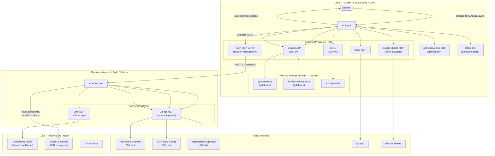
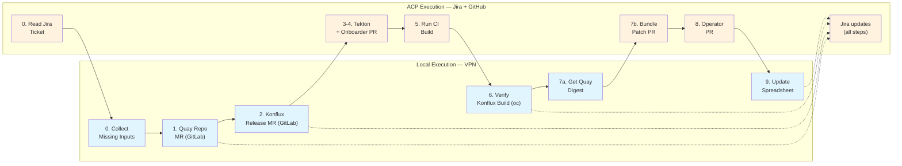
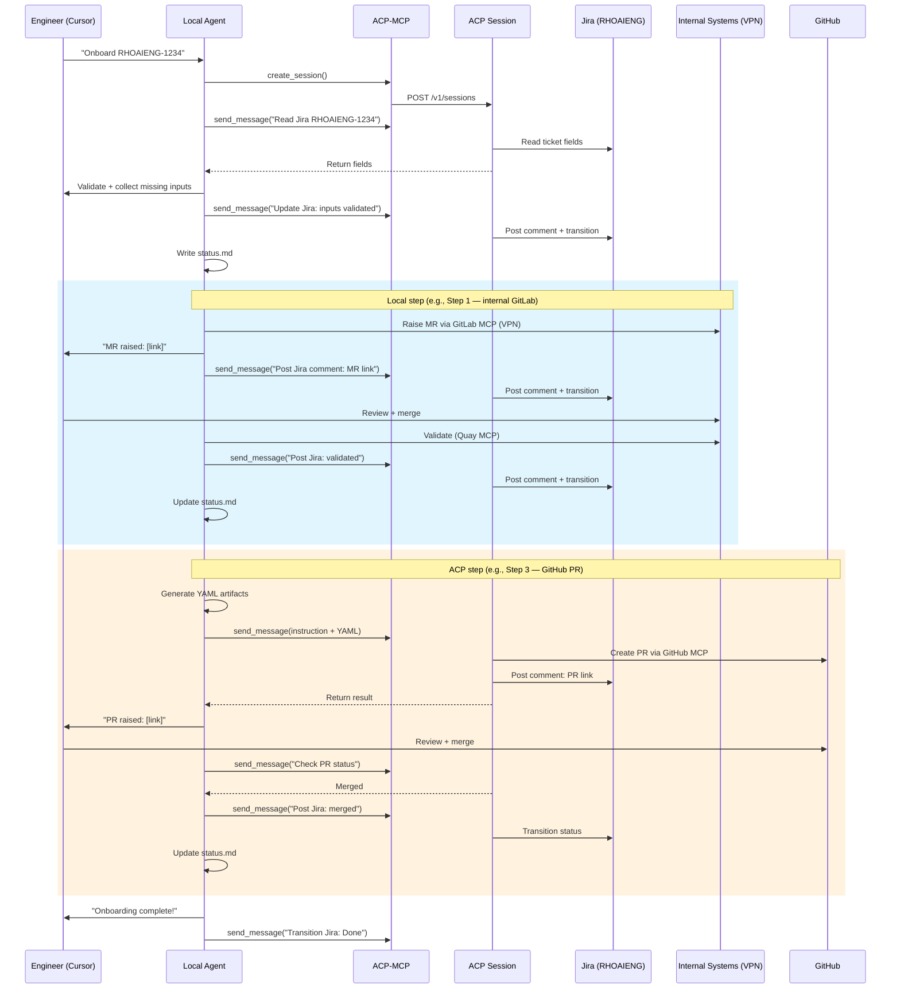

# Approach 3: ACP-Backed ODH Onboarding Skill (Hybrid)

## Overview

This approach is a **hybrid** between the fully-local Cursor Skill (Approach 1) and the fully-ACP Jira-triggered pipeline (Approach 4). A **local Cursor/Claude Code skill** acts as the **orchestrator** -- it holds the plan, drives HITL interactions, and makes routing decisions -- while an **Ambient Code Platform (ACP) session** serves as the **remote execution engine** for capabilities ACP already provides: **Jira MCP** (for all ticket interactions) and **GitHub MCP** (for PR creation and workflow triggers). Steps that require **Red Hat internal network access** (internal GitLab, Konflux) are executed **locally via VPN**, since ACP does not currently have internal network connectivity.

The key innovation is an **ACP-MCP server** configured in the local Cursor/Claude environment that lets the skill create, instruct, and monitor ACP sessions programmatically. The Jira ticket (RHOAIENG project) serves as a **shared blackboard**, with all Jira reads and writes flowing through ACP's Jira MCP.

This design provides:

- **Leverage what ACP has today** -- ACP's Jira MCP and GitHub MCP handle ticket management and public GitHub operations, eliminating the need for local Jira or GitHub MCP configuration.
- **Local execution for internal network** -- steps requiring `gitlab.cee.redhat.com` or Konflux APIs run locally via VPN, avoiding the ACP internal-network dependency entirely.
- **Graceful degradation** -- if ACP is unavailable, the skill can fall back to fully-local execution (Approach 1 mode) using local CLI tools.
- **Incremental adoption** -- as ACP gains internal network access or new MCP servers, steps can shift from local to ACP without rewriting the skill.

---

## Core Concept: Local Orchestrator + Remote Executor

```
┌─────────────────────────────────────────────────────────────────┐
│                    LOCAL (Cursor / Claude Code)                  │
│                                                                 │
│  ┌──────────────┐   ┌──────────┐   ┌──────────────────────┐    │
│  │ SKILL.md     │   │ status.md│   │ YAML Templates       │    │
│  │ (orchestrator│   │ (state)  │   │ (Konflux, Tekton,    │    │
│  │  + routing   │   │          │   │  bundle-patch)       │    │
│  │  decisions)  │   │          │   │                      │    │
│  └──────┬───────┘   └────┬─────┘   └──────────┬───────────┘    │
│         │                │                     │                │
│         ▼                ▼                     ▼                │
│  ┌─────────────────────────────────────────────────────────┐    │
│  │                     AI Agent                            │    │
│  │  • Delegates Jira reads/writes to ACP                   │    │
│  │  • Collects missing inputs interactively                │    │
│  │  • Decides: execute locally OR delegate to ACP          │    │
│  │  • Executes internal-network steps via VPN              │    │
│  │  • Updates status.md after each step                    │    │
│  │  • Manages HITL (chat + Jira via ACP dual-channel)      │    │
│  └──────┬──────────────────────────┬───────────────────────┘    │
│         │                          │                            │
│    Local MCP + CLI Tools      ACP-MCP Server                    │
│    ┌────────────┐             ┌──────────────┐                  │
│    │ GitLab MCP │             │ create_      │                  │
│    │ (VPN)      │             │ session()    │                  │
│    │ Quay MCP   │             │ send_        │                  │
│    │ oc CLI     │             │ message()    │                  │
│    │ (VPN)      │             │ get_status() │                  │
│    │ Google     │             │              │                  │
│    │ Sheets MCP │             │              │                  │
│    └────────────┘             └──────┬───────┘                  │
│                                      │                          │
│    Red Hat Internal Network          │                          │
│    (via VPN)                         │                          │
│    ┌──────────────────────┐          │                          │
│    │ gitlab.cee.redhat.com│          │                          │
│    │ Konflux APIs         │          │                          │
│    └──────────────────────┘          │                          │
│                                      │                          │
└──────────────────────────────────────┼──────────────────────────┘
                                       │
                          POST /v1/sessions
                          POST /v1/sessions/{id}/messages
                                       │
                                       ▼
┌─────────────────────────────────────────────────────────────────┐
│                    REMOTE (Ambient Code Platform)                │
│                                                                 │
│  ┌─────────────────────────────────────────────────────────┐    │
│  │                   ACP Session                           │    │
│  │  • Handles all Jira interactions (read/write/comment)   │    │
│  │  • Executes GitHub operations (PRs, workflows)          │    │
│  │  • Returns results to local skill via ACP-MCP           │    │
│  └──────┬──────────────────────────────────────────────────┘    │
│         │                                                       │
│    ACP MCP Servers                                              │
│    ┌────────────┐  ┌────────────┐                               │
│    │ Jira MCP   │  │ GitHub MCP │                               │
│    │ (all Jira  │  │ (native    │                               │
│    │  ops)      │  │  integr.)  │                               │
│    └────────────┘  └────────────┘                               │
│                                                                 │
│    No internal network access                                   │
└─────────────────────────────────────────────────────────────────┘
```

### Routing Principle

For each step, the skill asks two questions:

1. **Does the step need Red Hat internal network?** → execute **locally** (via VPN)
2. **Does the step need Jira or GitHub?** → delegate to **ACP**
3. **Both?** → split: execute the internal-network part locally, then delegate Jira/GitHub parts to ACP

---

## Architecture Diagram



---

## Step Routing Table

| Step | Primary Capability Needed | Needs Internal Network? | Needs Jira/GitHub? | Execution | Rationale |
|------|--------------------------|------------------------|--------------------|-----------|-----------|
| **0. Validate inputs** | Jira read + interactive HITL | No | Jira: yes | **ACP** (Jira read) + **Local** (interactive) | Create ACP session first, ask it to read Jira ticket. Collect missing inputs interactively in Cursor, sync back via ACP. |
| **1. Quay repo MR** | GitLab MCP + internal network | **Yes** (`gitlab.cee`) | Jira: yes | **Local** (GitLab MR via VPN) + **ACP** (Jira update) | Internal GitLab needs VPN. After MR is raised, tell ACP to post Jira comment. |
| **2. konflux-release-data MR** | GitLab MCP + `build-single.sh` + internal network | **Yes** (`gitlab.cee`) | Jira: yes | **Local** (GitLab MR + shell via VPN) + **ACP** (Jira update) | Same as Step 1. |
| **3-4. Tekton + Onboarder PR** | GitHub MCP | No | GitHub + Jira: yes | **ACP** | ACP has both GitHub and Jira MCP. Full delegation. |
| **5. Run CI Build** | GitHub MCP (workflow trigger) | No | GitHub + Jira: yes | **ACP** | ACP triggers workflow and posts updates to Jira. |
| **6. Verify Konflux Build** | Konflux API + Quay | **Yes** (Konflux) | Jira: yes | **Local** (oc CLI via VPN + Quay MCP) + **ACP** (Jira update) | Konflux needs VPN. Quay available locally. Tell ACP to update Jira. |
| **7. Bundle Patch PR** | Quay MCP + GitHub MCP | No | GitHub + Jira: yes | **Local** (Quay digest) + **ACP** (GitHub PR + Jira update) | Get digest locally, delegate PR and Jira to ACP. |
| **8. Operator PR** | GitHub MCP | No | GitHub + Jira: yes | **ACP** | Full delegation. |
| **9. Update spreadsheet** | Google Sheets MCP | No | Jira: yes | **Local** (Google Sheets) + **ACP** (Jira update) | Google Sheets not in ACP. Tell ACP to post final Jira comment. |

### Visual Step Flow



> Blue = local execution (VPN + local MCP/CLI). Orange = ACP execution (Jira MCP + GitHub MCP). Dashed arrows = locally-executed steps delegate their Jira updates to ACP.

---

## The ACP-MCP Server

The **ACP-MCP server** is an MCP server configured in the local Cursor/Claude environment that wraps the ACP public API.

### Tools

| Tool | Description | ACP API Call |
|------|-------------|--------------|
| `create_session` | Create a new ACP session. Returns session ID and URL. | `POST /v1/sessions` |
| `send_message` | Send an instruction to an existing ACP session. Used to delegate steps and Jira operations. | `POST /v1/sessions/{id}/messages` |
| `get_session_status` | Check if the ACP session has completed its current task. | `GET /v1/sessions/{id}` |
| `get_session_messages` | Read the session's message history to extract results. | `GET /v1/sessions/{id}/messages` |

### Session Management Strategy

The skill creates **one ACP session** at the start and reuses it for all ACP-delegated work. This session handles two categories of operations:

1. **Full step execution** -- GitHub PRs, workflow triggers (Steps 3-5, 7b, 8)
2. **Jira proxy** -- reading ticket fields, posting comments, transitioning statuses (all steps)

```
Local Skill                              ACP Session
    │                                         │
    ├── create_session(prompt="You are        │
    │   an assistant for ODH onboarding.      │
    │   You have Jira MCP and GitHub MCP.     │
    │   I will send step-by-step              │
    │   instructions.")                       │
    │ ──────────────────────────────────────>  │
    │                                         │ Session created
    │                                         │
    │   [Step 0: Read Jira]                   │
    ├── send_message("Read Jira ticket        │
    │   RHOAIENG-1234 and return all          │
    │   custom fields.")                      │
    │ ──────────────────────────────────────>  │
    │                                         │ Reads via Jira MCP
    │                                         │ Returns field values
    │   [Local validates, collects missing]    │
    │                                         │
    │   [Step 1: Jira update after local MR]  │
    ├── send_message("Post a Jira comment     │
    │   on RHOAIENG-1234: 'MR raised for      │
    │   Quay repo: <link>. Please review.'    │
    │   Transition to 'Quay MR Raised'.")     │
    │ ──────────────────────────────────────>  │
    │                                         │ Posts via Jira MCP
    │                                         │
    │   [Step 3: Full delegation]             │
    ├── send_message("Raise a PR to           │
    │   odh-konflux-central with these        │
    │   files: [...]. Post PR link as a       │
    │   Jira comment on RHOAIENG-1234.        │
    │   Transition to 'Tekton PR Raised'.")   │
    │ ──────────────────────────────────────>  │
    │                                         │ Creates PR via GitHub MCP
    │                                         │ Posts comment via Jira MCP
    │         ...                             │
```

---

## Context Handoff Between Local and ACP

| Channel | Direction | What it Carries | Mechanism |
|---------|-----------|-----------------|-----------|
| **ACP-MCP** | Local → ACP | Step instructions, generated artifacts, Jira comment text, status transition requests | `send_message` with structured prompt |
| **ACP-MCP response** | ACP → Local | Jira ticket fields, MR/PR links, task completion signals | `get_session_status` / `get_session_messages` |
| **Jira ticket** | ACP ↔ Jira | All ticket reads/writes flow exclusively through ACP's Jira MCP | ACP Jira MCP tools |

### Handoff Patterns

**Pattern A: ACP-executed step** (e.g., Steps 3-5, 7b, 8)

1. Local generates artifacts (YAML files) and composes an instruction.
2. Local sends instruction + artifacts to ACP via `send_message`.
3. ACP executes (GitHub PR) **and** updates Jira (comment + transition) in one operation.
4. Local polls ACP for completion and reads the result.

**Pattern B: Locally-executed step with ACP Jira proxy** (e.g., Steps 1, 2, 6)

1. Local executes the step directly (GitLab MR via VPN, `oc` via VPN).
2. Local sends a Jira-update instruction to ACP: "Post this comment on RHOAIENG-1234 and transition to status X."
3. ACP posts the Jira comment and transitions the status.
4. Local posts the same update in the Cursor chat for the engineer.

---

## Prerequisites

| # | Prerequisite | Details |
|---|-------------|---------|
| 1 | **Cursor IDE or Claude Code installed** | Engineer must be running Cursor with agent mode or Claude Code CLI. |
| 2 | **Skill installed** | The `odh-onboarding` skill directory with SKILL.md, templates, and routing logic. |
| 3 | **VPN connected** | Required for Steps 1, 2 (internal GitLab) and Step 6 (Konflux build verification). |
| 4 | **ACP-MCP server configured locally** | An MCP server wrapping the ACP public API, configured in `.cursor/mcp.json` with `ACP_URL` and `ACP_TOKEN`. |
| 5 | **GitLab MCP configured locally** | For raising MRs to `gitlab.cee.redhat.com` (app-interface, konflux-release-data). Requires VPN. |
| 6 | **Quay MCP configured locally** | For image digest retrieval and repo validation. |
| 7 | **Google Sheets MCP configured locally** | When available. Manual fallback otherwise. |
| 8 | **ACP workspace with Jira + GitHub MCP** | ACP must have Jira MCP and GitHub MCP (native integration) configured. |
| 9 | **RHOAIENG Jira ticket created** | Scrum team member creates a "Component Onboarding" ticket with required fields. |
| 10 | **`oc` CLI installed** | For Konflux build verification (Step 6) and component registration check (Step 2). Requires VPN. |
| 11 | **`kustomize` available** | For running `build-single.sh` in Step 2. |

> **Note**: No local Jira MCP or GitHub MCP configuration needed. ACP handles both.

---

## Dependencies

### External Services

- **Jira (RHOAIENG project)** -- accessed exclusively via ACP's Jira MCP
- **Ambient Code Platform** -- provides Jira and GitHub operations; no internal network required from ACP
- **Red Hat internal network** -- accessed locally via VPN for GitLab and Konflux
- All downstream systems: internal GitLab, GitHub repos, Quay, Konflux, Google Sheets

### MCP Servers -- Split by Environment

| MCP Server | Local (Cursor/Claude) | ACP | Notes |
|-----------|----------------------|-----|-------|
| **ACP-MCP** | **Yes** (must be built) | N/A | Wraps ACP API. Lets local skill manage ACP sessions and proxy Jira operations. |
| **Jira MCP** | **No** (ACP handles) | **Yes** (available) | All Jira reads/writes go through ACP. Local does not need Jira MCP. |
| **GitLab MCP** | **Yes** (available, needs VPN) | **No** (no internal network) | Local raises MRs to internal GitLab via VPN. |
| **GitHub MCP** | **No** (ACP handles) | **Yes** (native integration) | ACP creates PRs and triggers workflows. |
| **Quay MCP** | **Yes** (available) | Not needed | Used locally for digest retrieval and repo validation. |
| **Konflux MCP** | **Needs to be built** | Not feasible (no internal network) | Local falls back to `oc` CLI via VPN. |
| **Konflux Docs MCP** | **Needs to be built** | Not feasible (no internal network) | Local fallback: web search or embedded docs. |
| **Google Sheets MCP** | **Needs to be built** | Not needed | Only used locally. Manual fallback. |

### ACP Requirements

| Requirement | Detail | Status |
|------------|--------|--------|
| **ACP public API access** | Local ACP-MCP server needs `POST /v1/sessions` and `POST /v1/sessions/{id}/messages`. | **Available** (public API exists) |
| **Jira MCP in ACP workspace** | ACP must have Jira MCP configured with access to the RHOAIENG project. | **Available** (Jira MCP exists in ACP) |
| **GitHub MCP in ACP workspace** | Native ACP GitHub integration for PR creation and workflow triggering. | **Likely available -- confirm** |

> **Key difference from Approach 4**: No internal network access required from ACP. No dedicated ACP workflow or `workflow` API parameter needed. The local skill sends step-by-step instructions via `send_message`.

---

## User Inputs and Configuration

### Jira Ticket as Input Source (RHOAIENG project)

The skill takes a **Jira ticket key** as its argument:

| Field | Type | Required | Example |
|-------|------|----------|---------|
| Summary | Text | Yes | "Onboard odh-dashboard to ODH CI builds" |
| Component Name | Text (custom) | Yes | `odh-dashboard-ci` |
| Repository URL | URL (custom) | Yes | `https://github.com/opendatahub-io/odh-dashboard` |
| Quay Repo Name | Text (custom) | Yes | `odh-dashboard` |
| Context Path | Text (custom) | No (default: `./`) | `./` |
| Dockerfile Path | Text (custom) | No (default: `Dockerfile`) | `Dockerfile` |
| Branch | Text (custom) | No (default: `main`) | `main` |
| Is Operator | Checkbox (custom) | No (default: unchecked) | unchecked |
| Operator Manifest Src | Text (custom) | Conditional | `config/manifests` |
| Operator Manifest Dest | Text (custom) | Conditional | `odh-dashboard` |

### Invocation

```
Onboard component from RHOAIENG-1234
```

The agent creates an ACP session, asks it to read the Jira ticket via Jira MCP, and returns the fields to the local agent. Missing inputs are collected interactively in Cursor chat, then synced back to Jira via ACP.

---

## The `status.md` File

Same structure as before, with execution environments recorded per step:

```markdown
# ODH Onboarding Status: RHOAIENG-1234

## ACP Session
- Session ID: acp-session-abc123
- Session URL: https://acp.example.com/sessions/abc123
- Role: Jira operations + GitHub operations

## Inputs
- Jira Ticket: RHOAIENG-1234
- Component Name: odh-dashboard-ci
- Repository URL: https://github.com/opendatahub-io/odh-dashboard
- ...

## Plan
1. [x] Validate inputs (ACP: Jira read → LOCAL: interactive)
2. [x] Create Quay repo (LOCAL: GitLab MR via VPN → ACP: Jira update)
3. [x] Add to konflux-release-data (LOCAL: GitLab MR via VPN → ACP: Jira update)
4. [ ] Tekton + Onboarder changes (ACP: GitHub PR + Jira — IN PROGRESS)
5. [ ] Run CI Build Onboarding (ACP: GitHub workflow + Jira)
6. [ ] Verify Konflux Build (LOCAL: oc CLI via VPN → ACP: Jira update)
7. [ ] Bundle Patch changes (LOCAL: Quay digest → ACP: GitHub PR + Jira)
8. [ ] Operator changes (ACP: GitHub PR + Jira — skipped, not operator)
9. [ ] Update spreadsheet (LOCAL: Google Sheets → ACP: Jira update)

## Current Step
Step 4: Tekton + Onboarder changes
- Execution: ACP (GitHub PR + Jira update)
- Status: Instruction sent, awaiting ACP completion

## Log
- 2026-04-04 10:15 — [ACP] Jira ticket read. Fields returned to local.
- 2026-04-04 10:16 — [LOCAL] Missing inputs collected. Synced to Jira via ACP.
- 2026-04-04 10:18 — [LOCAL] Quay MR raised via GitLab MCP: https://gitlab.cee.redhat.com/.../merge_requests/456
- 2026-04-04 10:19 — [ACP] Jira comment posted: MR link. Status → Quay MR Raised.
- 2026-04-04 10:45 — [LOCAL] Quay MR merged. Quay repo verified via Quay MCP.
- 2026-04-04 10:46 — [ACP] Jira comment posted: Quay repo verified. Status → Quay MR Merged.
- 2026-04-04 10:50 — [LOCAL] Konflux MR raised: https://gitlab.cee.redhat.com/.../merge_requests/789
- 2026-04-04 10:51 — [ACP] Jira comment posted: MR link. Status → Konflux MR Raised.
```

---

## End-to-End Flow

### Step 0: Create ACP Session, Read Jira Ticket, Validate Inputs

| Aspect | Detail |
|--------|--------|
| **Execution** | **ACP** (Jira read) + **Local** (interactive validation) |
| **Agent action** | (1) Create ACP session via ACP-MCP `create_session`. (2) Send instruction: *"Read Jira ticket RHOAIENG-1234 and return all custom field values."* (3) ACP reads ticket via Jira MCP and returns fields. (4) Local agent validates inputs. If any are missing, collect interactively in Cursor chat. (5) Send collected values to ACP: *"Update Jira ticket RHOAIENG-1234 field X to Y. Post comment: 'Onboarding started. Inputs validated.'. Transition to In Progress."* |
| **MCP tools** | ACP: Jira MCP. Local: ACP-MCP. |
| **HITL gate** | Engineer confirms inputs in Cursor chat before proceeding. |
| **status.md** | Create with full plan, inputs, ACP session ID, Step 0 complete. |

### Step 1: Create Quay Repository

| Aspect | Detail |
|--------|--------|
| **Execution** | **Local** (internal GitLab via VPN) + **ACP** (Jira update) |
| **Agent action** | (1) Local uses GitLab MCP to raise MR to `app-interface` on `gitlab.cee.redhat.com`. (2) Local sends to ACP: *"Post Jira comment on RHOAIENG-1234: 'MR raised for Quay repo creation: [link]. Please review and merge.' Transition to 'Quay MR Raised'."* (3) Local posts same update in Cursor chat. (4) Engineer gets MR reviewed and merged. (5) Local uses Quay MCP to validate repo exists. (6) Local sends to ACP: *"Post Jira comment: 'Quay repo verified.' Transition to 'Quay MR Merged'."* |
| **MCP tools** | Local: GitLab MCP (VPN), Quay MCP, ACP-MCP. ACP: Jira MCP. |
| **HITL gate** | MR link in Cursor chat (local) + Jira comment (via ACP). Engineer reviews and merges. |
| **status.md** | Update with MR link, execution environment, step status. |

### Step 2: Add to konflux-release-data

| Aspect | Detail |
|--------|--------|
| **Execution** | **Local** (internal GitLab + shell via VPN) + **ACP** (Jira update) |
| **Agent action** | (1) Local renders Konflux Component YAML from template. (2) Local uses GitLab MCP to create branch, edit file, run `build-single.sh`, raise MR to `konflux-release-data`. (3) Local sends to ACP: *"Post Jira comment: 'MR raised: [link]'. Transition to 'Konflux MR Raised'."* (4) After merge, local verifies via `oc get component` (VPN). (5) Local sends to ACP: *"Post Jira comment: 'Component verified.' Transition to 'Konflux MR Merged'."* |
| **MCP tools** | Local: GitLab MCP (VPN), Shell (`build-single.sh`, `oc`), ACP-MCP. ACP: Jira MCP. |
| **HITL gate** | MR link in Cursor chat + Jira comment. Engineer reviews and merges. |
| **status.md** | Update with MR link, step status. |

### Steps 3-4: Tekton + Onboarder PR

| Aspect | Detail |
|--------|--------|
| **Execution** | **ACP** (full delegation: GitHub PR + Jira update) |
| **Agent action** | Local renders pipelinerun YAMLs from templates. Sends to ACP: *"Create a PR to odh-konflux-central with these files: [push YAML], [PR YAML]. Add '<repo>' to the onboarder workflow. Post PR link as Jira comment on RHOAIENG-1234. Transition to 'Tekton PR Raised'."* ACP creates PR via GitHub MCP and posts Jira comment. |
| **MCP tools** | ACP: GitHub MCP, Jira MCP. Local: ACP-MCP. |
| **Handoff** | Local generates YAMLs → sends to ACP → ACP creates PR + posts Jira comment → Local reads result and posts in Cursor chat. |
| **HITL gate** | PR link in Cursor chat + Jira. Engineer reviews and merges. Local polls ACP for merge confirmation. |
| **status.md** | Update with PR link. |

### Step 5: Run CI Build Onboarding

| Aspect | Detail |
|--------|--------|
| **Execution** | **ACP** (full delegation: GitHub workflow + Jira update) |
| **Agent action** | Local sends to ACP: *"Trigger odh-konflux-onboarder.yml in odh-konflux-central with inputs: repo=<repo>, branch=<branch>, build_type=CI. Post workflow run link and resulting PR link as Jira comments. Transition to 'CI Build Triggered'."* |
| **MCP tools** | ACP: GitHub MCP, Jira MCP. Local: ACP-MCP. |
| **HITL gate** | PR link in Cursor chat + Jira. Engineer merges. |
| **status.md** | Update with workflow link, PR link. |

### Step 6: Verify Konflux Build

| Aspect | Detail |
|--------|--------|
| **Execution** | **Local** (Konflux via VPN + Quay) + **ACP** (Jira update) |
| **Agent action** | (1) Local monitors build via `oc get pipelinerun` and `oc logs` (VPN). (2) If build fails, retrieve logs, analyze, suggest fix using embedded docs or Konflux Docs MCP. (3) Local sends status updates to ACP for Jira posting: *"Post Jira comment: 'Build status: [status].' Transition to 'Build Verifying' / 'Build Succeeded' / 'Build Failed'."* (4) If fix needed, propose in Cursor chat. After approval, tell ACP to post fix details to Jira. |
| **MCP tools** | Local: Shell (`oc` CLI, VPN), Quay MCP, ACP-MCP. ACP: Jira MCP. |
| **HITL gate** | If fix needed, propose in Cursor chat. Get approval. Send fix summary to Jira via ACP. |
| **Fallback note** | When Konflux MCP is built, this step stays local (needs VPN for Konflux) unless ACP gains internal network access. |
| **status.md** | Update with build status. |

### Step 7: Bundle Patch Changes

| Aspect | Detail |
|--------|--------|
| **Execution** | **Local** (Quay digest) + **ACP** (GitHub PR + Jira update) |
| **Agent action** | (1) Local fetches image digest via Quay MCP. (2) Local renders `bundle-patch.yaml` entry. (3) Sends to ACP: *"Raise PR to ODH-Build-Config adding this entry to bundle-patch.yaml: [rendered YAML]. Post PR link as Jira comment. Transition to 'Bundle PR Raised'."* |
| **MCP tools** | Local: Quay MCP, ACP-MCP. ACP: GitHub MCP, Jira MCP. |
| **HITL gate** | PR link in Cursor chat + Jira. Engineer reviews and merges. |
| **status.md** | Update with PR link. |

### Step 8: Operator Changes (conditional)

| Aspect | Detail |
|--------|--------|
| **Execution** | **ACP** (full delegation: GitHub PR + Jira update) |
| **Agent action** | If `is_operator = true`: send to ACP: *"Edit manifests-config.yaml in opendatahub-operator. Raise PR. Post link as Jira comment. Transition to 'Operator PR Raised'."* If not operator: send to ACP: *"Post Jira comment: 'Step skipped — not an operator component.'"* |
| **MCP tools** | ACP: GitHub MCP, Jira MCP. |
| **HITL gate** | PR link in Cursor chat + Jira. |
| **status.md** | Update accordingly. |

### Step 9: Update Spreadsheet

| Aspect | Detail |
|--------|--------|
| **Execution** | **Local** (Google Sheets) + **ACP** (Jira update) |
| **Agent action** | (1) Local updates spreadsheet via Google Sheets MCP (if available) or presents data for manual entry. (2) Sends to ACP: *"Post Jira comment: 'Spreadsheet updated. Onboarding complete.' Transition to 'Done'."* |
| **MCP tools** | Local: Google Sheets MCP, ACP-MCP. ACP: Jira MCP. |
| **status.md** | Mark complete. Finalize file. |

---

## Human-in-the-Loop (HITL) Model



### Key Principles

- **Local orchestrates, ACP executes Jira + GitHub**: The engineer interacts only with Cursor. ACP is the exclusive channel for all Jira operations and all GitHub operations.
- **VPN for internal network**: Steps 1, 2, and 6 run locally because they need `gitlab.cee.redhat.com` and Konflux APIs. The engineer must have VPN connected for these steps.
- **Dual-channel HITL**: MR/PR links and status updates appear in both Cursor chat (local) and Jira comments (via ACP). The engineer gets immediate feedback; Jira watchers get async notifications.
- **ACP as Jira proxy for local steps**: After every locally-executed step, the skill sends a Jira-update instruction to ACP. This keeps the Jira ticket current without requiring local Jira MCP configuration.
- **Interactive input collection locally**: Missing inputs are gathered in Cursor chat, then synced to Jira via ACP.
- **Persistent state via `status.md`**: Enables resume across restarts.
- **Preview before submit**: Generated artifacts shown in Cursor chat before sending to ACP or executing locally.

---

## Error Handling and Recovery

| Failure Scenario | Detection | Recovery |
|-----------------|-----------|----------|
| ACP-MCP cannot reach ACP | `create_session` or `send_message` fails | Alert engineer. **Fall back to Approach 1** (fully-local mode). Configure local Jira MCP and `gh` CLI as emergency fallback. Record in status.md. |
| ACP session expires | `send_message` returns error | Create new ACP session via `create_session`. Update session ID in status.md. Re-send current instruction. |
| ACP Jira MCP fails | ACP cannot read/write Jira | Alert engineer. Fall back to local Jira MCP (if configured) or direct Jira REST API via `curl`. |
| VPN not connected (Steps 1, 2, 6) | GitLab MCP / `oc` calls fail | Alert: *"VPN required for this step. Please connect."* Pause and retry after engineer confirms VPN. |
| GitLab MR CI fails | Agent polls MR status via GitLab MCP | Post failure logs in Cursor chat. Send failure details to ACP for Jira posting. Suggest fix. Push amendment after approval. |
| Konflux build fails (Step 6) | `oc get pipelinerun` shows failure | Retrieve logs via `oc logs`. Propose fix in Cursor chat. Send details to ACP for Jira comment. |
| Quay repo not created after MR merge | `get_repository` returns 404 | Exponential backoff (30s, 60s, 120s). Alert after 5 min. |
| GitHub PR CI fails (ACP step) | ACP polls and reports via `get_session_messages` | Local posts failure in Cursor chat. ACP posts to Jira. Suggest fix. |
| Session interrupted | Re-invocation reads status.md | Read status.md for ACP session ID. Attempt reconnect. If expired, create new session. Resume from last completed step. |
| Google Sheets MCP unavailable | Tool call error | Present data in Cursor chat. Send to ACP for Jira comment. Ask engineer to update manually. |

### Fallback Mode

If ACP is entirely unavailable, the skill degrades to **fully-local mode** (Approach 1):

```
ACP unavailable → all steps execute locally
├── Steps 1-2: Local GitLab MCP or glab CLI (VPN)
├── Steps 3-5, 7-8: Local gh CLI
├── Step 6: Local oc CLI (VPN)
├── Step 9: Local Google Sheets MCP or manual
└── Jira updates: Local Jira MCP (must be configured as fallback)
                   or direct REST API via curl
```

The skill records: `Mode: LOCAL_FALLBACK (ACP unavailable)` in status.md.

---

## MCP Setup Documentation Requirement

Documentation covers only the **locally-required** MCP servers:

| Section | Contents |
|---------|----------|
| **ACP-MCP Server** | Installation, configuration in `.cursor/mcp.json`, ACP URL and token setup, testing session creation and Jira reads. |
| **GitLab MCP** | Installation, configuration, Personal Access Token for `gitlab.cee.redhat.com`, VPN requirements, testing MR creation. |
| **Quay MCP** | Installation, configuration, API token, testing repo queries and digest retrieval. |
| **Google Sheets MCP** | Installation (when available), Google OAuth setup, spreadsheet ID configuration. |
| **`oc` CLI** | Installation, `oc login` for Konflux workspace, VPN requirements. |
| **Fallback setup** | `gh` CLI (for GitHub fallback), local Jira MCP (for ACP-unavailable fallback), `glab` CLI (for GitLab fallback). |
| **Verification checklist** | Script to validate: ACP-MCP can create a session and read a Jira ticket, GitLab MCP can reach `gitlab.cee.redhat.com`, Quay MCP can query a repo. |

**Key difference from Approach 1**: No local Jira MCP or GitHub MCP/`gh` CLI needed for normal operation. Engineers configure **4 local MCP servers** (ACP-MCP, GitLab, Quay, Google Sheets) instead of 7.

---

## Pros

- **Uses ACP's existing strengths** -- Jira MCP and GitHub MCP are already available in ACP. No need to configure them locally for every engineer.
- **No ACP internal-network dependency** -- does not require ACP to have Red Hat VPN or internal network access, which ACP does not currently support.
- **Reduced local setup** -- 4 local MCP servers instead of 7. No local Jira MCP or GitHub MCP configuration needed.
- **Interactive IDE experience** -- engineer stays in Cursor for all HITL interactions. ACP is transparent.
- **Dual-channel HITL** -- updates in both Cursor chat (immediate) and Jira (via ACP, for watchers/stakeholders).
- **Graceful degradation** -- if ACP is down, skill falls back to fully-local execution.
- **No dedicated ACP workflow needed** -- no `workflow` parameter or pre-built ACP workflow required. On-demand instructions via `send_message`.
- **No ACP network policy changes needed** -- ACP only accesses public services (Jira, GitHub), avoiding the complexity of internal network access from ACP.
- **Incremental adoption** -- as ACP gains internal network access, Steps 1, 2, 6 can shift from local to ACP. The routing table is the only change.
- **Resumable via `status.md`** -- tracks ACP session ID and step progress for clean resume.
- **Works with Claude Code** -- same architecture applies.

---

## Cons

- **VPN required for most of the workflow** -- Steps 1, 2, and 6 need VPN for internal GitLab and Konflux access. This is a larger VPN footprint than the previous version of this design (which assumed ACP had internal network).
- **ACP-MCP server must be built** -- a new MCP server wrapping the ACP API is a prerequisite.
- **Two-agent coordination complexity** -- local agent and remote ACP agent must stay synchronized. Miscommunication risk for complex instructions.
- **ACP as Jira proxy adds latency** -- every Jira comment or status transition from a local step requires a round-trip through ACP. Slightly slower than direct Jira MCP.
- **ACP dependency for Jira** -- if ACP is down, Jira updates are blocked (unless fallback local Jira MCP is configured).
- **Local GitLab MCP setup required** -- engineers must configure GitLab MCP with internal GitLab PAT and VPN, adding setup burden compared to the previous version.
- **Single-user execution** -- same as Approach 1.
- **Missing MCP servers** -- Konflux MCP, Konflux Docs MCP, and Google Sheets MCP still need to be built.
- **Debugging split** -- issues may span local (GitLab/Konflux steps) and ACP (GitHub/Jira steps), requiring inspection of both.

---

## Effort Estimate

| Work Item | Effort |
|-----------|--------|
| Build ACP-MCP server (wrapping ACP public API) | 2-3 days |
| Write SKILL.md with routing logic, handoff protocol, Jira-proxy pattern, and step templates | 4-5 days |
| Create parameterized YAML templates | 1 day |
| Write MCP Setup Documentation (ACP-MCP, GitLab, Quay, oc CLI, fallbacks) | 2-3 days |
| Configure ACP workspace (Jira MCP, GitHub MCP) | 1-2 days |
| Configure local GitLab MCP for `gitlab.cee.redhat.com` | 1 day |
| Build / source missing MCP servers (Konflux, Konflux Docs, Google Sheets) | 3-5 days each (shared) |
| Configure RHOAIENG Jira project (custom issue type, fields, workflow) | 2-3 days (shared) |
| End-to-end testing (hybrid path: local + ACP) | 3-4 days |
| Fallback mode testing (fully-local when ACP unavailable) | 1-2 days |
| Team onboarding | 1-2 days |
| **Total** | **~3-5 weeks** |

### Comparison to Other Approaches

| Dimension | Approach 1 (Local Skill) | Approach 4 (Full ACP) | **Approach 5 (Hybrid)** |
|-----------|------------------------|----------------------|------------------------|
| Local MCP setup | 7 MCP servers | 0 (all in ACP) | **4 MCP servers** (ACP-MCP, GitLab, Quay, Google Sheets) |
| VPN required? | Yes (all internal steps) | No (ACP handles) | **Yes** (Steps 1, 2, 6 — internal GitLab + Konflux) |
| ACP dependency | None | Full blocker | **Graceful degradation** (Jira/GitHub only) |
| ACP internal network needed? | N/A | **Yes** (blocker) | **No** |
| Interactive HITL | Yes (Cursor chat) | No (Jira only) | **Yes (Cursor chat + Jira via ACP)** |
| Local Jira MCP needed? | Yes | No | **No** (ACP handles) |
| Local GitHub needed? | Yes (`gh` CLI) | No | **No** (ACP handles) |
| Dedicated ACP workflow? | No | Yes (`workflow` param) | **No** (on-demand instructions) |
| New component to build | — | ACP workflow, Jira automation | **ACP-MCP server** |
| Effort | ~3-4 weeks | ~5-7 weeks | **~3-5 weeks** |
