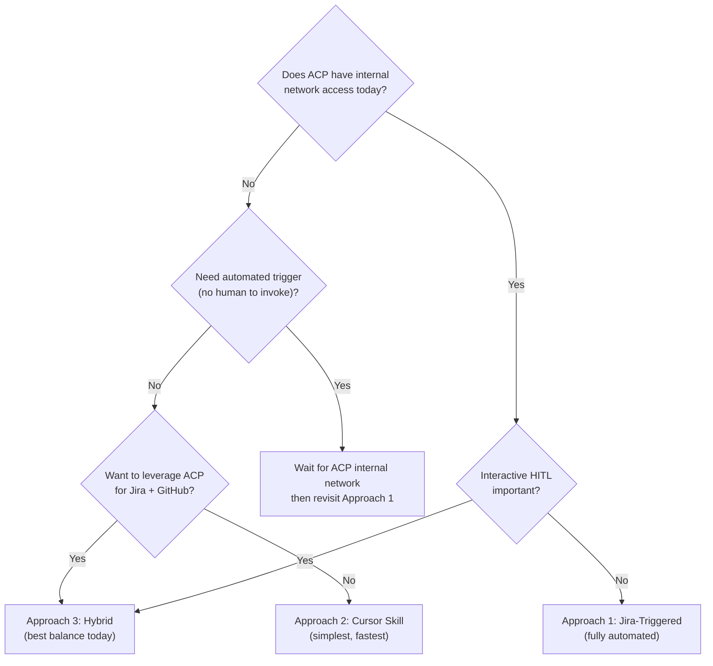
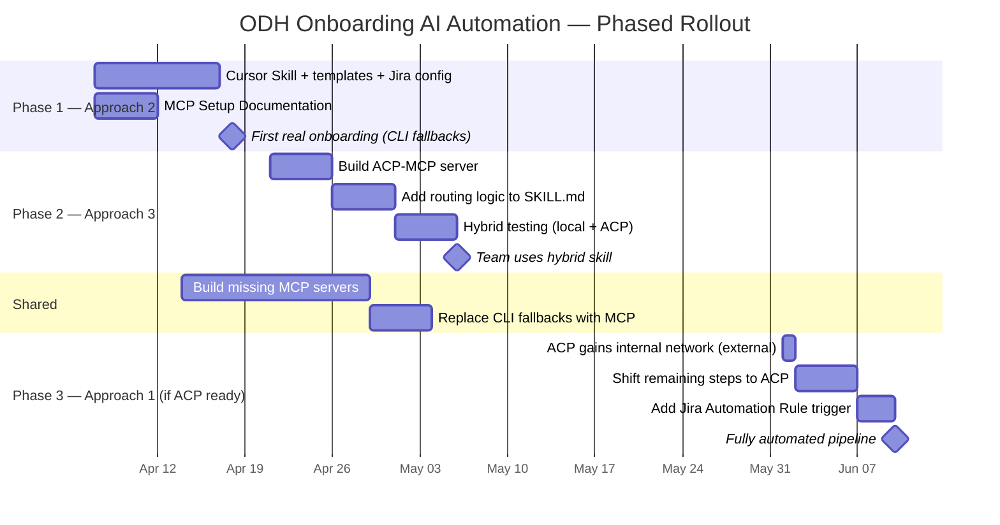

# AI-Automated ODH Component Onboarding -- Approach Comparison

## Approaches at a Glance

| # | Approach | One-Line Summary | Design Document |
|---|----------|-----------------|-----------------|
| 1 | **Jira-Triggered Pipeline** | Fully ACP-based. Jira Automation Rule creates an ACP session that does everything. | [1-design-jira-triggered.md](1-design-jira-triggered.md) |
| 2 | **Cursor / Claude Code Skill** | Fully local. All MCP servers and network access configured on the engineer's machine. | [2-design-cursor-skill.md](2-design-cursor-skill.md) |
| 3 | **ACP-Backed Skill (Hybrid)** | Local skill orchestrates; ACP handles Jira + GitHub; local handles internal network via VPN. | [3-design-acp-backed-skill.md](3-design-acp-backed-skill.md) |

---

## Feature Matrix

| Dimension | Approach 1: Jira-Triggered | Approach 2: Cursor Skill | Approach 3: Hybrid |
|-----------|---------------------------|--------------------------|---------------------|
| **Trigger** | Automatic (Jira Automation Rule on ticket creation) | Manual (engineer invokes skill in IDE) | Manual (engineer invokes skill in IDE) |
| **Primary interface** | Jira ticket (async comments) | Cursor/Claude Code chat (interactive) | Cursor/Claude Code chat (interactive) |
| **Execution environment** | Fully ACP | Fully local | Split: local (VPN steps) + ACP (Jira/GitHub) |
| **Jira integration** | ACP reads/writes via Jira MCP | Local reads/writes via Jira MCP | ACP reads/writes via Jira MCP (proxy) |
| **GitHub operations** | ACP via GitHub MCP | Local via `gh` CLI | ACP via GitHub MCP |
| **Internal GitLab ops** | ACP via GitLab MCP (requires ACP internal network) | Local via GitLab MCP (requires VPN) | Local via GitLab MCP (requires VPN) |
| **Konflux build verification** | ACP via Konflux MCP (requires ACP internal network) | Local via `oc` CLI (requires VPN) | Local via `oc` CLI (requires VPN) |
| **Input collection** | Jira custom fields + async comment-based Q&A | Jira fields + interactive Cursor chat | Jira fields (via ACP) + interactive Cursor chat |
| **Interactive HITL** | No (async Jira comments only) | Yes (real-time Cursor chat + Jira) | Yes (real-time Cursor chat + Jira via ACP) |
| **Collaboration** | Multi-user (Jira watchers get ACP session access) | Single user (engineer in Cursor) | Single user (engineer in Cursor) |
| **Audit trail** | Full (Jira comments + ACP session) | Jira comments + `status.md` + chat transcript | Jira comments (via ACP) + `status.md` + chat transcript |
| **Visibility to stakeholders** | Anyone with Jira access | Jira watchers (via dual-channel updates) | Jira watchers (via ACP-proxied updates) |
| **State persistence** | Jira ticket status (most robust) | `status.md` + Jira ticket | `status.md` + Jira ticket + ACP session ID |
| **Resumability** | Best — Jira is single source of truth; ACP reads ticket to resume | Good — `status.md` + Jira cross-check | Good — `status.md` + ACP session reconnect + Jira |
| **Graceful degradation** | None — if ACP or internal network fails, pipeline stalls | Full — CLI fallbacks for every MCP server | Partial — falls back to fully-local mode (Approach 2) if ACP unavailable |
| **VPN required?** | No (ACP handles internal network) | Yes (all internal-network steps) | Yes (Steps 1, 2, 6 — internal GitLab + Konflux) |
| **ACP internal network required?** | **Yes** (blocker) | No | **No** |
| **Dedicated ACP workflow required?** | Yes (`workflow` param in `POST /v1/sessions`) | No | No (on-demand instructions via `send_message`) |

---

## MCP Server Requirements

| MCP Server | Approach 1: Jira-Triggered | Approach 2: Cursor Skill | Approach 3: Hybrid |
|-----------|---------------------------|--------------------------|---------------------|
| **Jira MCP** | ACP (available) | Local (available) | ACP (available) — local not needed |
| **GitLab MCP** | ACP (needs config + internal network) | Local (available, needs VPN) | Local (available, needs VPN) |
| **GitHub MCP** | ACP (needs integration) | Local (`gh` CLI) | ACP (native integration) — local not needed |
| **Quay MCP** | ACP (available) | Local (available) | Local (available) |
| **Konflux MCP** | ACP (**needs to be built** + internal network) | Local (**needs to be built**, fallback: `oc` CLI) | Local (**needs to be built**, fallback: `oc` CLI) |
| **Konflux Docs MCP** | ACP (**needs to be built**) | Local (**needs to be built**, fallback: web search) | Local (**needs to be built**, fallback: web search) |
| **Google Sheets MCP** | ACP (**needs to be built**) | Local (**needs to be built**, fallback: manual) | Local (**needs to be built**, fallback: manual) |
| **ACP-MCP** | Not needed | Not needed | Local (**must be built**) |
| | | | |
| **Total local MCP servers** | **0** | **7** | **4** (ACP-MCP, GitLab, Quay, Google Sheets) |
| **Total ACP MCP servers** | **7** | **0** | **2** (Jira, GitHub) |
| **MCP servers to build** | 3 (Konflux, Konflux Docs, Google Sheets) | 3 (Konflux, Konflux Docs, Google Sheets) | **4** (Konflux, Konflux Docs, Google Sheets + **ACP-MCP**) |

---

## ACP Platform Requirements

| Requirement | Approach 1 | Approach 2 | Approach 3 |
|------------|------------|------------|------------|
| ACP instance needed? | **Yes** (core runtime) | No | **Yes** (for Jira + GitHub ops) |
| `workflow` param in `POST /v1/sessions`? | **Yes** (blocker) | No | No |
| `POST /v1/sessions/{id}/messages`? | No (single workflow drives all steps) | No | **Yes** (skill sends step-by-step instructions) |
| Session sharing API? | **Yes** (share with Jira watchers) | No | No |
| Red Hat internal network from ACP? | **Yes** (blocker for GitLab, Konflux) | No | **No** |
| GitLab MCP in ACP? | **Yes** (blocker) | No | No |
| GitHub MCP in ACP? | **Yes** (needs confirmation) | No | **Yes** (needs confirmation) |
| Jira MCP in ACP? | **Yes** (available) | No | **Yes** (available) |

### Blocker Analysis

| Blocker | Approach 1 | Approach 2 | Approach 3 |
|---------|------------|------------|------------|
| ACP internal network access | **BLOCKER** | Not needed | Not needed |
| `workflow` parameter in ACP API | **BLOCKER** | Not needed | Not needed |
| Session sharing API | Degraded (manual link sharing) | Not needed | Not needed |
| GitLab MCP in ACP | **BLOCKER** | Not needed | Not needed |
| GitHub MCP in ACP | **BLOCKER** | Not needed | Needed (likely available) |
| Jira MCP in ACP | Available | Not needed | Available |
| | | | |
| **Total blockers** | **4** | **0** | **0** |

---

## Network and Access Requirements

| Resource | Approach 1 | Approach 2 | Approach 3 |
|----------|------------|------------|------------|
| `gitlab.cee.redhat.com` | ACP internal network | Local VPN | Local VPN |
| Konflux APIs | ACP internal network | Local VPN | Local VPN |
| `github.com` | ACP (native) | Local (`gh` CLI) | ACP (native) |
| `quay.io` | ACP (Quay MCP) | Local (Quay MCP) | Local (Quay MCP) |
| Jira (issues.redhat.com) | ACP (Jira MCP) | Local (Jira MCP + VPN/SSO) | ACP (Jira MCP) |
| Google Sheets API | ACP (when MCP built) | Local (when MCP built) | Local (when MCP built) |
| | | | |
| **VPN needed by engineer?** | **No** | **Yes** (all internal steps) | **Yes** (Steps 1, 2, 6) |
| **ACP internal network needed?** | **Yes** | **No** | **No** |

---

## HITL Model Comparison

| Aspect | Approach 1 | Approach 2 | Approach 3 |
|--------|------------|------------|------------|
| **Interaction mode** | Asynchronous (Jira comments) | Synchronous (Cursor chat) + async (Jira) | Synchronous (Cursor chat) + async (Jira via ACP) |
| **Missing input collection** | Jira comment Q&A (slow, async) | Interactive chat (fast, immediate) | Interactive chat + sync to Jira via ACP |
| **PR review requests** | Jira comment notification | Cursor chat + Jira comment | Cursor chat + Jira comment (via ACP) |
| **Artifact preview** | No (generated and submitted directly) | Yes (shown in chat before submit) | Yes (shown in chat before submit) |
| **Error escalation** | Jira comment with error + fix proposal | Chat + Jira dual-channel | Chat + Jira via ACP dual-channel |
| **Abort/resume** | Jira status is source of truth | `status.md` + Jira cross-check | `status.md` + ACP session ID + Jira |
| **Engineer involvement** | Create ticket, respond to comments, review MRs/PRs | Invoke skill, interact in chat, review MRs/PRs | Invoke skill, interact in chat, review MRs/PRs |
| **Stakeholder involvement** | Watch Jira ticket | Watch Jira ticket (dual-channel updates) | Watch Jira ticket (ACP-proxied updates) |

---

## Per-Step Execution Comparison

| Step | Approach 1 | Approach 2 | Approach 3 |
|------|------------|------------|------------|
| **0. Validate inputs** | ACP (Jira MCP) — async comment if missing | Local (Jira MCP + interactive chat) | ACP (Jira read) + Local (interactive chat) |
| **1. Quay repo MR** | ACP (GitLab MCP, internal network) | Local (GitLab MCP, VPN) | **Local** (GitLab MCP, VPN) + ACP (Jira) |
| **2. Konflux release MR** | ACP (GitLab MCP, internal network) | Local (GitLab MCP + shell, VPN) | **Local** (GitLab MCP + shell, VPN) + ACP (Jira) |
| **3-4. Tekton + Onboarder PR** | ACP (GitHub MCP) | Local (`gh` CLI) | **ACP** (GitHub MCP + Jira) |
| **5. Run CI Build** | ACP (GitHub MCP) | Local (`gh` CLI) | **ACP** (GitHub MCP + Jira) |
| **6. Verify Konflux Build** | ACP (Konflux MCP, internal network) | Local (`oc` CLI, VPN) | **Local** (`oc` CLI, VPN) + ACP (Jira) |
| **7. Bundle Patch PR** | ACP (Quay MCP + GitHub MCP) | Local (Quay MCP + `gh` CLI) | **Local** (Quay digest) + **ACP** (GitHub PR + Jira) |
| **8. Operator PR** | ACP (GitHub MCP) | Local (`gh` CLI) | **ACP** (GitHub MCP + Jira) |
| **9. Update spreadsheet** | ACP (Google Sheets MCP) | Local (Google Sheets MCP / manual) | **Local** (Google Sheets MCP / manual) + ACP (Jira) |
| **Jira updates** | ACP (every step) | Local (every step) | **ACP** (every step, including proxy for local steps) |

---

## Pros and Cons -- Side by Side

### Pros

| # | Approach 1: Jira-Triggered | Approach 2: Cursor Skill | Approach 3: Hybrid |
|---|---------------------------|--------------------------|---------------------|
| 1 | Fully automated from ticket creation | Lowest infrastructure footprint | Uses ACP's existing Jira + GitHub capabilities |
| 2 | Jira-native experience for scrum teams | Immediate usability, any Cursor user | No ACP internal-network dependency |
| 3 | Full audit trail in Jira | Interactive IDE — full engineer control | Reduced local setup (4 vs. 7 MCP servers) |
| 4 | Broad visibility (anyone with Jira access) | Dual-channel HITL (chat + Jira) | Interactive IDE + dual-channel HITL |
| 5 | Session sharing with Jira watchers | Interactive input collection | Graceful degradation to fully-local mode |
| 6 | Asynchronous — no simultaneous presence | Resumable via `status.md` | No dedicated ACP workflow needed |
| 7 | Scalable tracking (Jira board/dashboard) | Transparent execution (visible tool calls) | No ACP network policy changes needed |
| 8 | Dedicated ACP workflow (versionable) | Easy to maintain (markdown + YAML) | Incremental adoption path |
| 9 | MR/PR merge detection via MCP polling | Works with Claude Code too | Resumable via `status.md` + ACP session |
| 10 | Reminder capability for stale reviews | Can use YAML config file as alternative | Works with Claude Code too |

### Cons

| # | Approach 1: Jira-Triggered | Approach 2: Cursor Skill | Approach 3: Hybrid |
|---|---------------------------|--------------------------|---------------------|
| 1 | **4 ACP blockers** (internal network, `workflow` param, GitLab MCP, GitHub MCP) | 7 MCP servers to configure locally | ACP-MCP server must be built (new component) |
| 2 | ACP internal network access required (may not exist) | VPN required for all internal-network steps | VPN required for Steps 1, 2, 6 |
| 3 | Missing MCP servers block steps (no CLI fallback in ACP) | Every engineer sets up all tools independently | Two-agent coordination complexity |
| 4 | Not interactive (async Jira comments only) | Single-user execution | ACP dependency for Jira (blocked if ACP down) |
| 5 | Jira configuration overhead (custom fields, 14+ statuses) | No automated triggering | ACP as Jira proxy adds latency |
| 6 | Status explosion in Jira workflow | MCP setup burden (7 servers per engineer) | Local GitLab MCP setup still required |
| 7 | `workflow` parameter may not exist in ACP API | Chat history limits on long sessions | Single-user execution |
| 8 | Jira Automation stores ACP token in plaintext | VPN disconnection pauses progress | Debugging split across local + ACP |
| 9 | Dual-platform dependency (Jira + ACP) | MCP server gaps (3 need building) | MCP server gaps (3 need building + ACP-MCP) |
| 10 | Debugging distance (Jira → ACP session) | — | — |

---

## Risk Assessment

| Risk | Approach 1 | Approach 2 | Approach 3 |
|------|------------|------------|------------|
| **ACP not ready** (missing features) | **High** — 4 blockers, cannot proceed without ACP team | **None** — fully local, no ACP dependency | **Low** — degrades to Approach 2 if ACP unavailable |
| **Internal network inaccessible** | **High** — ACP needs internal network for 4 steps | **Medium** — VPN must be connected | **Medium** — VPN must be connected for 3 steps |
| **MCP server not built** | **High** — no CLI fallback in ACP | **Low** — CLI fallbacks exist for all | **Low** — CLI fallbacks exist for all local steps |
| **Engineer setup failure** | **None** — no local setup needed | **High** — 7 MCP servers + CLIs per engineer | **Medium** — 4 MCP servers + CLIs per engineer |
| **Session interruption** | **Low** — Jira ticket preserves state | **Low** — `status.md` preserves state | **Low** — `status.md` + ACP session reconnect |
| **Jira unavailable** | **High** — entire pipeline blocked | **Medium** — Jira updates fail, onboarding can continue locally | **High** — Jira updates blocked (proxied through ACP) |
| **Two-agent miscommunication** | N/A (single agent in ACP) | N/A (single agent locally) | **Medium** — local and ACP agents may misinterpret instructions |

---

## Effort Comparison

| Work Item | Approach 1 | Approach 2 | Approach 3 |
|-----------|------------|------------|------------|
| Jira configuration (custom fields, workflow) | 2-3 days | 2-3 days | 2-3 days |
| Jira Automation Rule | 1 day | — | — |
| Dedicated ACP workflow | 4-5 days | — | — |
| SKILL.md + routing logic | — | 3-4 days | 4-5 days |
| YAML templates | (embedded in workflow) | 1 day | 1 day |
| Build ACP-MCP server | — | — | 2-3 days |
| MCP Setup Documentation | — | 2-3 days | 2-3 days |
| Configure ACP workspace | 2-3 days | — | 1-2 days |
| Configure local MCP servers | — | 2-3 days | 1 day |
| Coordinate ACP team (internal network, APIs) | 3-5 days | — | — |
| Build missing MCP servers (Konflux, Docs, GSheets) | 9-15 days (shared) | 9-15 days (shared) | 9-15 days (shared) |
| End-to-end testing | 3-4 days | 2-3 days | 3-4 days |
| Fallback mode testing | — | — | 1-2 days |
| Documentation + team onboarding | 1-2 days | 1-2 days | 1-2 days |
| | | | |
| **Total** | **~5-7 weeks** | **~3-4 weeks** | **~3-5 weeks** |
| **With CLI fallbacks (skip missing MCPs)** | Not feasible (ACP has no CLI) | **~2 weeks** | **~2-3 weeks** |

---

## Readiness to Start

| Factor | Approach 1 | Approach 2 | Approach 3 |
|--------|------------|------------|------------|
| Can start building today? | **No** — blocked on ACP team for internal network + API features | **Yes** | **Yes** |
| Can do first real onboarding in 2 weeks? | **No** | **Yes** (with CLI fallbacks) | **Yes** (with CLI fallbacks) |
| Can run without ACP? | **No** | **Yes** (no ACP needed) | **Yes** (fallback mode) |
| Blocked by missing MCP servers? | **Yes** (no fallback in ACP) | **No** (CLI fallbacks) | **No** (CLI fallbacks) |
| Requires Jira admin coordination? | Yes | Yes | Yes |
| Requires ACP team coordination? | **Yes** (4+ items) | No | Minimal (confirm Jira/GitHub MCP in ACP) |

---

## Decision Framework



---

## Recommendation

### Short-Term: Start with Approach 2 (Cursor Skill)

**Why**: It has **zero blockers**, can deliver value within **2 weeks** using CLI fallbacks, and produces reusable artifacts (YAML templates, SKILL.md, MCP documentation) that feed directly into the other approaches.

- No ACP dependency
- No coordination with ACP team needed
- Any engineer with Cursor can use it immediately
- Full interactive HITL in the IDE
- MCP documentation deliverable benefits all approaches

### Medium-Term: Evolve to Approach 3 (Hybrid)

**Why**: Once ACP's Jira MCP and GitHub MCP availability is confirmed, the hybrid approach **reduces per-engineer setup from 7 to 4 MCP servers**, eliminates the need for local Jira and GitHub configuration, and adds graceful degradation. The migration path from Approach 2 to Approach 3 is straightforward:

1. Build the ACP-MCP server (~2-3 days)
2. Add routing logic to the existing SKILL.md
3. Remove local Jira MCP and `gh` CLI requirements
4. The same `status.md`, templates, and Jira integration carry over

### Long-Term: Consider Approach 1 (Jira-Triggered) only when ACP gains internal network

**Why**: Approach 1 is the most powerful (fully automated, no human invocation needed, best audit trail), but it has **4 hard blockers** today. If/when ACP gains internal network access and the `workflow` API parameter, Approach 1 becomes viable and the routing logic from Approach 3 can shift entirely to ACP, making the migration path natural:

```
Approach 2 (all local)
    ↓ add ACP-MCP + routing
Approach 3 (hybrid: local internal-network + ACP Jira/GitHub)
    ↓ ACP gains internal network → shift all steps to ACP
Approach 1 (all ACP) + Jira Automation trigger
```

### Summary Timeline



Each phase builds on the previous one. No work is wasted — templates, Jira configuration, MCP servers, and `status.md` logic carry forward through every phase.
