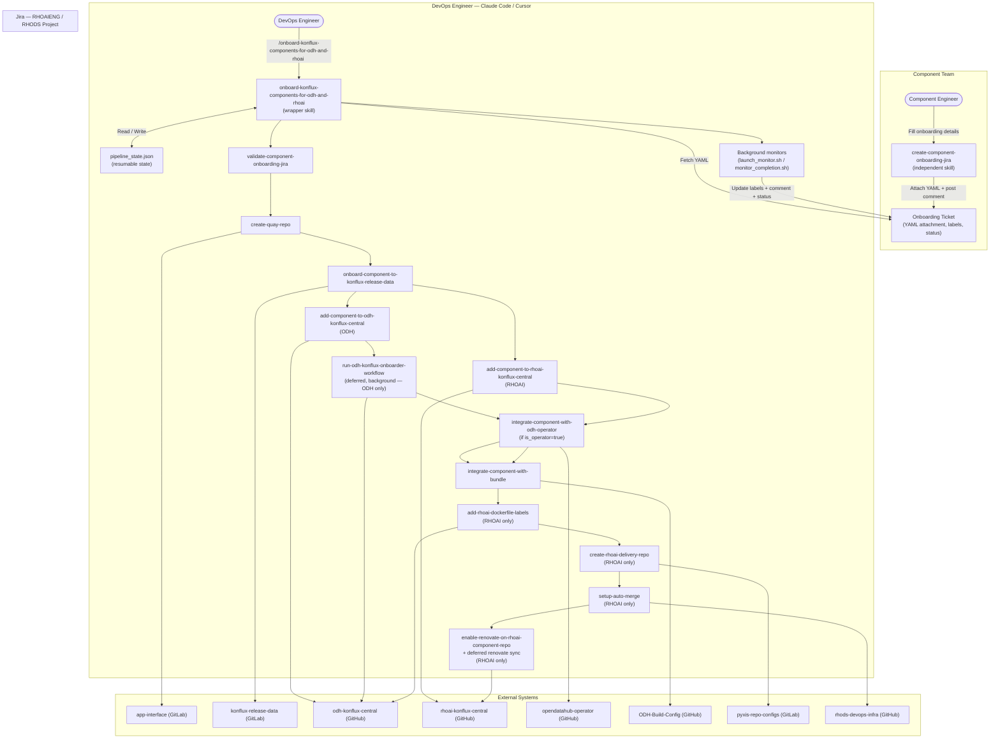

# Approach 2: Claude Code / Cursor Skills — Local Execution

## Overview

The ODH/RHOAI component onboarding workflow is implemented as a **suite of modular Claude Code skills**, each responsible for one discrete step of the pipeline. A component team member first runs the `create-component-onboarding-jira` skill to create the Jira ticket and capture onboarding parameters. The DevOps engineer then invokes the `onboard-konflux-components-for-odh-and-rhoai` wrapper skill with the Jira URL; the wrapper reads the attached YAML, derives the **product context** (ODH or RHOAI), executes each applicable step skill in sequence, raises PRs/MRs to the target repositories, and launches background monitors to track merges. Jira is updated automatically at each milestone, and the ticket transitions to "Resolved" once all PRs and MRs are merged.

The skill supports both **ODH** and **RHOAI** onboarding from a single invocation. ODH and RHOAI share a common core pipeline (Steps 1–7) but diverge on product-specific steps: RHOAI includes additional steps for Dockerfile label validation, delivery repo provisioning, auto-merge configuration, and Renovate enablement (Steps 8–11), while ODH triggers a deferred GitHub Actions workflow (Step 5) instead.

All skills run **locally** in the engineer's Claude Code / Cursor IDE session. A planned follow-on phase will automatically trigger the wrapper skill on Jira ticket creation via a webhook or CI pipeline, eliminating the manual invocation step.

---

## Skill Directory Structure

All skills live under `.claude/skills/` in the `aiops-infra` repository:

```
.claude/skills/
├── create-component-onboarding-jira/          # Run by component teams (independent)
│   ├── SKILL.md
│   └── install.sh
├── validate-component-onboarding-jira/        # Step 1: fetch + validate Jira YAML
│   ├── SKILL.md
│   ├── install.sh
│   └── assets/
│       └── component_onboarding_details.schema.json
├── create-quay-repo/                          # Step 2: GitLab MR to app-interface
│   ├── SKILL.md
│   └── install.sh
├── onboard-component-to-konflux-release-data/ # Step 3: GitLab MR to konflux-release-data
│   ├── SKILL.md
│   └── install.sh
├── add-component-to-odh-konflux-central/      # Step 4 (ODH): GitHub PR for Tekton pipelineruns
│   ├── SKILL.md
│   └── install.sh
├── add-component-to-rhoai-konflux-central/    # Step 4 (RHOAI): GitHub PR for Tekton pipelineruns
│   ├── SKILL.md
│   └── install.sh
├── run-odh-konflux-onboarder-workflow/        # Step 5 (ODH only): GitHub Actions workflow trigger
│   ├── SKILL.md
│   └── install.sh
├── integrate-component-with-odh-operator/     # Step 6: GitHub PR to opendatahub-operator (conditional)
│   ├── SKILL.md
│   └── install.sh
├── integrate-component-with-bundle/           # Step 7: GitHub PR to ODH-Build-Config
│   ├── SKILL.md
│   └── install.sh
├── add-rhoai-dockerfile-labels/               # Step 8 (RHOAI only): GitHub PR to add OCI labels
│   ├── SKILL.md
│   └── install.sh
├── create-rhoai-delivery-repo/                # Step 9 (RHOAI only): GitLab MR to pyxis-repo-configs
│   ├── SKILL.md
│   └── install.sh
├── setup-auto-merge/                          # Step 10 (RHOAI only): GitHub PR to rhods-devops-infra
│   ├── SKILL.md
│   └── install.sh
├── enable-renovate-on-rhoai-component-repo/   # Step 11 (RHOAI only): GitHub PR to rhoai-konflux-central
│   ├── SKILL.md
│   └── install.sh
├── sync-rhoai-renovate-configs/               # Step 11 deferred (RHOAI only): triggers renovate sync workflow
│   ├── SKILL.md
│   └── install.sh
├── onboard-konflux-components-for-odh-and-rhoai/  # Wrapper — orchestrates all steps
│   ├── SKILL.md
│   └── install.sh
└── common/
    └── scripts/                               # Shared helper scripts used across skills
        ├── fetch_jira_details.py
        ├── update_jira_issue.py
        ├── validate_yaml_schema.py
        ├── download_jira_attachment.py
        ├── setup_github_fork.py
        ├── raise_github_pr.py
        ├── monitor_github_pr.py
        ├── setup_gitlab_fork.py
        ├── raise_gitlab_mr.py
        ├── monitor_gitlab_mr.py
        ├── run_github_workflow.py
        ├── check_quay_repo.sh
        ├── check_konflux_component.sh
        ├── login_to_konflux_cluster.sh
        ├── launch_monitor.sh             # Launches background PR/MR monitors
        ├── monitor_pr.sh                 # Worker: retry loop + Jira update on merge
        └── watch_monitors.sh             # Live event stream across all monitors
```

---

## Architecture Diagram



---

## Two Entry Points

### 1. `create-component-onboarding-jira` — Run by Component Teams

This skill is **independent** and intended for component teams, not DevOps. It:

1. Interactively collects onboarding parameters (product context, component name, repo URL, branch, Dockerfile path, whether it is an operator, etc.).
2. Generates a validated `component_onboarding_details.yaml` against a JSON Schema.
3. Attaches the YAML to the Jira ticket (or clones a template Jira and creates a new one for ODH).

```
/create-component-onboarding-jira [<jira-url>]
```

The YAML attachment is the **contract** between the component team and the DevOps automation. Once attached and the Jira label `yaml-attached` is set, the ticket is ready for the wrapper skill.

### 2. `onboard-konflux-components-for-odh-and-rhoai` — Run by DevOps Engineers

This is the **wrapper / parent skill** that drives the full onboarding pipeline. It:

1. Validates prerequisites (env vars, CLI tools).
2. Reads `pipeline_state.json` and resumes from the last completed step if interrupted.
3. Derives `PRODUCT_CONTEXT` (ODH or RHOAI) from the Jira key prefix or ticket summary, and marks non-applicable steps as skipped.
4. Invokes each step skill in sequence, overriding their blocking PR/MR monitors with background monitors.
5. Updates Jira labels and status at each milestone.
6. Transitions the ticket to "Resolved" automatically when all PRs/MRs are merged.

```
/onboard-konflux-components-for-odh-and-rhoai <jira-url>
```

---

## End-to-End Flow

| Step | Skill | Action | Target Repo | ODH / RHOAI | HITL Gate |
|------|-------|--------|-------------|-------------|-----------|
| 0 | *(wrapper)* | Parse inputs, check prerequisites, derive product context, init/resume `pipeline_state.json` | — | Both | — |
| 1 | `validate-component-onboarding-jira` | Fetch YAML from Jira; validate against schema; set Jira → "In Progress" | — | Both | Blocks on schema failure |
| 2 | `create-quay-repo` | Raise GitLab MR to `app-interface` to create Quay repository | `gitlab.cee.redhat.com` | Both | MR review + merge |
| 3 | `onboard-component-to-konflux-release-data` | Render Konflux Component YAML; raise GitLab MR to `konflux-release-data`; run `build-single.sh` | `gitlab.cee.redhat.com` | Both | MR review + merge |
| 4 | `add-component-to-odh-konflux-central` / `add-component-to-rhoai-konflux-central` | Add Tekton PipelineRun YAMLs; raise GitHub PR to the product-specific konflux-central repo | `odh-konflux-central` / `rhoai-konflux-central` | Both (product-specific skill) | PR review + merge |
| 5 | `run-odh-konflux-onboarder-workflow` | *(Deferred, ODH only)* Waits for Steps 2–4 to merge, then triggers `odh-konflux-onboarder.yml`; monitors resulting Tekton PR | `odh-konflux-central` | ODH only | Tekton PR review + merge |
| 6 | `integrate-component-with-odh-operator` | Skipped if `is_operator=false`. Raise GitHub PR to add manifest config to `opendatahub-operator` | `opendatahub-operator` | Both | PR review + merge |
| 7 | `integrate-component-with-bundle` | Fetch latest image digest from Quay; add `relatedImages` entry to `bundle-patch.yaml`; raise GitHub PR | `ODH-Build-Config` | Both | PR review + merge |
| 8 | `add-rhoai-dockerfile-labels` | Check component Dockerfile for mandatory RHOAI OCI labels; raise GitHub PR to add any missing labels | component repo | RHOAI only | PR review + merge |
| 9 | `create-rhoai-delivery-repo` | Raise GitLab MR to `pyxis-repo-configs` to provision the RHOAI delivery repository | `gitlab.cee.redhat.com` | RHOAI only | MR review + merge |
| 10 | `setup-auto-merge` | Raise GitHub PR to `rhods-devops-infra` to configure auto-merge for the component repo | `rhods-devops-infra` | RHOAI only | PR review + merge |
| 11 | `enable-renovate-on-rhoai-component-repo` | Raise GitHub PR to `rhoai-konflux-central` to enable Renovate; on merge, trigger deferred `sync-rhoai-renovate-configs` workflow | `rhoai-konflux-central` | RHOAI only | PR review + merge |

After all PRs/MRs are merged, Jira is transitioned to **Resolved** automatically by the background completion monitor.

---

## Background Monitoring Pattern

The wrapper replaces each step skill's **blocking** PR/MR monitor with a non-blocking background process. This allows the wrapper to raise all PRs/MRs in a single session and then exit, letting monitors run in the background.

- **`launch_monitor.sh`** — starts `monitor_pr.sh` via `nohup`, returns immediately.
- **`monitor_pr.sh`** — polls for merge; on merge, calls `update_jira_issue.py` to post a comment and remove the "raised" label. Retries automatically on connection errors and transient VPN drops.
- **`deferred_workflow.sh`** *(ODH only)* — waits for Steps 2, 3, and 4 to merge before triggering the GitHub Actions workflow for Step 5, then monitors the resulting Tekton PR.
- **`renovate_sync.sh`** *(RHOAI only)* — waits for the Step 11 Renovate PR to merge, then triggers the `sync-rhoai-renovate-configs` workflow to push the config to all registered component repos.
- **`monitor_completion.sh`** — polls `pipeline_state.json` until all applicable steps are done, then transitions Jira to "Resolved".

Live event stream (run in a separate terminal while the wrapper is active):
```bash
bash .claude/skills/common/scripts/watch_monitors.sh --workdir ./<JIRA_ID>
```

---

## State Management

The wrapper maintains `<JIRA_ID>/pipeline_state.json` in the working directory. Each step writes its status (`pending` → `mr_raised` / `pr_raised` → `merged` / `skipped` / `done`) and the PR/MR URL. Non-applicable steps are marked `skipped` immediately after the product context is derived. On re-invocation with the same Jira URL, completed steps are skipped and the workflow resumes from where it left off.

```json
{
  "jira_url": "...",
  "jira_id": "RHOAIENG-1234",
  "component_name": "my-component",
  "product_context": "RHOAI",
  "quay_org": "rhoai",
  "quay_visibility": "private",
  "quay_repo_uri": "quay.io/rhoai/my-component-rhel9",
  "is_operator": false,
  "steps": {
    "validate":          { "status": "done" },
    "quay":              { "mr_url": "https://gitlab.../merge_requests/456", "status": "merged" },
    "krd":               { "mr_url": "https://gitlab.../merge_requests/789", "status": "mr_raised" },
    "okc":               { "pr_url": "", "status": "pending" },
    "onboarder":         { "run_id": "", "tekton_pr_url": "", "status": "skipped" },
    "operator":          { "pr_url": "", "status": "skipped" },
    "bundle":            { "pr_url": "", "status": "pending" },
    "dockerfile_labels": { "pr_url": "", "status": "pending" },
    "delivery_repo":     { "mr_url": "", "status": "pending" },
    "auto_merge":        { "pr_url": "", "status": "pending" },
    "renovate":          { "pr_url": "", "status": "pending" }
  }
}
```

---

## Prerequisites

| # | Requirement | Details |
|---|-------------|---------|
| 1 | **Claude Code or Cursor IDE** | Agent mode enabled. |
| 2 | **VPN connected** | Required for GitLab (`gitlab.cee.redhat.com`) and Konflux cluster access (Steps 2, 3, 9). |
| 3 | **Environment variables** | `JIRA_USER_EMAIL`, `JIRA_API_TOKEN`, `GITLAB_USER`, `GITLAB_TOKEN` (api + write_repository), `GITHUB_USER`, `GITHUB_TOKEN` (repo + actions:write). Optional overrides for each target repo URL. |
| 4 | **CLI tools** | `uv`, `git`, `oc`, `skopeo`, `yamllint`, `jq`, `kustomize`. Run `install.sh` in the wrapper directory to set up any missing shims. |
| 5 | **Skills installed** | Run `install.sh` in each skill directory, or run it from the wrapper directory which installs all dependencies. |
| 6 | **Jira ticket with YAML attached** | Component team must have run `create-component-onboarding-jira` first; the ticket must have the `yaml-attached` label. |

---

## Jira Lifecycle

| Milestone | Jira Status | Labels |
|-----------|-------------|--------|
| YAML attached by component team | *(unchanged)* | `yaml-attached` added |
| Wrapper starts, YAML validated | In Progress | — |
| All PRs/MRs raised | Review | `onboarding-in-review` added |
| Quay MR merged | Review | `quay-mr-raised` removed |
| KRD MR merged | Review | `konflux-mr-raised` removed |
| OKC/RKC PR merged | Review | `okc-pr-raised` / `rkc-pr-raised` removed |
| Tekton PR merged *(ODH)* | Review | `tekton-pr-merged` added |
| Dockerfile labels PR merged *(RHOAI)* | Review | `dockerfile-labels-pr-raised` removed |
| Delivery repo MR merged *(RHOAI)* | Review | `delivery-repo-mr-raised` removed |
| Auto-merge PR merged *(RHOAI)* | Review | `auto-merge-setup-done` removed |
| Renovate PR merged + sync triggered *(RHOAI)* | Review | `renovate-sync-triggered` added |
| All steps done | Resolved | `onboarding-complete` added, `onboarding-in-review` removed |

---

## Error Handling and Resumption

| Failure | Recovery |
|---------|----------|
| Missing env var or CLI tool | Wrapper exits with a remediation message at Step 1. Fix and re-run. |
| YAML schema validation fails | `validate-component-onboarding-jira` stops with specific errors. Fix YAML, re-upload to Jira, re-run. |
| VPN drops mid-run | GitLab calls fail. Background monitors retry automatically (60 s intervals). Re-run wrapper for incomplete foreground steps. |
| MR/PR creation fails (3 retries) | Wrapper stops at that step. Check credentials and VPN. Re-run; completed steps are skipped via `pipeline_state.json`. |
| Deferred workflow times out (3 h) *(ODH)* | Check `deferred_workflow.log`; re-run `deferred_workflow.sh` manually. |
| Renovate sync times out (3 h) *(RHOAI)* | Check `renovate_sync.log`; re-run `/sync-rhoai-renovate-configs` manually. |
| Completion monitor times out (4 h) | Check individual `.result` files; re-run `monitor_completion.sh` manually. |
| Re-run after any failure | Re-invoke the wrapper with the same Jira URL. `pipeline_state.json` skips completed steps. |

---

## Planned: Jira-Triggered Automatic Execution

Currently all skills are invoked **manually** by a DevOps engineer in their local Claude Code / Cursor session. The next phase will eliminate this manual step by automatically triggering the wrapper skill when a Jira ticket with `yaml-attached` is created or transitioned.

**Proposed trigger mechanism:**
- A Jira automation rule (or webhook to a CI pipeline) fires when a ticket is created in the RHOAIENG/RHODS project with the `yaml-attached` label.
- The webhook triggers a GitHub Actions workflow (or an ACP/Tekton pipeline) that runs `onboard-konflux-components-for-odh-and-rhoai` in a containerized Claude Code agent session.
- The agent session has all required credentials injected as environment variables from a secrets store.
- All HITL gates (PR review and merge) continue to operate via Jira comments and GitHub/GitLab PR reviews — no human needs to be present in an IDE session.

This mirrors **Approach 1 (Jira-triggered ACP execution)** but uses the same Claude Code skill infrastructure, avoiding duplication. The skills themselves require no changes; only the invocation mechanism changes from manual to automated.

---

## Pros

- **Minimal infrastructure** — no new servers or CI pipelines required for the current phase.
- **Modular and maintainable** — each onboarding step is a separate skill; changes to one step don't affect others.
- **Resumable** — `pipeline_state.json` enables clean recovery from any interruption.
- **Jira as source of truth** — all progress, PR/MR links, and status transitions are recorded in Jira automatically.
- **Non-blocking** — background monitors allow the engineer to raise all PRs/MRs in one session and not wait for each merge manually.
- **ODH and RHOAI from one invocation** — product context is derived automatically; a single wrapper handles both pipelines.
- **Incremental path to automation** — the same skills will be reused when the Jira-triggered phase is implemented.

## Cons

- **Manual invocation** — currently requires a DevOps engineer to start the wrapper skill locally.
- **Local environment dependency** — VPN, credentials, and CLI tools must be set up on every engineer's machine.
- **Context window limits** — very long sessions may truncate earlier context; `pipeline_state.json` mitigates this.
- **Bundle PR requires manual image digest fix** — the SHA placeholder in `bundle-patch.yaml` must be updated once the first Konflux build completes, which may fall outside the automated pipeline.
