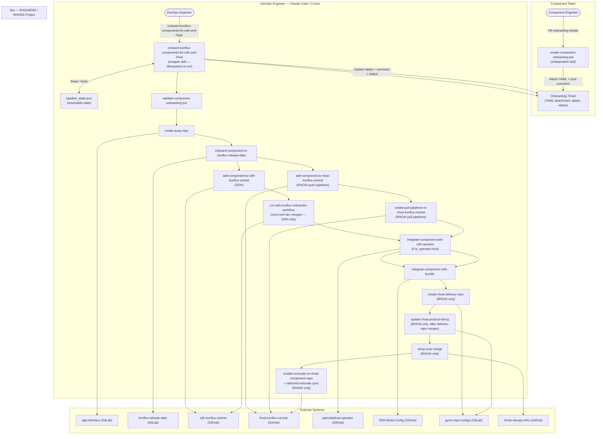

# Claude Code / Cursor Skills — Local Execution

## Overview

The ODH/RHOAI component onboarding workflow is implemented as a **suite of modular Claude Code skills**, each responsible for one discrete step of the pipeline. A component team member first runs the `create-component-onboarding-jira` skill to create the Jira ticket and capture onboarding parameters. The DevOps engineer then invokes the `onboard-konflux-components-for-odh-and-rhoai` wrapper skill with the Jira URL; the wrapper reads the attached YAML, derives the **product context** (ODH or RHOAI), executes each applicable step skill in sequence, raises PRs/MRs to the target repositories, and posts a summary of what changed to Jira. Jira is updated automatically at each milestone, and the ticket transitions to "Resolved" once all PRs and MRs are merged.

The skill supports both **ODH** and **RHOAI** onboarding from a single invocation. ODH and RHOAI share a common core pipeline (Steps 1–7) but diverge on product-specific steps: RHOAI includes additional steps for delivery repo provisioning, product listing update, auto-merge configuration, and Renovate enablement (Steps 8–11), while ODH triggers a deferred GitHub Actions workflow (Step 5) instead. For RHOAI, Step 4 also raises a second PR for push-request PipelineRuns in konflux-central.

The skill follows an **idempotent re-run model**: invoke it any number of times for the same Jira URL. Each run syncs PR/MR state from the GitHub/GitLab APIs and Jira labels, executes newly-unblocked steps, and posts a comment only when something changed. No background processes are used.

All skills run **locally** in the engineer's Claude Code / Cursor IDE session. A planned follow-on phase will automatically trigger the wrapper skill on Jira ticket creation via a webhook or CI pipeline, eliminating the manual invocation step.

---

## Skill Directory Structure

All skills live under `.claude/skills/` in the `aiops-infra` repository:

```
.claude/skills/
├── create-component-onboarding-jira/          # Run by component teams (independent)
│   ├── SKILL.md
│   └── install.sh
├── validate-component-onboarding-jira/        # Step 1: fetch + validate Jira YAML
│   ├── SKILL.md
│   ├── install.sh
│   └── assets/
│       └── component_onboarding_details.schema.json
├── create-quay-repo/                          # Step 2: GitLab MR to app-interface
│   ├── SKILL.md
│   └── install.sh
├── onboard-component-to-konflux-release-data/ # Step 3: GitLab MR to konflux-release-data
│   ├── SKILL.md
│   └── install.sh
├── add-component-to-odh-konflux-central/      # Step 4 (ODH): GitHub PR for push PipelineRuns
│   ├── SKILL.md
│   └── install.sh
├── add-component-to-rhoai-konflux-central/    # Step 4 (RHOAI): GitHub PR for push PipelineRuns
│   ├── SKILL.md
│   └── install.sh
├── create-pull-pipelines-in-rhoai-konflux-central/ # Step 4b (RHOAI): GitHub PR for pull-request PipelineRuns
│   ├── SKILL.md
│   └── install.sh
├── run-odh-konflux-onboarder-workflow/        # Step 5 (ODH only): GitHub Actions workflow trigger
│   ├── SKILL.md
│   └── install.sh
├── integrate-component-with-odh-operator/     # Step 6: GitHub PR to opendatahub-operator (conditional)
│   ├── SKILL.md
│   └── install.sh
├── integrate-component-with-bundle/           # Step 7: GitHub PR to ODH-Build-Config
│   ├── SKILL.md
│   └── install.sh
├── create-rhoai-delivery-repo/                # Step 8 (RHOAI only): GitLab MR to pyxis-repo-configs
│   ├── SKILL.md
│   └── install.sh
├── update-rhoai-product-listing/             # Step 9 (RHOAI only): GitLab MR to pyxis-repo-configs
│   ├── SKILL.md
│   └── install.sh
├── setup-auto-merge/                          # Step 10 (RHOAI only): GitHub PR to rhods-devops-infra
│   ├── SKILL.md
│   └── install.sh
├── enable-renovate-on-rhoai-component-repo/   # Step 11 (RHOAI only): GitHub PR to rhoai-konflux-central
│   ├── SKILL.md
│   └── install.sh
├── sync-rhoai-renovate-configs/               # Step 11 deferred (RHOAI only): triggers renovate sync workflow
│   ├── SKILL.md
│   └── install.sh
├── add-rhoai-dockerfile-labels/               # Standalone skill (not part of orchestrator pipeline)
│   ├── SKILL.md
│   └── install.sh
├── onboard-konflux-components-for-odh-and-rhoai/  # Wrapper — orchestrates all steps
│   ├── SKILL.md
│   └── install.sh
└── common/
    └── scripts/                               # Shared helper scripts used across skills
        ├── fetch_jira_details.py
        ├── update_jira_issue.py
        ├── validate_yaml_schema.py
        ├── download_jira_attachment.py
        ├── setup_github_fork.py
        ├── raise_github_pr.py
        ├── monitor_github_pr.py
        ├── setup_gitlab_fork.py
        ├── raise_gitlab_mr.py
        ├── monitor_gitlab_mr.py
        ├── run_github_workflow.py
        ├── check_quay_repo.sh
        ├── check_konflux_component.sh
        ├── login_to_konflux_cluster.sh
        ├── parse_jira_url.sh              # Extracts JIRA_URL / JIRA_ID from args
        ├── check_prerequisites.sh         # Validates env vars and CLI tools
        ├── init_pipeline.sh               # Creates/resumes pipeline_state.json
        ├── parse_component_details.sh     # Reads YAML, derives computed vars
        ├── sync_state_from_jira.py        # Rebuilds state from Jira labels + comments
        ├── check_pr_mr_status.sh          # Queries GitHub/GitLab APIs for merge status
        ├── pipeline_state.sh              # Low-level state read/write helper
        ├── build_progress_summary.py      # Renders Jira comment bodies (full/pending/changes)
        └── raise_jira_review.sh          # Transitions Jira to Review status
```

---

## Architecture Diagram



---

## Two Entry Points

### 1. `create-component-onboarding-jira` — Run by Component Teams

This skill is **independent** and intended for component teams, not DevOps. It:

1. Interactively collects onboarding parameters (product context, component name, repo URL, branch, Dockerfile path, whether it is an operator, etc.).
2. Generates a validated `component_onboarding_details.yaml` against a JSON Schema.
3. Attaches the YAML to the Jira ticket (or clones a template Jira and creates a new one for ODH).

```
/create-component-onboarding-jira [<jira-url>]
```

The YAML attachment is the **contract** between the component team and the DevOps automation. Once attached and the Jira label `yaml-attached` is set, the ticket is ready for the wrapper skill.

### 2. `onboard-konflux-components-for-odh-and-rhoai` — Run by DevOps Engineers

This is the **wrapper / parent skill** that drives the full onboarding pipeline. It:

1. Validates prerequisites (env vars, CLI tools).
2. Reads `pipeline_state.json` (or restores it from Jira labels) and resumes from where it left off.
3. Derives `PRODUCT_CONTEXT` (ODH or RHOAI) from the Jira key prefix or ticket summary, and marks non-applicable steps as skipped.
4. Queries GitHub/GitLab APIs to detect any PRs/MRs that merged since the last run.
5. Executes each newly-unblocked step (raises PR/MR only — no blocking waits).
6. Posts a Jira comment only when something changed (new PR raised or existing PR merged).
7. Transitions the ticket to "Resolved" automatically when all applicable steps are done.

```
/onboard-konflux-components-for-odh-and-rhoai <jira-url>
```

---

## End-to-End Flow

| Step | Skill | Action | Target Repo | ODH / RHOAI | HITL Gate |
|------|-------|--------|-------------|-------------|-----------|
| 0 | *(wrapper)* | Parse inputs, check prerequisites, derive product context, init/resume `pipeline_state.json`, sync state from Jira labels | — | Both | — |
| 1 | `validate-component-onboarding-jira` | Fetch YAML from Jira; validate against schema; set Jira → "In Progress" | — | Both | Blocks on schema failure |
| 2 | `create-quay-repo` | Raise GitLab MR to `app-interface` to create Quay repository | `gitlab.cee.redhat.com` | Both | MR review + merge |
| 3 | `onboard-component-to-konflux-release-data` | Render Konflux Component YAML; raise GitLab MR to `konflux-release-data`; run `build-single.sh` | `gitlab.cee.redhat.com` | Both | MR review + merge |
| 4 | `add-component-to-odh-konflux-central` / `add-component-to-rhoai-konflux-central` | Add push-pipeline Tekton PipelineRun YAMLs; raise GitHub PR to the product-specific konflux-central repo | `odh-konflux-central` / `rhoai-konflux-central` | Both (product-specific skill) | PR review + merge |
| 4b | `create-pull-pipelines-in-rhoai-konflux-central` | Add pull-request Tekton PipelineRun YAMLs; raise GitHub PR to `rhoai-konflux-central` | `rhoai-konflux-central` | RHOAI only | PR review + merge |
| 5 | `run-odh-konflux-onboarder-workflow` | *(Deferred, ODH only)* Once Steps 3 and 4 are both merged, triggers `odh-konflux-onboarder.yml` and monitors the resulting Tekton PR | `odh-konflux-central` | ODH only | Tekton PR review + merge |
| 6 | `integrate-component-with-odh-operator` | Skipped if `is_operator=false`. Raise GitHub PR to add manifest config to `opendatahub-operator` | `opendatahub-operator` | Both | PR review + merge |
| 7 | `integrate-component-with-bundle` | Fetch latest image digest from Quay; add `relatedImages` entry to `bundle-patch.yaml`; raise GitHub PR | `ODH-Build-Config` | Both | PR review + merge |
| 8 | `create-rhoai-delivery-repo` | Raise GitLab MR to `pyxis-repo-configs` to provision the RHOAI delivery repository | `gitlab.cee.redhat.com` | RHOAI only | MR review + merge |
| 9 | `update-rhoai-product-listing` | Raise GitLab MR to `pyxis-repo-configs` to add the component to the RHOAI product listing; runs after Step 8 merges | `gitlab.cee.redhat.com` | RHOAI only | MR review + merge |
| 10 | `setup-auto-merge` | Raise GitHub PR to `rhods-devops-infra` to configure auto-merge for the component repo | `rhods-devops-infra` | RHOAI only | PR review + merge |
| 11 | `enable-renovate-on-rhoai-component-repo` | Raise GitHub PR to `rhoai-konflux-central` to enable Renovate; on merge, trigger deferred `sync-rhoai-renovate-configs` workflow | `rhoai-konflux-central` | RHOAI only | PR review + merge |

After all PRs/MRs are merged, Jira is transitioned to **Resolved** automatically on the next re-run.

---

## Re-run Model

The wrapper uses an **idempotent re-run model** — there are no persistent background processes. Re-invoking the skill for the same Jira URL is the mechanism for advancing the pipeline after PRs/MRs are merged.

Each run follows this pattern:

1. **Sync state** — `sync_state_from_jira.py` reconstructs `pipeline_state.json` from Jira labels and comments (resilient to fresh checkouts or lost state files).
2. **Check PR/MR status** — `check_pr_mr_status.sh` queries the GitHub/GitLab APIs for every step currently in `pr_raised` or `mr_raised` status and updates `pipeline_state.json` with any merges detected.
3. **Compute unblocked steps** — steps whose `depends_on` list is fully satisfied and whose status is still `pending` are eligible for execution this run.
4. **Execute unblocked steps** — each child skill is followed through to the PR/MR raise only; no blocking wait is performed. The PR/MR URL is recorded in `pipeline_state.json` and the corresponding label added to Jira.
5. **Post Jira comment** — if anything changed this run (new PRs raised or existing ones merged), a pending-PRs-only summary is posted to Jira. If nothing changed, no comment is posted.
6. **Resolve or keep in Review** — if all steps are done, the full pipeline table is posted and Jira transitions to Resolved; otherwise, Jira is set to Review.

The recommended cadence is to re-run the skill once a day (or whenever a PR/MR is merged) until the ticket resolves.

---

## State Management

The wrapper maintains `<JIRA_ID>/pipeline_state.json` in the working directory. Each step writes its status (`pending` → `mr_raised` / `pr_raised` → `merged` / `skipped` / `done`) and the PR/MR URL. Non-applicable steps are marked `skipped` immediately after the product context is derived. On re-invocation with the same Jira URL, `sync_state_from_jira.py` restores state from Jira labels even if the local file is missing, ensuring the pipeline can always resume correctly.

```json
{
  "jira_url": "...",
  "jira_id": "RHOAIENG-1234",
  "component_name": "my-component",
  "product_context": "RHOAI",
  "quay_org": "rhoai",
  "quay_visibility": "private",
  "quay_repo_uri": "quay.io/rhoai/my-component-rhel9",
  "is_operator": false,
  "last_status_change_at": "2025-04-01T10:00:00Z",
  "steps": {
    "validate":          { "status": "done" },
    "quay":              { "mr_url": "https://gitlab.../merge_requests/456", "status": "merged" },
    "krd":               { "mr_url": "https://gitlab.../merge_requests/789", "status": "mr_raised" },
    "okc":               { "pr_url": "", "status": "pending" },
    "pull_pipelines":    { "pr_url": "", "status": "pending" },
    "onboarder_workflow":{ "status": "pending" },
    "operator":          { "pr_url": "", "status": "skipped" },
    "bundle":            { "pr_url": "", "status": "pending" },
    "delivery_repo":     { "mr_url": "", "status": "pending" },
    "product_listing":   { "mr_url": "", "status": "pending" },
    "auto_merge":        { "pr_url": "", "status": "pending" },
    "renovate":          { "pr_url": "", "status": "pending" },
    "renovate_sync":     { "status": "pending" }
  }
}
```

---

## Prerequisites

| # | Requirement | Details |
|---|-------------|---------|
| 1 | **Claude Code or Cursor IDE** | Agent mode enabled. |
| 2 | **VPN connected** | Required for GitLab (`gitlab.cee.redhat.com`) access (Steps 2, 3, 8, 9). |
| 3 | **Environment variables** | `JIRA_USER_EMAIL`, `JIRA_API_TOKEN`, `GITLAB_USER`, `GITLAB_TOKEN` (api + write_repository), `GITHUB_USER`, `GITHUB_TOKEN` (repo + actions:write). Optional overrides for each target repo URL. |
| 4 | **CLI tools** | `uv`, `git`, `oc`, `skopeo`, `yamllint`, `jq`, `kustomize`. Run `install.sh` in the wrapper directory to set up any missing shims. |
| 5 | **Skills installed** | Run `install.sh` in each skill directory, or run it from the wrapper directory which installs all dependencies. |
| 6 | **Jira ticket with YAML attached** | Component team must have run `create-component-onboarding-jira` first; the ticket must have the `yaml-attached` label. |

---

## Jira Lifecycle

| Milestone | Jira Status | Labels |
|-----------|-------------|--------|
| YAML attached by component team | *(unchanged)* | `yaml-attached` added |
| Wrapper starts, YAML validated | In Progress | — |
| All PRs/MRs raised | Review | `onboarding-in-review` added |
| Quay MR merged | Review | `quay-mr-raised` removed |
| KRD MR merged | Review | `konflux-mr-raised` removed |
| OKC/RKC PR merged | Review | `okc-pr-raised` / `rkc-pr-raised` removed |
| Pull pipelines PR raised *(RHOAI)* | Review | `rkc-pull-pr-raised` added |
| Pull pipelines PR merged *(RHOAI)* | Review | `rkc-pull-pr-raised` removed |
| ODH onboarder workflow triggered *(ODH)* | Review | `onboarder-workflow-triggered` added |
| Delivery repo MR merged *(RHOAI)* | Review | `delivery-repo-mr-raised` removed |
| Product listing MR merged *(RHOAI)* | Review | `product-listing-mr-raised` removed |
| Auto-merge PR merged *(RHOAI)* | Review | `auto-merge-pr-raised` removed |
| Renovate PR merged + sync triggered *(RHOAI)* | Review | `renovate-sync-triggered` added |
| All steps done | Resolved | `component-onboarding-completed` added, `onboarding-in-review` removed |

---

## Error Handling and Resumption

| Failure | Recovery |
|---------|----------|
| Missing env var or CLI tool | Wrapper exits with a remediation message at Step 1. Fix and re-run. |
| YAML schema validation fails | `validate-component-onboarding-jira` stops with specific errors. Fix YAML, re-upload to Jira, re-run. |
| VPN drops mid-run | GitLab calls fail. Re-activate VPN and re-run; completed steps are skipped via `pipeline_state.json`. |
| MR/PR creation fails (3 retries) | Wrapper stops at that step. Check credentials and VPN. Re-run; completed steps are skipped. |
| State file lost (fresh checkout) | Re-run; Step 5 (`sync_state_from_jira.py`) restores state from Jira labels and comments. |
| Onboarder workflow 422 *(ODH)* | krd or okc not yet merged — re-run after both merge. |
| Renovate sync workflow fails *(RHOAI)* | Re-run `/sync-rhoai-renovate-configs` manually after renovate PR merges. |
| Re-run after any failure | Re-invoke the wrapper with the same Jira URL. `pipeline_state.json` (restored if needed from Jira) skips completed steps. |
| PR/MR still not detected as merged | Check if URL in `pipeline_state.json` is correct; verify API connectivity. |

---

## Planned: Jira-Triggered Automatic Execution

Currently all skills are invoked **manually** by a DevOps engineer in their local Claude Code / Cursor session. The next phase will eliminate this manual step by automatically triggering the wrapper skill when a Jira ticket with `yaml-attached` is created or transitioned.

**Proposed trigger mechanism:**
- A Jira automation rule (or webhook to a CI pipeline) fires when a ticket is created in the RHOAIENG/RHODS project with the `yaml-attached` label.
- The webhook triggers a GitHub Actions workflow (or an ACP/Tekton pipeline) that runs `onboard-konflux-components-for-odh-and-rhoai` in a containerized Claude Code agent session.
- The agent session has all required credentials injected as environment variables from a secrets store.
- All HITL gates (PR review and merge) continue to operate via Jira comments and GitHub/GitLab PR reviews — no human needs to be present in an IDE session.

This mirrors **Approach 1 (Jira-triggered ACP execution)** but uses the same Claude Code skill infrastructure, avoiding duplication. The skills themselves require no changes; only the invocation mechanism changes from manual to automated.

---

## Pros

- **Minimal infrastructure** — no new servers or CI pipelines required for the current phase.
- **Modular and maintainable** — each onboarding step is a separate skill; changes to one step don't affect others.
- **Resumable** — `pipeline_state.json` (backed by Jira labels) enables clean recovery from any interruption or fresh checkout.
- **Jira as source of truth** — all progress, PR/MR links, and status transitions are recorded in Jira automatically.
- **Non-blocking** — each run raises PRs/MRs and exits; no waiting or background processes needed.
- **ODH and RHOAI from one invocation** — product context is derived automatically; a single wrapper handles both pipelines.
- **Incremental path to automation** — the same skills will be reused when the Jira-triggered phase is implemented.

## Cons

- **Manual re-invocation** — currently requires a DevOps engineer to re-run the wrapper after each batch of PR/MR merges.
- **Local environment dependency** — VPN, credentials, and CLI tools must be set up on every engineer's machine.
- **Context window limits** — very long sessions may truncate earlier context; `pipeline_state.json` mitigates this.
- **Bundle PR requires manual image digest fix** — the SHA placeholder in `bundle-patch.yaml` must be updated once the first Konflux build completes, which may fall outside the automated pipeline.
