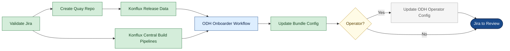
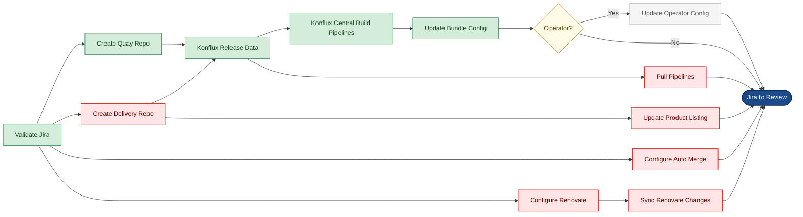
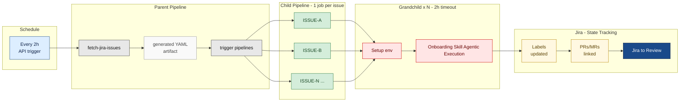

# Component Onboarding — Flow Diagrams (Left-to-Right)

---

## 1. ODH Component Onboarding

| 🟢 Green | Both ODH & RHOAI | 🔵 Blue | ODH only | ⬜ Grey dashed | Conditional |

---

## 2. RHOAI Component Onboarding

| 🟢 Green | Both ODH & RHOAI | 🔴 Red | RHOAI only | ⬜ Grey dashed | Conditional |

---

## 3. GitLab CI — Component Onboarding Execution

| 🔵 Blue | Schedule | ⬜ Grey | Parent pipeline | 🟢 Green | Child jobs | 🔴 Red | Grandchild — Claude | 🟡 Amber | Jira state |
