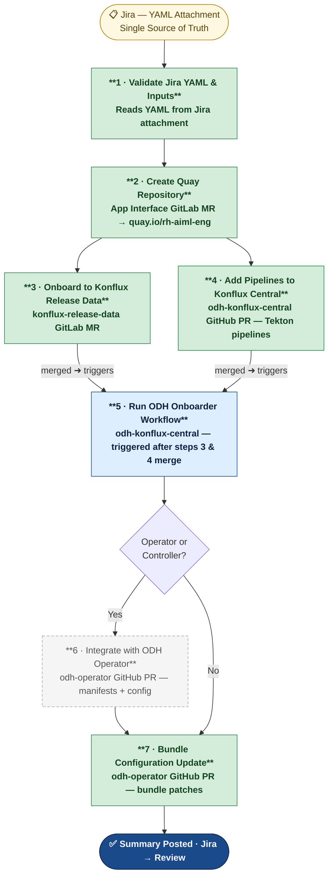
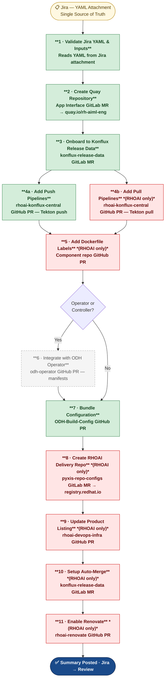
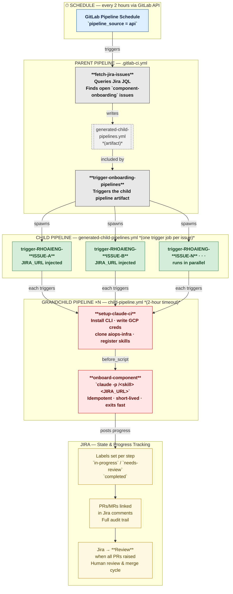

# Component Onboarding — Flow Diagrams

---

## 1. ODH Component Onboarding



**Color legend**

| Color | Meaning |
|-------|---------|
| 🟢 Green | Both ODH & RHOAI (standard steps) |
| 🔵 Blue | ODH only |
| ⬜ Grey dashed | Conditional — operator/controller only |

---

## 2. RHOAI Component Onboarding



**Color legend**

| Color | Meaning |
|-------|---------|
| 🟢 Green | Both ODH & RHOAI (standard steps) |
| 🔴 Red | RHOAI only |
| ⬜ Grey dashed | Conditional — operator/controller only |

---

## 3. GitLab CI — Component Onboarding Execution Flow



**Pipeline cascade**

| Level | File | Runs |
|-------|------|------|
| **Parent** | `.gitlab-ci.yml` | Once per schedule tick — discovers Jira issues |
| **Child** | `generated-child-pipelines.yml` (artifact) | Once — contains one trigger job per issue |
| **Grandchild** | `child-pipeline.yml` | N times in parallel — one per Jira issue |

**How it advances over time**

```
Tick 1  →  Raises all newly-unblocked PRs/MRs, exits
Tick 2  →  Detects what merged, raises next batch, exits
Tick N  →  All PRs merged → posts summary → Jira → Resolved
```
