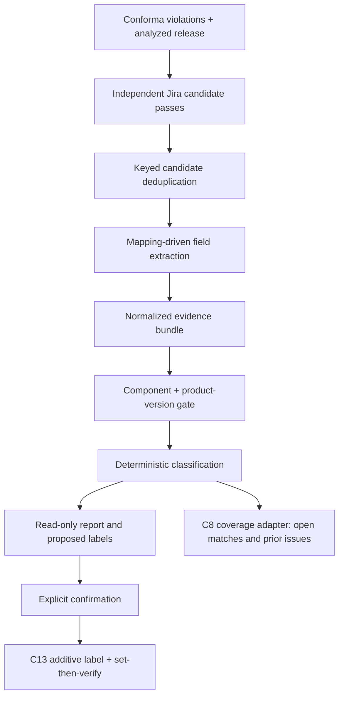

# C14 — Hybrid discovery of Conforma-related Jira tickets

Status: **IN PROGRESS**

Depends on: C11; integrates with C13 independent labelling

> **C14 is the consolidated Jira discovery-engine work item.** C8 must not be
> implemented, completed, or reviewed as an isolated label-first cutover.
> C8's historical cutover requirements are incorporated here, and any C8 code
> changes must be implemented and validated through this plan's broader
> all-status, multi-project, component-and-product-version requirements.

## Goal

Extend Jira coverage so label-less tickets can be discovered as potentially
related to the Conforma violations being analyzed, including
RHOAIENG-70681. Use deterministic code for retrieval, normalization, matching,
and write safety. Use a large language model only as an advisory adjudicator
for candidates that deterministic rules cannot classify confidently.

## Current state

The existing `conforma_jira_ticket_ops.py` implementation provides part of the
deterministic foundation:

- label-first discovery across the configured Jira projects and statuses;
- additional rule/component text candidates when current violation data is
  supplied to `discover_conforma_tickets`;
- exact unique violation-label searches;
- Merge Request-reference lookup and retrieval of referenced Jira tickets;
- deterministic rule-plus-component matching;
- unit-test coverage containing RHOAIENG-70681 as a closed prior issue.

The following pieces are missing:

- standalone broad discovery of label-less tickets;
- Jira comment and issue-history evidence retrieval;
- a normalized evidence bundle with source and match explanations;
- confidence and ambiguity handling;
- large-language-model adjudication for genuinely ambiguous candidates;
- independent presentation and confirmation of proposed labels.

## Audit findings and implementation handover (2026-09-18)

The first implementation slices centralized Jira labels/statuses and added a
validated project mapping. A follow-up audit found that C14 is not complete;
the remaining gaps below are implementation requirements, not optional
refactoring:

| Gap | Impact | Required implementation |
|---|---|---|
| No component-and-product-version gate | A ticket for the wrong or unknown release can suppress current ticket creation | Add canonical release and component identities, then require both signals before a confirmed match |
| Jira version matching uses lowercase/substring checks | Equivalent spellings are missed and unrelated versions can match | Replace `_normalize_version()` and pattern matching with one structured parser shared by release context, coverage, Jira, and component callers |
| Legacy `prefetch_open_jira_tickets()` still owns matching passes | C8 has not been cut over and two discovery contracts can diverge | Move all candidate passes into the normalized C14 engine, update coverage callers, then delete the old matching body |
| Discovery returns raw tickets rather than evidence | Results cannot be audited or safely classified | Produce field-level evidence, match sources, missing evidence, release relevance, and deterministic classifications |
| Candidate passes are one OR query | The report cannot explain which pass found a ticket or merge evidence | Execute bounded independent passes, record query/result/pagination metadata, deduplicate by key, and merge sources/evidence |
| No pagination or incomplete-source state | A 500-result cap can silently omit candidates | Add pagination and distinguish successful empty results from incomplete or failed searches |
| Comments/history are not retrieved | Relevant release/component evidence can be missed | Fetch permitted comments/history and record unavailable fields explicitly |
| Project mapping is validation-only | Project-specific target/affected/fix versions are not extracted | Add typed field descriptors, extraction paths, JQL capabilities, and mapping-driven extraction errors |
| Shared component parsing is not migrated | Jira, catalog, Slack, Merge Request, and renderer callers can disagree | Migrate callers to shared full-name, identity, and comparison primitives; preserve specialized transformations separately |
| Mapping metadata is absent on referenced tickets | Evidence records are inconsistent across discovery sources | Normalize every ticket, including direct Merge Request references, through the mapping/evidence builder |
| New mapping module lacks the dual-mode command-line interface | It does not meet repository `*_ops.py` conventions | Add deterministic `--help` and validation/load subcommands with JSON output |

### Proposed C14 execution phases

| Phase | Scope | Status |
|---|---|---|
| [Phase 1.1 — Audit and handover](#audit-findings-and-implementation-handover-2026-09-18) | Record gaps, invariants, and continuation state | DONE |
| [Phase 1.2 — Shared release/component primitives](#phase-12--shared-releasecomponent-primitives) | Canonical parsing, identities, and regression coverage | IN PROGRESS |
| [Phase 1.3 — Mapping-driven Jira field extraction](#phase-13--mapping-driven-jira-field-extraction) | Typed mapping, field extraction, and explicit failures | NOT STARTED |
| [Phase 2.1 — Independent candidate passes](#phase-21--independent-candidate-passes) | Queries, pagination, deduplication, and evidence sources | IN PROGRESS |
| [Phase 2.2 — Deterministic evidence classification](#phase-22--deterministic-evidence-classification) | Component/version gate and classifications | IN PROGRESS |
| [Phase 2.3 — C8 coverage cutover](#phase-23--c8-coverage-cutover) | Replace legacy prefetch and update coverage | NOT STARTED |
| [Phase 3.1 — Independent labelling integration](#phase-31--independent-labelling-integration) | Report, confirmation, additive writes, verification | NOT STARTED |
| [Phase 3.2 — Read-only acceptance and handover](#phase-32--read-only-acceptance-and-handover) | RHOAIENG-70681, full tests, live read-only audit | NOT STARTED |

The phase headings below are the durable handover points. Each completed phase
must record its commit, tests, coverage result, and remaining risks here before
the next phase begins.

### Proposed architecture

## Phase 1.2 — Shared release/component primitives

Definition of Done:

- One tested parser returns a canonical release structure plus original
  evidence text.
- One tested component primitive preserves the full versioned name, derives a
  release-independent identity, and compares identities explicitly.
- Jira version relevance and ticket component matching use these primitives.
- Existing context and coverage behavior remains compatible, with regression
  tests for supported release spellings.
- Changed code has the repository-required coverage threshold.

Handover: the shared primitive now exists in
`scripts/conforma_release_component_ops.py`. It parses product family,
major/minor release, stage, and stage number; rejects a bare `ea 2` fragment
without context; and exposes component stem/identity comparison. Jira version
relevance and Jira component suffix stripping now use it. Commit and test
details will be added after this phase is committed. Remaining work in this
phase is migrating release-context, coverage, catalog, Slack, Merge Request,
renderer, and exception callers and adding their regression coverage.

## Phase 1.3 — Mapping-driven Jira field extraction

Definition of Done:

- The mapping validates field descriptor types and source metadata.
- Jira search/get operations extract target, fix, affected, component, label,
  and link evidence using the mapping rather than hardcoded project branches.
- Unknown projects, unsupported fields, and permission failures are explicit
  incomplete evidence, never empty matches.
- The mapping module provides tested JSON-producing command-line validation.

Handover: the mapping loader now has deterministic `validate` and `project`
commands and rejects unknown returned projects. Mapping-driven extraction of
all version fields and typed descriptors remains outstanding.

## Phase 2.1 — Independent candidate passes

Definition of Done:

- Label, rule-label, rule-text, component/version, and direct-reference passes
  execute independently across all configured projects and statuses.
- Each pass records its query, result count, pagination state, and failures.
- Duplicate keys merge all match sources and field evidence deterministically.

Handover: `classify_ticket_evidence()` now records component/version evidence,
release relevance, missing evidence, and a confirmation classification. The
production sync path applies the gate. Independent query passes, comments and
history evidence, and complete source metadata remain outstanding.

## Phase 2.2 — Deterministic evidence classification

Definition of Done:

- Confirmed matches require both component and product-version evidence.
- Missing, mismatched, future, and ambiguous release evidence have distinct
  classifications and explanations.
- Comments/history limitations remain visible in the evidence bundle.

Handover: not started.

## Phase 2.3 — C8 coverage cutover

Definition of Done:

- `prefetch_open_jira_tickets()` is a thin adapter over C14 output or is
  removed when coverage consumes the normalized API directly.
- The old four-pass matching implementation is deleted.
- Coverage continues to show open matches while retaining closed tickets as
  prior-issue evidence without allowing them to suppress current work.

Handover: not started.

## Phase 3.1 — Independent labelling integration

Definition of Done:

- C13 consumes the C14 report independently of ticket creation and sync.
- No label write occurs before explicit confirmation.
- Additive writes, verification failures, and API failures are distinct.

Handover: not started.

## Phase 3.2 — Read-only acceptance and handover

Definition of Done:

- RHOAIENG-70681 is confirmed with evidence or reported as insufficient
  evidence, never guessed.
- Unit tests, coverage checks, and workflow-reference checks pass.
- A live read-only audit is recorded without creating or labelling tickets.
- This document records commits, tests, coverage, and remaining risks.

Handover: not started.

## Legacy four-pass analysis and repurposing decision

The removed legacy search had four useful candidate sources:

1. open tickets with the `conforma-violation` label;
2. open tickets whose label matched the violation rule;
3. open tickets whose summary contained the rule text, including tickets
   without Conforma labels;
4. open tickets whose text contained both “Conforma” and a component name,
   followed by rule inference.

The new engine should repurpose these as independent candidate passes, not as
an ordered fallback chain. Every pass should contribute a candidate and a
`match_source`; deduplication should merge evidence instead of hiding which
pass found the ticket. Required changes:

- search all configured projects, not only the two projects used by the old
  summary pass;
- include both `conforma` and `conforma-violation` labels, plus the existing
  legacy exception label for context;
- search open and closed tickets; closed tickets remain prior-issue evidence
  and never block current release work;
- retain rule-label matching as a strong signal, but never treat a rule label
  alone as sufficient for a release-specific match;
- retain rule-text and component-text searches as candidate generation only;
- replace the old pass-4 inference rule with the strict component-and-product-
  version gate below.

The legacy implementation must not be restored as a compatibility path. Its
candidate logic should be reimplemented behind the current discovery engine's
single normalized evidence model, then deleted from the old module as part of
C14.

## Version-aware matching gate

For a candidate to match a report violation for a specific component and
release, the engine must prove both:

1. the Jira evidence identifies the relevant component; and
2. the Jira evidence identifies the analyzed product version.

Acceptable component evidence includes a versioned component token in the
summary, description, comments, labels, or linked evidence, for example
`odh-dashboard-v3-6-ea-2`. An unversioned component name alone is not enough.

If Jira contains an unversioned component name, it must also contain a matching
product-version signal separately. The component and version signals do not
have to come from the same field: for example, a component matched in the
summary, description, or other freeform text plus a clearly matching
`fixVersions`, `TargetVersion`, or release-bearing label is sufficient. The
same applies when the product version is found in another project-mapped
structured field. These signals together are a confirmed component-and-product
version match even when no freeform text repeats the product version.

The version signal must be attributable to the analyzed product release, not
merely an arbitrary Jira version. If no matching structured or freeform product
version signal exists, classify the candidate as `possible_conforma_related` or
`insufficient_evidence`, not as a match.

Version comparison must normalize equivalent forms across punctuation,
separator, and spacing differences. Examples include `rhoai-3.6-ea.2`,
`3.6-ea.2`, `v3-6-ea-2`, `3.6ea2`, `3-6.ea2`, `3.6 ea 2`, and `ea 2` when
the surrounding product or release context identifies the applicable `3.6`
release. The normalizer must parse the product family, major/minor release,
release stage, and stage number into a canonical structure rather than relying
only on string replacement. It must retain the original field and text as
evidence.

Short fragments such as `ea 2` are not sufficient by themselves: they require
nearby product/component or release context that unambiguously connects them
to the analyzed product version. A future or different release is evidence
against the current match, not a weak positive signal.

### Shared version normalization

This must use one shared version-normalization primitive across the repository,
including release parsing, `context.yaml` creation and resolution, Jira
coverage, Jira ticket discovery, and any future release comparisons. C14 must
not introduce a Jira-only parser or a second set of equivalent-version rules.

The shared primitive should expose both a canonical release structure for
comparison and the original text/evidence used to derive it. Existing
normalization code must be consolidated or migrated as part of the work; in
particular, the release resolver currently performs richer parsing than the
Jira helper's simple lowercase-and-trim normalization. The migration must
preserve existing `context.yaml` release values and add regression coverage for
all callers before the old duplicate helpers are removed.

### Existing duplicated matching logic to consolidate

The implementation must audit and migrate these overlapping helpers into the
shared primitives instead of adding another local matcher:

- release parsing in `scripts/resolve_release_context.py` and version
  comparison in `scripts/conforma_jira_ops.py`;
- version-suffix stripping and component-stem matching in
  `conforma_jira_ops.py`, `conforma_jira_ticket_ops.py`,
  `conforma_slack_ops.py`, `conforma_mr_ops.py`,
  `component_catalog_ops.py`, and `guide_renderers.py`;
- duplicate Jira open/closed status sets and `is_open()` implementations in
  `conforma_jira_ops.py` and `conforma_jira_ticket_ops.py`;
- Jira Conforma label and discovery-scope constants in
  `conforma_constants.py` and `conforma_jira_ticket_ops.py`;
- Jira component overlap logic in `conforma_jira_ops.py` and
  `conforma_jira_ticket_ops.py`.

The shared component primitive should expose explicit operations for retaining
the full versioned component name, deriving a release-independent component
identity, and comparing component identities. It must preserve the stricter
version-aware behavior required by C14. Callers that need additional semantics
must compose the primitive rather than fork its regular expressions.

The audit must distinguish true component identity from specialized parsing:
image digest removal, operating-system suffix removal, and exception-specific
name canonicalization may remain separate transformations when their input
contracts differ, but they must document how they compose with the shared
component identity primitive and must not silently implement competing release
normalization rules.

The shared Jira status classifier and Conforma discovery constants should be
owned by the common Jira/Conforma primitives and imported by discovery,
labelling, and ticket-creation workflows. The project-specific version-field
mapping below remains the source of truth for Jira field differences.

## Project-specific Jira field mapping

The seven discovery projects do not share one reliable version-field contract.
Create a version-controlled mapping file owned by `conforma-analyze`, for
example:

`skills/conforma-analyze/references/jira-project-field-mapping.yaml`

The mapping must define, per project:

- allowed issue types and whether the project is discovery-only;
- fields to request and extraction paths for target version, fix versions,
  affected versions, components, labels, and links;
- the canonical display and normalization strategy for each version field;
- JQL capabilities and project-specific query clauses;
- whether closed tickets are eligible as prior-issue context;
- field-access failures that must become explicit incomplete evidence.

Initial grounded mapping decisions to encode and test:

- `RHOAIENG` is the current Conforma violation ticket creation target;
- `RHOAIENG`, `RHAIENG`, `RHAI`, and `AIPCC` expose the verified
  `TargetVersion` field `customfield_10855` for the relevant task shape;
- `OCPEXCEPT` uses `Affects versions` for its task shape;
- `PSX` and `PRODSECRM` currently have no `Task` issue type and are
  discovery-only for this workflow.

The mapping must be data-driven rather than encoded as project-name branches
throughout the matcher. Unknown projects or unavailable fields must produce a
clear mapping/evidence error, never an assumed version match. Add mapping
version and source metadata so future teams can extend it without changing the
classifier contract.

## Proposed flow

### 1. Build deterministic search candidates

Run the repurposed legacy candidate passes across the configured Jira projects
and all statuses using violation-derived signals, not only labels:

- exact and normalized Conforma rule codes;
- rule aliases and violation-message terms;
- version-stripped Konflux component names;
- mapped Jira component names;
- release and environment identifiers;
- known Jira keys from current data, prior runs, and Merge Request references.

The candidate passes are:

- label pass: `conforma`, `conforma-violation`, and legacy exception labels;
- rule-label pass: exact and normalized rule-label candidates;
- rule-text pass: rule code and violation-alias text in supported fields;
- component/version pass: component and Conforma text candidates, retained
  only after the version-aware matching gate;
- direct-reference pass: known Jira keys and Merge Request references.

Use bounded, auditable JQL/search passes. Record each query, result count,
pagination state, and any failed source. A successful empty result must remain
distinct from a failed or unauthorized search.

### 2. Retrieve evidence for each candidate

Fetch and normalize the fields needed for adjudication:

- key, project, issue type, status, labels, summary, description;
- Jira components, target version, fix versions, and links;
- comments and relevant issue history when permissions allow;
- matching Conforma rules, messages, releases, environments, and components;
- related Merge Request references and their source locations;
- every query/pass that found the candidate and every field used by the
  component/version gate.

Retain source URLs and field-level evidence. If comments or history cannot be
read, record that limitation instead of treating the fields as empty.

### 3. Apply deterministic classification first

Return structured classifications such as:

- `confirmed_conforma_violation`;
- `confirmed_conforma_general`;
- `possible_conforma_related`;
- `unrelated`;
- `insufficient_evidence`.

The deterministic classifier should explain every match and apply conservative
thresholds. A ticket must not receive `conforma-violation` solely because it
contains the word “Conforma”. Existing exception-ticket safeguards must remain
in force.

Add explicit evidence fields for `component_match`, `version_match`,
`rule_match`, `label_match`, `release_relevance`, `match_sources`, and
`missing_evidence`. A candidate cannot become a confirmed match when either
`component_match` or `version_match` is false or unproven.

The large language model may help interpret ambiguous text or map a human
description to a known rule, but it may not waive the component-and-version
gate. Missing version evidence remains missing evidence.

### 4. Adjudicate only ambiguous candidates

For `possible_conforma_related` candidates, optionally send a minimal,
redacted evidence bundle to a configured large-language-model provider. Require
a structured response containing:

- relatedness decision: `violation`, `general`, `unrelated`, or `uncertain`;
- matched rule, component, release, and evidence references;
- confidence and reasons;
- explicit acknowledgement of missing evidence.

The model must not call Jira, modify labels, create tickets, or override a
deterministic negative result. Provider failure, malformed output, or low
confidence becomes `insufficient_evidence` and is reported for review.

The default workflow must remain usable without a model provider. Model use
must be opt-in/configured, observable, and covered by mocked tests.

### 5. Present and label independently

Produce a read-only report showing each candidate, classification, evidence,
proposed labels, and unresolved ambiguity. The labelling action from C13 must
consume this report independently of ticket creation or Jira sync. Once C14 is
implemented, the standard workflow must invoke C13 for the candidates produced
here, including candidates that were not found by label-first discovery.

Before any Jira write, require explicit confirmation and then add labels
additively with set-then-verify behavior. Preserve unrelated labels and record
success, verification failure, and API failure separately.

## RHOAIENG-70681 acceptance case

- Retrieve the ticket without relying on existing labels.
- Show which rule, component, release, description, comment, or related
  Merge Request evidence connects it to the observed Conforma violation.
- Require the component-and-version gate; the component name alone is not
  sufficient.
- Classify it as a prior violation only when the evidence supports that claim.
- If the evidence is insufficient, report it as ambiguous rather than applying
  labels automatically.
- Add regression fixtures for the live field shape, including its empty-label
  state.

## Tests and validation

- Unit-test each deterministic search pass, pagination, deduplication, and
  failure-versus-empty distinction.
- Test all seven projects, both Conforma labels, open and closed statuses, and
  project-specific version-field extraction.
- Test normalization of Jira fields, comments, history, rule aliases,
  component stems, releases, and Merge Request references.
- Test that context resolution and Jira coverage use the same shared
  normalization result for every supported release spelling.
- Test every migrated component caller against the shared component identity
  and version-suffix behavior, including Slack, Merge Request, Jira, catalog,
  renderer, and exception workflows.
- Test that open/closed classification and Conforma discovery labels are
  identical in discovery, labelling, and ticket-creation paths.
- Test versioned component tokens, unversioned component plus separate product
  version, including a freeform component combined with `fixVersions`,
  `TargetVersion`, or a release-bearing label, mismatched release, missing
  version, future release, punctuation/separator/spacing variants such as
  `3.6ea2`, `3-6.ea2`, and `ea 2` with and without required context, and
  equivalent normalized version forms.
- Test deterministic classification boundaries and exception-ticket safeguards.
- Test model-provider payload construction, schema validation, timeout/error
  handling, low-confidence results, and provider-disabled behavior with mocks.
- Test that model output cannot cause a Jira write or override a deterministic
  negative classification.
- Test independent C13 labelling when ticket creation and Jira sync are
  disabled or failed.
- Run a live read-only audit for RHOAIENG-70681 and other label-less candidates
  before proposing any label changes.

## Dependencies and decisions

- C13 independent labelling action.
- The existing seven-project discovery scope and current Jira field behavior.
- A new project-field mapping file with schema validation and fixture data.
- Decide which Jira projects and issue statuses are in scope for broad search.
- Decide whether comments/history may be sent to the configured model provider
  and what redaction is required.
- Choose the supported model provider and structured-output contract, if model
  adjudication is enabled.
- Define confidence thresholds and the required human review path.
- Confirm whether closed tickets should receive labels.
- Decide whether comments and issue history are mandatory for a confirmed match
  or only supporting evidence when field-level component/version evidence is
  already present.

## Definition of done

- Label-less related tickets are discoverable without weakening auth/error
  handling or silently returning incomplete results.
- The legacy candidate sources are repurposed behind one normalized discovery
  engine; the old four-pass implementation is removed rather than retained as
  a second path.
- Release normalization, component identity/stem matching, Jira status
  classification, and Conforma discovery constants have one shared owner;
  migrated callers no longer maintain competing local implementations.
- Every confirmed match satisfies the component-and-product-version gate.
- Project-specific version fields are extracted through the version-controlled
  mapping file, with explicit failures for unknown or unavailable mappings.
- Each candidate has deterministic evidence and a reproducible classification.
- Ambiguous candidates can be adjudicated by a configured model, but model
  failure never produces an automatic label or pass.
- C13 can label independently of creation and sync.
- C14 automatically feeds its confirmed candidates to C13 during the standard
  workflow, subject to the existing confirmation-before-write rule.
- RHOAIENG-70681 is either confirmed with evidence or explicitly reported as
  insufficient evidence, with tests covering the outcome.
- Read-only audit, confirmation, additive writes, and set-then-verify behavior
  are documented and tested.
