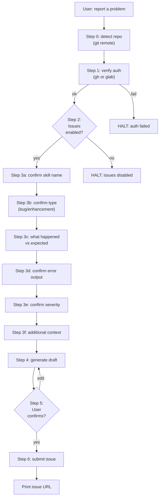

# conforma-feedback

Report bugs, enhancement requests, or general feedback about Conforma skills by filing an issue on the repository that hosts this codebase. The skill auto-detects whether the repo lives on GitHub or GitLab and uses the appropriate API.

## Prerequisites

- `gh` CLI authenticated (`gh auth login`) -- for GitHub repos
- `glab` CLI or `GITLAB_TOKEN` configured -- for GitLab repos
- `git` available on PATH
- Current working directory must be inside a git repository

## Workflow

Follow these steps **in order**. Each step is deterministic -- do not skip or reorder.



### Step 0 -- Detect repository

```bash
python3 skills/conforma-feedback/scripts/submit_feedback.py detect
```

Returns `platform`, `repo_path`, `host`. If `platform` is `unknown`, halt and ask the user to clarify.

### Step 1 -- Auth check

Run the platform-appropriate auth verification:

- **GitHub:** `python3 scripts/github_ops.py verify-auth`
- **GitLab:** `python3 scripts/gitlab_ops.py verify-auth`

If auth fails, route to the appropriate auth skill (`github-auth` or `gitlab-auth`) and halt.

### Step 2 -- Issues enabled

```bash
python3 skills/conforma-feedback/scripts/submit_feedback.py check-issues \
    --repo-path <repo_path> --platform <platform> [--host <host>]
```

If `enabled` is `false`, tell the user: "Issues are disabled on this repository. Please enable them or file the feedback manually."

### Step 3 -- Deterministic questionnaire

Gather information from the user. For each field, **infer the value from conversation context first** and present it for confirmation. Only ask the user to provide a value when it cannot be inferred.

| Field | Infer from | Ask if unknown |
|-------|-----------|---------------|
| **(a) Skill name** | The skill the user was using when the problem occurred | "Which conforma skill were you using?" |
| **(b) Type** | `bug` if the user reports an error/failure; `enhancement` if requesting improvement | "Is this a bug report or an enhancement request?" |
| **(c) What happened vs expected** | User's description of the problem | "What happened? What did you expect instead?" |
| **(d) Error output** | Error messages from the conversation or session | "Do you have any error output to include? (paste or say 'none')" |
| **(e) Severity** | `critical` for total failure, `major` for broken functionality, `minor` for inconvenience, `cosmetic` for display issues | Suggest severity, ask user to confirm |
| **(f) Additional context** | Any extra information from the conversation | "Any additional context? (optional)" |

### Step 4 -- Generate draft

```bash
python3 skills/conforma-feedback/scripts/submit_feedback.py gather-context \
    --skill-name "<skill>" \
    --type "<bug|enhancement>" \
    --summary "<one-line summary>" \
    --expected "<expected behavior>" \
    --actual "<actual behavior>" \
    --error-output "<error text or N/A>" \
    --severity "<critical|major|minor|cosmetic>" \
    --additional-context "<extra info or N/A>"
```

Returns `title`, `body`, `labels`. Present the full draft to the user.

### Step 5 -- User review

Show the user the complete issue:
- **Title:** (from output)
- **Body:** (from output, rendered as markdown)
- **Labels:** (from output)
- **Target:** `<platform>:<repo_path>`

Ask: "Does this look correct? Confirm to submit, or tell me what to change."

If the user requests edits, update the fields and re-run Step 4. Iterate until confirmed.

### Step 6 -- Submit

```bash
python3 skills/conforma-feedback/scripts/submit_feedback.py submit \
    --repo-path "<repo_path>" \
    --platform "<platform>" \
    --title "<confirmed title>" \
    --body "<confirmed body>" \
    --label conforma --label conforma-skill [--label bug|enhancement] \
    [--host "<host>"]
```

Print the resulting issue URL to the user.
